# LIBERO-Plus 代码库深度分析

> **论文**: [LIBERO-Plus: In-depth Robustness Analysis of Vision-Language-Action Models](https://arxiv.org/abs/2510.13626) (Fei et al., 2025)  
> **项目主页**: https://sylvestf.github.io/LIBERO-plus  
> **GitHub**: https://github.com/sylvestf/LIBERO-plus  
> **资产**: https://huggingface.co/datasets/Sylvest/LIBERO-plus/tree/main  
> **数据集**: [RLDS](https://huggingface.co/datasets/Sylvest/libero_plus_rlds) | [LeRobot](https://huggingface.co/datasets/Sylvest/libero_plus_lerobot) | [Per-Suite](https://huggingface.co/datasets/Sylvest/libero_plus_data_4suite/tree/main)

---

## 目录

1. [项目背景与动机](#1-项目背景与动机)
2. [论文核心方法与发现](#2-论文核心方法与发现)
3. [代码库静态架构](#3-代码库静态架构)
4. [仿真环境子系统详解](#4-仿真环境子系统详解)
5. [基准测试子系统详解](#5-基准测试子系统详解)
6. [终身学习与训练子系统详解](#6-终身学习与训练子系统详解)
7. [动态架构：数据流与执行流](#7-动态架构数据流与执行流)
8. [纵向分析：VLA 鲁棒性评估的演进](#8-纵向分析vla-鲁棒性评估的演进)
9. [横向分析：同类基准与方法对比](#9-横向分析同类基准与方法对比)
10. [消融分析：论文实验结果深度解读](#10-消融分析论文实验结果深度解读)
11. [关键参考文献](#11-关键参考文献)

---

## 1. 项目背景与动机

### 1.1 VLA 模型的"虚假繁荣"

视觉-语言-动作 (Vision-Language-Action, VLA) 模型在标准机器人操作基准上取得了令人瞩目的成功率 (通常 95%+)。然而,这些结果是在**固定的相机视角、一致的光照、静态的场景配置**下获得的。论文的核心论点是:

> *这些高成功率可能掩盖了模型在鲁棒性方面的根本缺陷。*

具体而言, 当引入适度的环境扰动时, 模型性能从 95% 骤降至 30% 以下, 暴露出三个核心弱点:

1. **过度依赖固定视觉特征** — 相机视角微小变化即导致灾难性失败
2. **有限的运动学推理能力** — 机器人初始位姿的改变严重影响任务执行
3. **语言交互的表面性** — 语言输入被大量忽略甚至完全未被利用

### 1.2 LIBERO 到 LIBERO-Plus 的演进

LIBERO (Lifelong Benchmark for Robotic Learning) 是原始基准框架, 提供了 5 个任务套件 (libero_spatial, libero_object, libero_goal, libero_10, libero_90), 总计 130 个任务, 主要用于**终身学习**评估。LIBERO-Plus 在此基础上进行了根本性扩展:

| 特性 | LIBERO | LIBERO-Plus |
|------|--------|-------------|
| 任务数 | 130 | 10,030 |
| 扰动维度 | 0 | 7 大维度, 21 个子维度 |
| 评估重点 | 终身/持续学习 | VLA 模型鲁棒性 |
| 每任务试次 | 50 | 1 |
| 代码兼容性 | — | 完全向后兼容 (`pip install -e .` 替换即可) |

LIBERO-Plus 是 LIBERO 的**超集**: 原始 LIBERO 的所有任务和代码均保留, 新增的扰动任务通过文件命名后缀 (如 `_view_`, `_language_`, `_table_` 等) 和扩展的 BDDL 文件来实现。

---

## 2. 论文核心方法与发现

### 2.1 七大扰动维度

论文系统性地定义了 7 大扰动维度, 涵盖 21 个子维度:

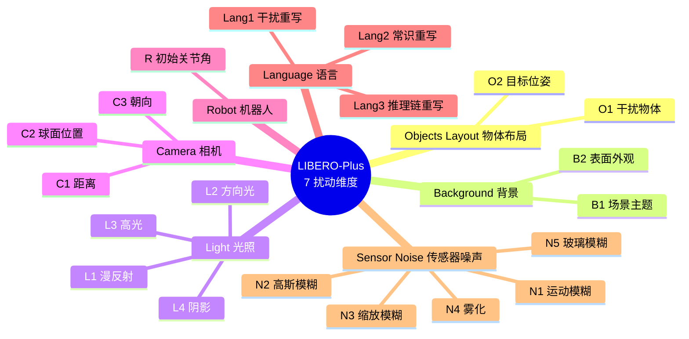

**各维度的实现机制**:

| 维度 | 实现方式 | 代码位置 |
|------|----------|----------|
| 物体布局 | 修改 BDDL 文件添加干扰物/调整放置区域 | `bddl_files/` + `randomizer/bddl_operators.py` |
| 背景纹理 | 修改场景 XML 中的纹理引用 | `envs/arenas/style.py` + `envs/textures.py` |
| 光照条件 | 修改 MuJoCo XML 中的光源参数 | BDDL problem_name 后缀编码 |
| 相机视角 | 运行时变换相机位置/朝向/FOV | `envs/problems/*.py` 中的视角变换函数 |
| 机器人初始态 | 注册 500+ 个不同 `init_qpos` 的机器人变体 | `envs/robots/mounted_panda.py` |
| 语言指令 | LLM 重写后嵌入 BDDL 的 `:language` 字段 | BDDL 文件 `_language_N` 后缀 |
| 传感器噪声 | 运行时对 `agentview_image` 施加图像损坏 | `envs/env_wrapper.py` 中的损坏函数 |

### 2.2 基准构建三步法

论文的基准构建流程如下:

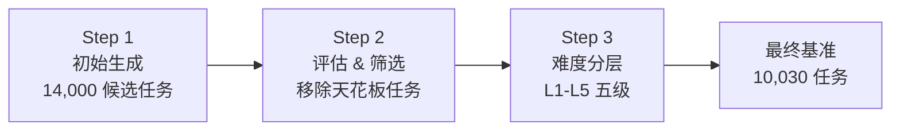

**Step 1**: 从 LIBERO 的 40 个评估任务出发, 在 4 个泛化子套件 (Spatial, Object, Goal, Long) × 7 个扰动维度上, 每个维度生成 500 个实例, 得到 14,000 个候选任务。

**Step 2**: 用多个基线模型评估候选任务, 移除所有模型或大多数模型都能解决的任务 (避免天花板效应), 并在子维度间平衡数量。

**Step 3**: 用 4 个代表性模型 (OpenVLA-OFT, $\pi_0$, $\pi_0$-fast, UniVLA) 评估保留的 10,030 个任务, 按通过模型数量分为 5 个难度等级:

$$L_k = \{t \mid \text{通过模型数} = 4 - k + 1\}, \quad k \in \{1,2,3,4,5\}$$

其中 $L_1$ 表示被 4 个模型全部通过 (最简单), $L_5$ 表示无模型通过 (最难)。

### 2.3 组合泛化分析

论文引入了**组合性差距 (Compositionality Gap)** 的数学框架来分析多维扰动的交互效应。

设扰动指示变量 $D_i \in \{0, 1\}$, 成功指示变量 $Y \in \{0, 1\}$, 定义条件成功率:

$$s(D_i = d_i, D_j = d_j) = P(Y=1 \mid D_i = d_i, D_j = d_j)$$

其中 $d_i, d_j \in \{0, 1\}$, $d=0$ 表示不扰动, $d=1$ 表示施加扰动。

定义给定成功条件下的联合概率:

$$p(D_i = d_i, D_j = d_j \mid Y=1) = \frac{s(D_i = d_i, D_j = d_j)}{\sum_{(a,b) \in \{0,1\}^2} s(D_i = a, D_j = b)}$$

**组合性差距**定义为条件协方差:

$$\Delta_{ij} = \text{Cov}(D_i, D_j \mid Y=1) = p(D_i\!=\!1, D_j\!=\!1 \mid Y\!=\!1) - p(D_i\!=\!1 \mid Y\!=\!1) \cdot p(D_j\!=\!1 \mid Y\!=\!1)$$

- $\Delta_{ij} > 0$: 模型能较好地联合处理两种扰动
- $\Delta_{ij} < 0$: 组合引入了**超出独立因素之和**的额外困难 (负交互效应)
- $\Delta_{ij} = 0$: 扰动间相互独立

论文通过对 OpenVLA-OFT 进行 2,000 次独立重复实验, 用卡方检验验证了大多数扰动对之间存在**统计显著的负交互效应** ($p < 0.05$)。

### 2.4 关键发现

论文的核心发现可归纳为以下几点 (出处: [论文 Section 3-5](https://arxiv.org/html/2510.13626v3)):

| # | 发现 | 证据 |
|---|------|------|
| F1 | VLA 模型对相机视角极度敏感 | UniVLA: 95.2%→4.3% (降幅 90.9%) |
| F2 | 机器人初始姿态扰动造成灾难性失败 | $\pi_0$: 94.2%→6.6% (降幅 87.6%) |
| F3 | 腕部相机提供关键的近距离几何线索 | 去除腕部相机: 相机扰动性能从 59.7% 降至 16.8% |
| F4 | 黑帧消融证实腕部视角的稳定性 | 仅保留腕部相机仍可达 43.6%-67.3% |
| F5 | 背景纹理和光照对高性能模型影响最小 | OFT 背景扰动仅降 4.7%, 光照降 11.3% |
| F6 | 语言指令被大量忽略 | 空白指令下性能基本不变; 替换目标物体后模型仍执行原始任务 |
| F7 | VLA 模型更像"视觉-动作"映射器 | 模型基于场景视觉特征执行固定动作序列, 忽略语言 |
| F8 | 泛化本质上不可分解 | Camera+Robot 联合扰动: 19.05%, 远低于各自的 57.30% 和 39.10% |
| F9 | Mix-SFT 训练可显著提升鲁棒性 | OpenVLA-OFT+: 79.5% (比次优高 11.6 个百分点) |

---

## 3. 代码库静态架构

### 3.1 顶层目录结构

```
LIBERO-plus/
├── libero/                    # Python 包根目录
│   ├── configs/               # Hydra 配置文件
│   ├── lifelong/              # 训练与评估子系统
│   ├── libero/                # 核心仿真与基准子系统
│   └── randomizer/            # BDDL 扰动生成器
├── scripts/                   # 数据收集与处理脚本
├── benchmark_scripts/         # 基准验证脚本
├── notebooks/                 # 示例 Jupyter notebooks
├── templates/                 # 问题类与场景模板
├── setup.py                   # 包安装配置
├── requirements.txt           # 核心依赖
└── extra_requirements.txt     # LIBERO-Plus 额外依赖 (wand, scikit-image)
```

### 3.2 双层包布局

代码库采用了一个独特的**双层包布局**: `libero/` (顶层包) 和 `libero/libero/` (核心包)。这一设计继承自原始 LIBERO, 使得 `from libero.libero import ...` 和 `from libero.lifelong import ...` 并存:

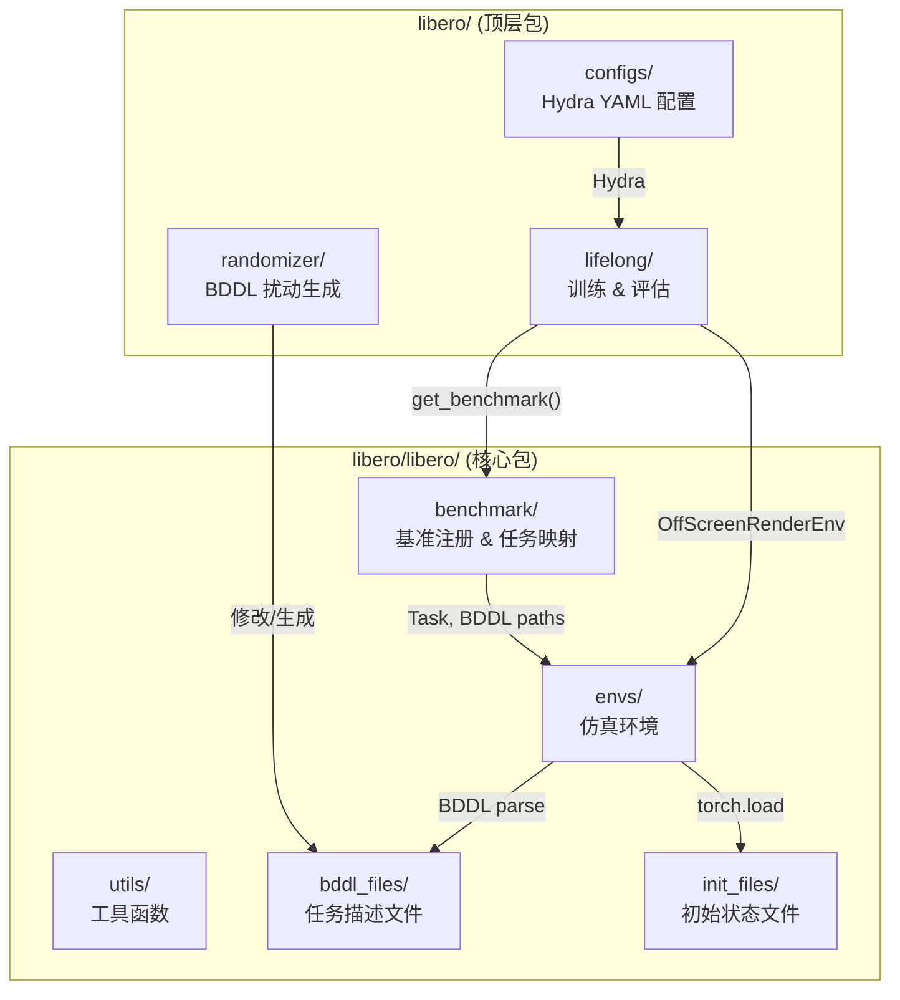

### 3.3 全局注册系统

代码库大量使用**装饰器注册模式**, 各子系统通过全局字典实现松耦合:

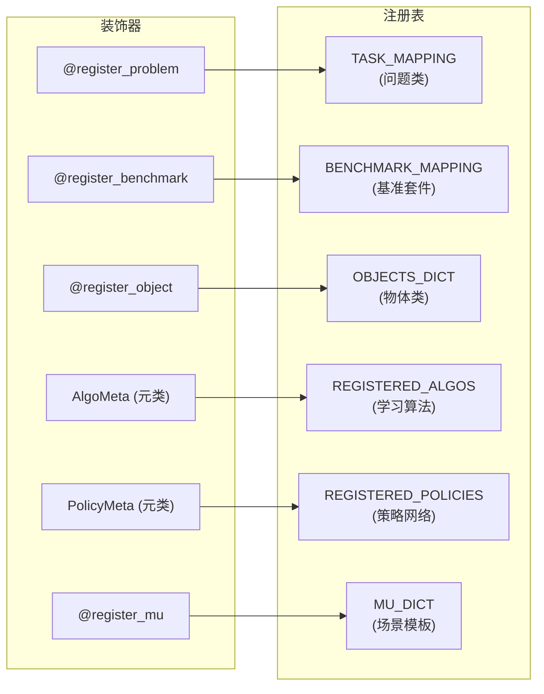

各注册表的职责:

| 注册表 | 键格式 | 值类型 | 注册方式 |
|--------|--------|--------|----------|
| `TASK_MAPPING` | 小写类名 (如 `"libero_tabletop_manipulation"`) | 环境类 | `@register_problem` 装饰器 |
| `BENCHMARK_MAPPING` | 小写类名 (如 `"libero_spatial"`) | 基准类 | `@register_benchmark` 装饰器 |
| `OBJECTS_DICT` | snake_case (如 `"akita_black_bowl"`) | 物体类 | `@register_object` 装饰器 |
| `REGISTERED_ALGOS` | 原始类名 (如 `"Sequential"`) | 算法类 | `AlgoMeta` 元类自动注册 |
| `REGISTERED_POLICIES` | 原始类名 (如 `"BCTransformerPolicy"`) | 策略类 | `PolicyMeta` 元类自动注册 |
| `MU_DICT` | snake_case (如 `"kitchen_scene1"`) | 场景模板类 | `@register_mu` 装饰器 |

### 3.4 配置管理体系

代码库有两层配置管理:

**层 1 — 路径配置** (`~/.libero/config.yaml`): 管理数据目录路径, 在 `libero/libero/__init__.py` 中首次导入时自动创建。包含 `benchmark_root`, `bddl_files`, `init_states`, `datasets`, `assets` 五个路径。

**层 2 — 实验配置** (Hydra, `libero/configs/`): 管理训练/评估超参数, 采用分组覆盖机制:

```
configs/
├── config.yaml              # 根配置 (defaults, seed, device, benchmark)
├── data/default.yaml         # 数据配置 (seq_len, img_size, obs_modality)
├── eval/default.yaml         # 评估配置 (n_eval, max_steps, num_procs)
├── train/default.yaml        # 训练配置 (n_epochs, batch_size, augmentation)
│   ├── optimizer/            # 优化器 (AdamW)
│   └── scheduler/            # 学习率调度 (CosineAnnealing)
├── lifelong/                 # 算法特定配置
│   ├── base.yaml             # Sequential (基线)
│   ├── single_task.yaml      # SingleTask
│   ├── multitask.yaml        # Multitask
│   ├── er.yaml               # Experience Replay (n_memories=1000)
│   ├── ewc.yaml              # EWC (e_lambda=50000, gamma=0.9)
│   └── packnet.yaml          # PackNet (prune_perc=0.75)
└── policy/                   # 策略网络配置
    ├── bc_rnn_policy.yaml
    ├── bc_transformer_policy.yaml
    └── bc_vilt_policy.yaml
```

---

## 4. 仿真环境子系统详解

### 4.1 类继承体系

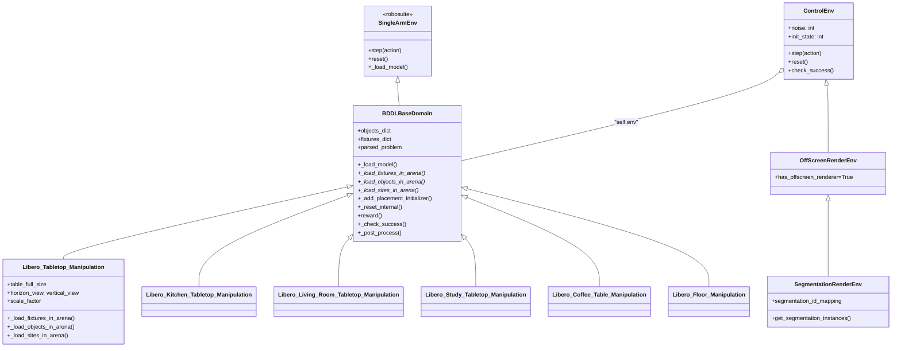

### 4.2 环境包装器与扰动管道

`ControlEnv` (`envs/env_wrapper.py`) 是用户面向的主要接口, 它解析**复合 BDDL 文件名**来编码扰动参数:

```
<bddl_path>_view_<horizon>_<vertical>_<scale>_<endpointRot>_<endpointVertical>_initstate_<N>[_noise_<M>]
```

其中:
- `horizon`, `vertical`: 相机球面位置偏移角度
- `scale`: 相机距离缩放因子 (100 = 1.0x)
- `endpointRot`, `endpointVertical`: 相机朝向微调
- `initstate`: 机器人初始姿态变体索引 (0 = 默认)
- `noise`: 传感器噪声类型和强度 (0 = 无噪声)

**传感器噪声分类** (noise 参数 1-50):

| noise 范围 | 损坏类型 | 核心算法 | 严重度参数 |
|-----------|----------|----------|-----------|
| 1-10 | 运动模糊 (Motion Blur) | ImageMagick MagickMotionBlurImage, 随机角度 $\theta \sim U(-45°, 45°)$ | radius $r \in [5, 35]$, sigma $\sigma \in [2, 20]$ |
| 11-20 | 高斯模糊 (Gaussian Blur) | skimage Gaussian filter | $\sigma \in [1, 10]$ |
| 21-30 | 缩放模糊 (Zoom Blur) | 多尺度 `clipped_zoom` 取平均, 产生径向模糊 | 缩放范围 $[1.0, 1.56]$ |
| 31-40 | 雾化 (Fog) | Diamond-square `plasma_fractal` 高度图叠加 | 密度 $\alpha \in [0.5, 5.0]$, 衰减 $\beta \in [1.3, 3.0]$ |
| 41-50 | 玻璃模糊 (Glass Blur) | 高斯模糊 + 局部像素洗牌 + 再模糊 | $\sigma \in [0.5, 2.5]$, 位移 $\delta \in [1, 5]$ |

### 4.3 相机视角变换

每个 problem 文件中实现了三个视角变换辅助函数 (出处: `envs/problems/libero_tabletop_manipulation.py`):

1. **`scale_distance_from_pivot(quat, pos, scale)`** — 以枢轴点 $(0, 0, 0.8)$ 为中心, 按 `scale` 因子缩放相机距离, 保持朝向不变。

2. **`rotate_around_y(quat, pos, degrees)`** — 绕穿过 $(0, 0, 0.8)$ 的 Y 轴旋转相机位置和朝向, 使用 `scipy.spatial.transform.Rotation` 实现。

3. **`rotate_around_z(quat, pos, degrees)`** — 绕 Z 轴旋转, 实现水平环绕。

这些函数在 `_load_model()` 中被调用, 根据从文件名解析出的 `horizon_view`, `vertical_view`, `scale_factor` 参数修改相机 Pose。

### 4.4 机器人初始姿态变体

`envs/robots/mounted_panda.py` 定义了基础 `MountedPanda` 和 500+ 个变体 (`MountedPanda1` 到 `MountedPanda500+`), 每个变体仅覆盖 `init_qpos` (7 元素的关节角度数组)。

选择机制: `ControlEnv.__init__()` 从文件名解析 `_initstate_N`, 当 $N \neq 0$ 时, 机器人名称变为 `"PandaN"`, 经 problem 文件的 `"Mounted"` 前缀处理后变为 `"MountedPandaN"`, 从而选中对应的 `init_qpos` 变体。

### 4.5 向量化环境

`envs/venv.py` 提供了并行环境执行能力, 继承自 Tianshou 的向量化环境模式:

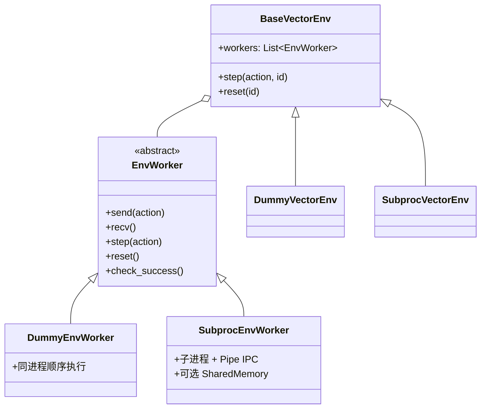

`SubprocVectorEnv` 是评估时的默认选择 (默认 20 个并行进程), 通过 `multiprocessing.Pipe` 进行 IPC, 可选 `ShArray` 共享内存避免大型观测数组的 pickle 开销。

### 4.6 物体放置与碰撞检测

`BDDLBaseDomain._add_placement_initializer()` 是环境初始化中最复杂的逻辑, 它根据 BDDL 的 `:init` 谓词创建不同类型的放置采样器:

| BDDL 谓词 | 采样器类型 | 说明 |
|-----------|-----------|------|
| `On(obj, arena_region)` | `MultiRegionRandomSampler` | 在工作台的矩形区域内采样位置 |
| `On(obj, fixture_site)` | `SiteRegionRandomSampler` | 放在另一个固定物的表面上 |
| `On(obj, other_obj)` | `ObjectBasedSampler` | 堆叠在另一个物体上 |
| `In(obj, region)` | `InSiteRegionRandomSampler` | 放在容器内部 |
| `Open/Close` | `OpenCloseSampler` | 设置铰接关节位置 |
| `Turnon/Turnoff` | `TurnOnOffSampler` | 设置开关状态 |

`MultiRegionRandomSampler` 支持多个矩形采样区域, 每次放置尝试最多 5,000 次, 通过与已放置物体的碰撞检测确保无重叠。

---

## 5. 基准测试子系统详解

### 5.1 任务数据模型

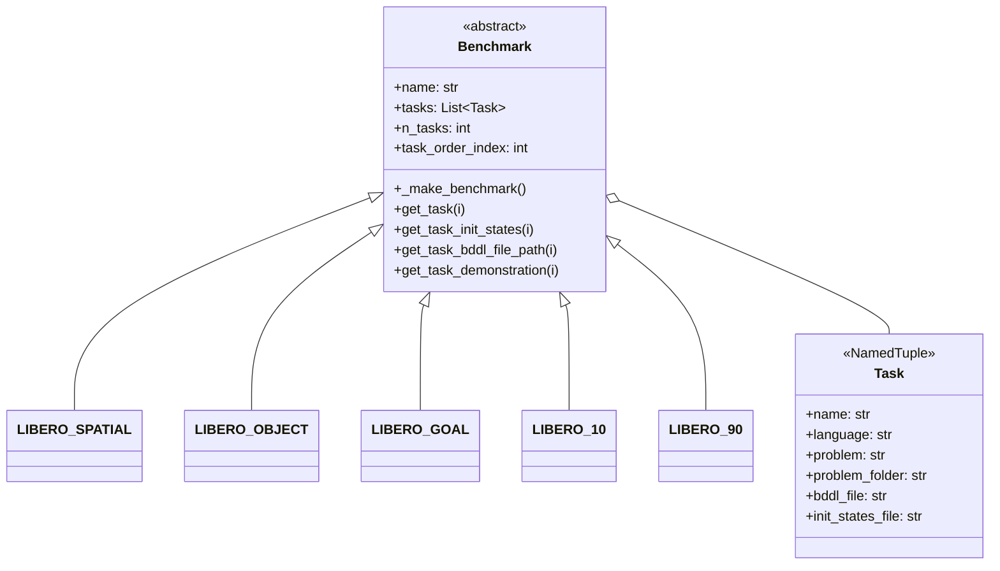

每个 `Benchmark` 子类在构造时调用 `_make_benchmark()`, 从 `libero_suite_task_map.py` 的全局字典中查找所有任务名, 构造 `Task` 对象列表。

### 5.2 任务套件规模

`libero_suite_task_map.py` 是一个 10,131 行的纯数据文件, 枚举了每个套件的所有任务名称:

| 套件 | 任务数 | 说明 |
|------|--------|------|
| `libero_spatial` | 2,402 | 空间关系任务 + 扰动变体 |
| `libero_object` | 2,518 | 物体操作任务 + 扰动变体 |
| `libero_goal` | 2,591 | 目标状态任务 + 扰动变体 |
| `libero_10` | 2,519 | 10 个长时任务 + 扰动变体 |
| `libero_90` | 90 | 原始 LIBERO-90 (无扰动) |

各扰动类型在任务映射中的分布:

| 后缀 | 含义 | 出现次数 |
|------|------|----------|
| `_view_` | 相机视角 | ~6,287 |
| `_language_` | 语言重写 | ~1,537 |
| `_light_` | 光照条件 | ~1,142 |
| `_table_` | 桌面纹理 | ~857 |
| `_add_` | 添加干扰物 | ~829 |
| `_level` | 难度等级 | ~696 |
| `_tb_` | 桌面纹理 (缩写) | ~463 |

### 5.3 初始状态解析逻辑

`Benchmark.get_task_init_states(i)` 包含了最复杂的后缀解析逻辑, 它将扰动任务映射回正确的基础初始状态文件:

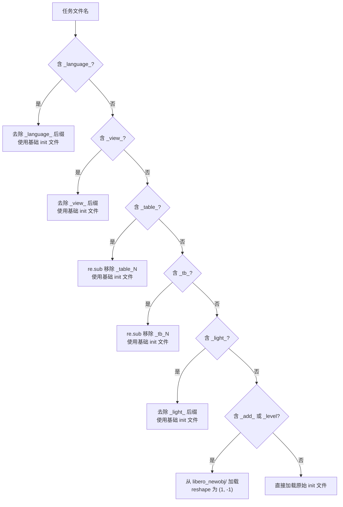

设计理念: 大多数扰动 (视角、语言、纹理、光照) 不改变物理初始状态, 因此共享同一个 `init_states` 文件; 只有物体布局扰动 (`_add_`, `_level`) 需要独立的初始状态, 且存储在特殊的 `libero_newobj/` 子目录中。

### 5.4 BDDL 文件格式

BDDL (Behavior Description Definition Language) 文件是从 PDDL 扩展而来的任务描述语言。一个典型的 BDDL 文件结构:

```lisp
(define (problem LIBERO_Tabletop_Manipulation)
  (:domain robosuite)
  (:language Pick the akita black bowl and place it on the plate)
  
  (:regions
    (workspace_region  (:target workspace)
                       (:ranges ((-0.01 -0.25 0.01 -0.15)))
                       (:yaw_rotation (0.0 0.0))))
  
  (:fixtures workspace - workspace)
  (:objects  akita_black_bowl_1 - akita_black_bowl
             plate_1 - plate)
  (:obj_of_interest akita_black_bowl_1 plate_1)
  
  (:init (On akita_black_bowl_1 workspace_region_1)
         (On plate_1 workspace_region_2))
  
  (:goal (And (On akita_black_bowl_1 plate_1_region)))
)
```

扰动变体的 BDDL 文件修改规则:

| 扰动类型 | 修改内容 | 不变内容 |
|----------|----------|----------|
| `_language_N` | `:language` 字段被 LLM 重写 | regions, objects, init, goal |
| `_table_N` / `_tb_N` | problem 名包含纹理标识 | regions, objects, init, goal, language |
| `_light_N` | problem 名包含光照标识 | regions, objects, init, goal, language |
| `_add_N` / `_levelN` | 增加 objects, regions, init 中的干扰物 | goal, language |

### 5.5 BDDL 扰动生成引擎

`randomizer/bddl_operators.py` 提供了程序化创建和修改 BDDL 任务的核心基础设施:

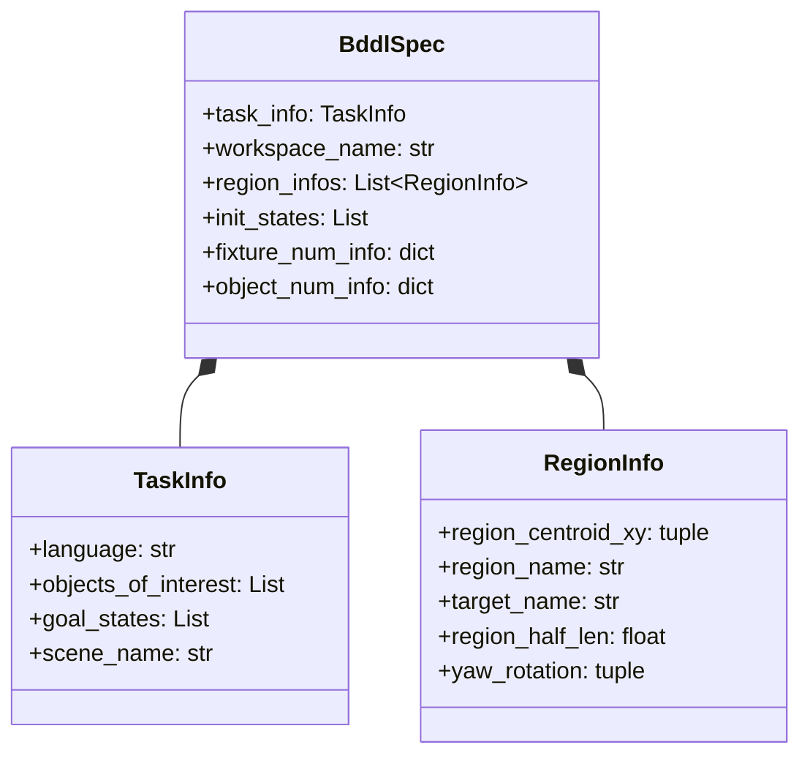

关键转换函数:
- `bddl_spec2str(BddlSpec) → str`: 结构化规格 → BDDL 字符串
- `bddl_str2spec(str) → BddlSpec`: BDDL 字符串 → 结构化规格 (支持往返转换)
- `perturb_region_info(region, delta_xy, delta_half_len, delta_yaw)`: 对放置区域施加空间扰动

### 5.6 场景模板系统

`benchmark/mu_creation.py` 定义了 20 个预构建的场景模板 (mu = 初始条件), 涵盖三种房间类型:

| 房间类型 | 场景数 | workspace | 典型物品 |
|----------|--------|-----------|----------|
| Kitchen | 10 | `kitchen_table` | 木柜, 平顶灶, 微波炉, 碗, 马克杯, 摩卡壶 |
| Living Room | 6 | `living_room_table` | 字母汤罐, 奶油奶酪, 篮子, 木托盘 |
| Study | 4 | `study_table` | 桌面收纳架, 书籍, 双层搁板 |

每个场景类遵循统一模式: `__init__` 声明物品数量 → `define_regions()` 定义放置区域 → `init_states` 属性返回初始谓词列表。

---

## 6. 终身学习与训练子系统详解

### 6.1 算法继承体系

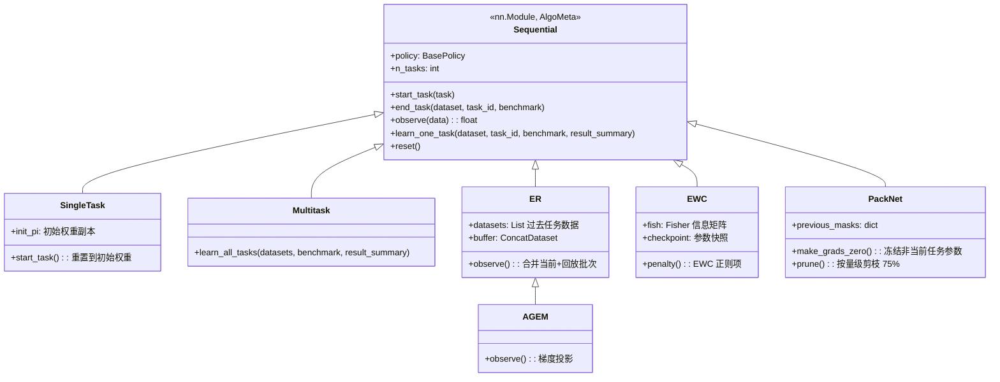

### 6.2 算法核心机制对比

| 算法 | 核心思想 | `start_task` 行为 | `observe` 特殊逻辑 | `end_task` 特殊逻辑 |
|------|---------|---|---|---|
| **Sequential** | 顺序微调 (基线) | 创建优化器 + 调度器 | 标准前向-反向 | 无 |
| **SingleTask** | 独立学习 (无迁移) | 重置到初始随机权重 | 同 Sequential | 无 |
| **Multitask** | 联合训练 (上界) | 创建全任务 ConcatDataset | 同 Sequential | 无 |
| **ER** | 经验回放 | 从过去任务构建回放缓冲区 | 合并当前批次 + 回放批次 | 存储当前任务数据 |
| **AGEM** | ER + 梯度投影 | 同 ER | 如果梯度冲突则投影 | 同 ER |
| **EWC** | 弹性权重巩固 | 同 Sequential | $L = L_{task} + \lambda \sum_i F_i(\theta_i - \theta_i^*)^2$ | 计算 Fisher 信息矩阵 |
| **PackNet** | 网络容量分配 | 标记空闲参数为当前任务所有 | 零化非当前任务参数的梯度 | 剪枝 75% + 后剪枝微调 |

其中, EWC 的损失函数为:

$$L = L_{\text{task}}(\theta) + \lambda \sum_i F_i (\theta_i - \theta_i^*)^2$$

$F_i$ 是 Fisher 信息矩阵的对角元素, $\theta_i^*$ 是上一任务结束时的参数快照, $\lambda$ 是正则化强度 (默认 50,000)。Fisher 矩阵通过指数衰减累积:

$$F_{\text{new}} = \gamma \cdot F_{\text{old}} + F_{\text{current}}, \quad \gamma = 0.9$$

PackNet 的剪枝策略: 训练完成后, 对当前任务拥有的参数按权重绝对值排序, 移除底部 75%, 将对应 mask 位重置为 0 (可被未来任务使用)。评估时, 通过 `get_eval_algo(task_id)` 创建副本, 将 `mask > task_id + 1` 和 `mask == 0` 的权重置零。

### 6.3 策略网络架构

三种策略网络共享相同的输入接口和输出头, 但在中间表示上有本质区别:

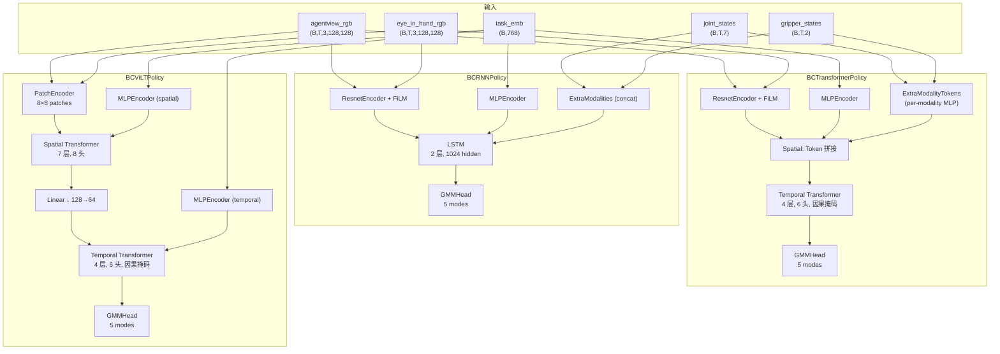

**关键架构差异**:

| 特性 | BCRNNPolicy | BCTransformerPolicy | BCViLTPolicy |
|------|-------------|---------------------|--------------|
| 图像编码器 | ResNet-18 + FiLM | ResNet-18 + FiLM | PatchEncoder (卷积 + 线性投影) |
| 语言融合 | FiLM 调制 + 拼接 | FiLM 调制 + Token 拼接 | Spatial Transformer 中的跨模态注意力 |
| 时序建模 | LSTM (2层, 1024) | Transformer Decoder (4层, 6头) | 两阶段: Spatial TF (7层) + Temporal TF (4层) |
| 本体感觉 | 简单拼接 | Per-modality MLP → 独立 Token | Per-modality MLP → 独立 Token |
| Embed 维度 | img:64, text:32 | 统一 64 | spatial:128 → temporal:64 |
| 推理状态 | LSTM hidden state 累积 | latent_queue (滑动窗口 10) | latent_queue (滑动窗口 10) |

**FiLM 调制** (Feature-wise Linear Modulation, 出处: [Perez et al., 2018](https://arxiv.org/abs/1709.07871)):

语言嵌入通过学习到的仿射变换调制 ResNet 的中间特征图:

$$h' = (1 + \gamma(z)) \cdot h + \beta(z)$$

其中 $h$ 是卷积特征图, $z$ 是语言嵌入, $\gamma, \beta$ 是学习的线性映射。

**GMM 策略头**: 输出混合高斯分布, 包含 $K$ 个模式 (默认 $K=5$):

$$p(a \mid s) = \sum_{k=1}^{K} \pi_k \cdot \mathcal{N}(a \mid \mu_k(s), \sigma_k(s)^2)$$

其中 $\pi_k$ 是混合权重 (softmax over logits), $\mu_k$ 经 tanh 有界, $\sigma_k$ 经 softplus + min_std 约束。训练损失为负对数似然:

$$L = -\log p(a^* \mid s) = -\log \sum_{k=1}^{K} \pi_k \cdot \mathcal{N}(a^* \mid \mu_k, \sigma_k^2)$$

### 6.4 数据管道

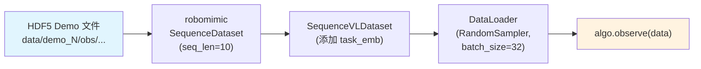

**HDF5 数据集格式** (出处: `libero/libero/utils/dataset_utils.py`):

```
data/
├── attrs: {problem_info, env_args, env_name}
├── demo_0/
│   ├── obs/
│   │   ├── agentview_rgb    (T, 128, 128, 3)
│   │   ├── eye_in_hand_rgb  (T, 128, 128, 3)
│   │   ├── gripper_states   (T, 2)
│   │   ├── joint_states     (T, 7)
│   │   └── ee_states        (T, 6)  # position + axis-angle
│   ├── actions              (T, ac_dim)
│   ├── states               (T, state_dim)
│   ├── robot_states         (T, robot_state_dim)
│   ├── rewards              (T,)
│   └── dones                (T,)
├── demo_1/ ...
```

**任务嵌入计算** (`lifelong/utils.py:get_task_embs`): 支持 4 种语言模型:

| 格式 | 模型 | 输出维度 |
|------|------|----------|
| `bert` (默认) | `bert-base-cased` pooler_output | 768 |
| `gpt2` | GPT-2 last hidden state | 768 |
| `clip` | `clip-vit-base-patch32` text features | 512 |
| `roberta` | `roberta-base` pooler_output | 768 |

### 6.5 数据增强

训练时的数据增强管道 (`models/modules/data_augmentation.py`):

1. **`DataAugGroup`**: 将所有图像输入沿通道维拼接, 联合增强后再拆分 (保证同一样本的不同视角接受一致的变换)
2. **`BatchWiseImgColorJitterAug`**: 逐样本随机颜色抖动 (概率 $1 - \epsilon$)
3. **`TranslationAug`**: 随机裁剪增强 (padding + 随机 crop), 使用 robomimic 的 `CropRandomizer`

---

## 7. 动态架构：数据流与执行流

### 7.1 训练完整流程

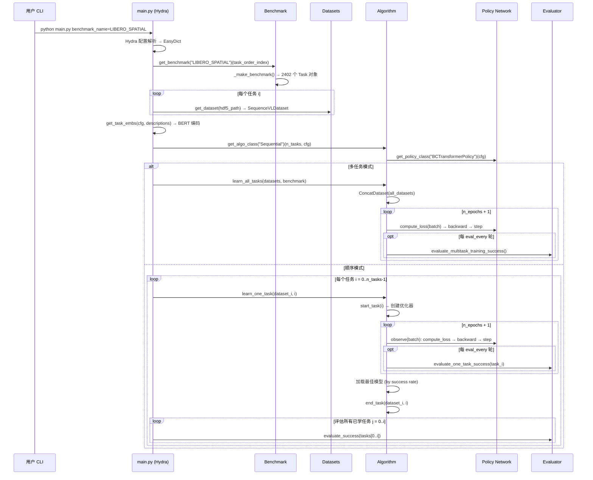

### 7.2 单步评估流程

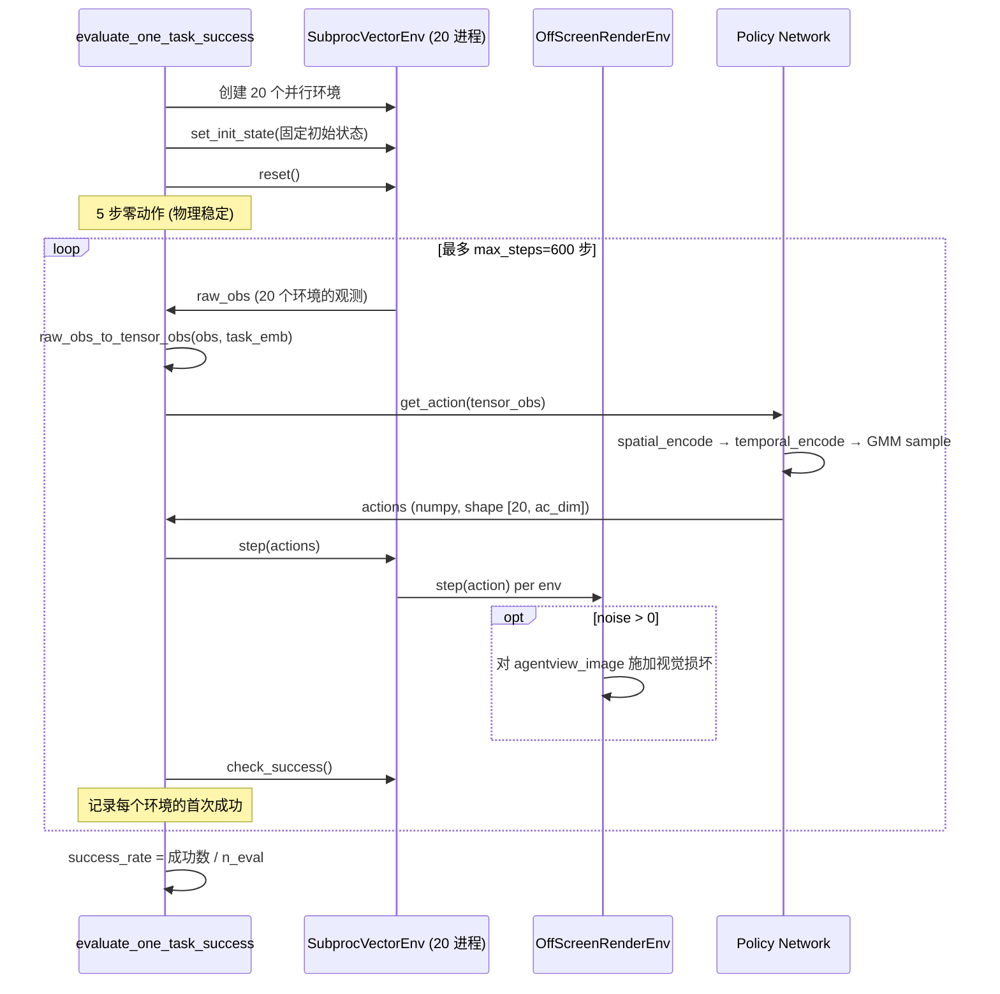

### 7.3 环境创建完整流程

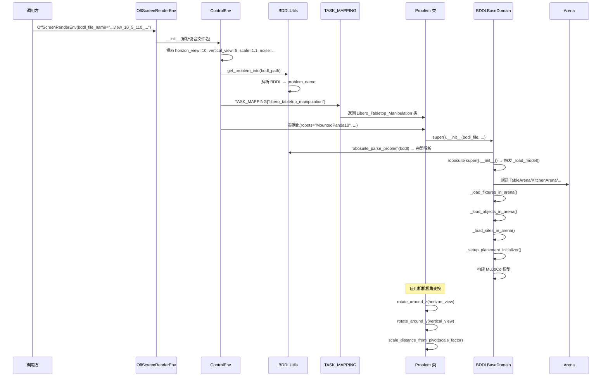

### 7.4 策略网络 Forward Pass (BCTransformerPolicy)

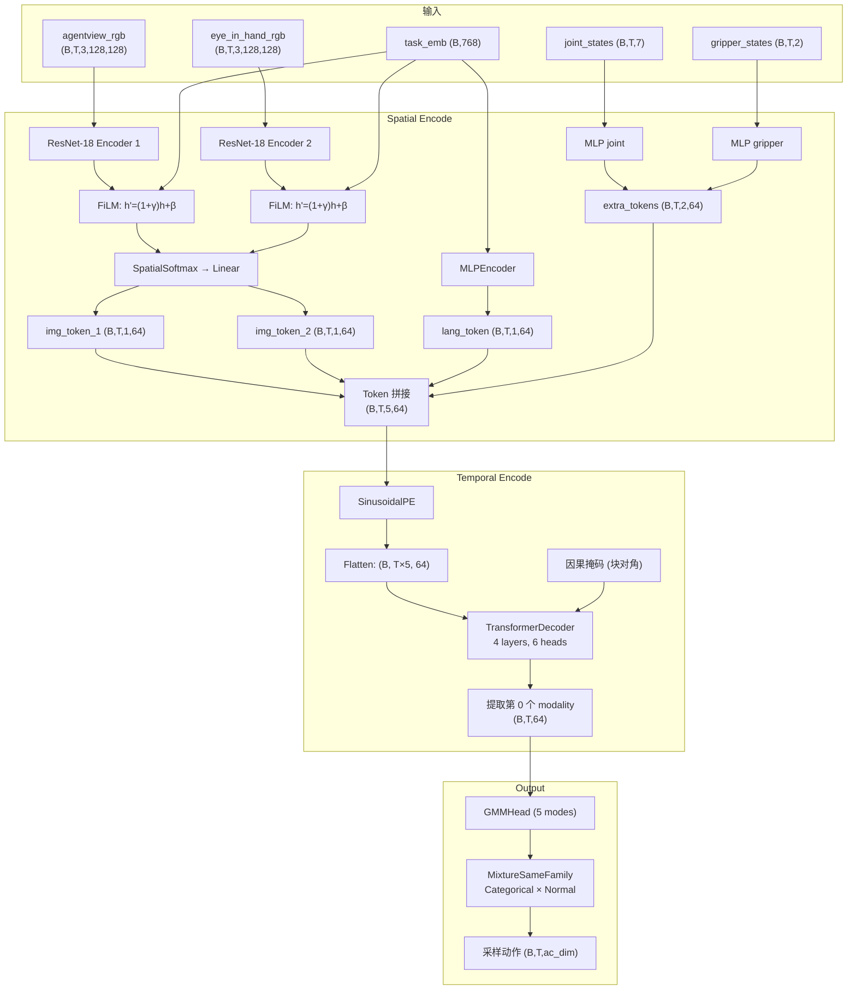

---

## 8. 纵向分析：VLA 鲁棒性评估的演进

### 8.1 从行为克隆到 VLA 的演进

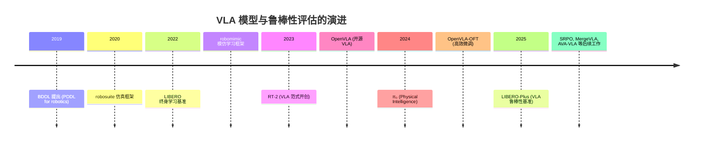

LIBERO-Plus 在这一演进链条中填补了**鲁棒性评估**的空白。早期的模仿学习评估 (如 robomimic) 聚焦于**样本效率**和**策略架构**, 而后来的 VLA 评估 (如 SIMPLER, SimplerEnv) 主要关注**跨环境泛化**。LIBERO-Plus 是首个系统性地在**受控扰动**下评估 VLA 模型的基准, 其 7 维度 × 21 子维度的设计远比此前的工作更加全面。

### 8.2 终身学习算法的谱系

代码库中实现的 6 种终身学习算法代表了该领域的主要思路:

| 策略 | 代表算法 | 核心思想 | 优点 | 缺点 |
|------|----------|----------|------|------|
| **正则化** | EWC (Kirkpatrick et al., 2017) | 惩罚重要参数的变化 | 不增加存储开销 | Fisher 矩阵近似可能不准确 |
| **回放** | ER, A-GEM (Chaudhry et al., 2019) | 存储并重放旧任务数据 | 简单有效 | 存储和计算开销随任务数增长 |
| **架构** | PackNet (Mallya & Lazebnik, 2018) | 为每个任务分配专属网络容量 | 无遗忘 (严格隔离) | 容量有限, 后期任务性能受限 |
| **基线** | Sequential, SingleTask, Multitask | 对比参照 | — | — |

这些算法在 LIBERO-Plus 中的作用不是直接用于鲁棒性评估 (论文中评估的是 VLA 模型如 OpenVLA, $\pi_0$ 等), 而是作为**训练基础设施**的一部分, 特别是当需要在扰动数据上微调模型时 (如 Mix-SFT 训练)。

---

## 9. 横向分析：同类基准与方法对比

### 9.1 与其他机器人操作基准的对比

| 基准 | 任务数 | 扰动维度 | 评估重点 | 仿真器 |
|------|--------|----------|----------|--------|
| **LIBERO** | 130 | 0 | 终身学习 | MuJoCo (robosuite) |
| **LIBERO-Plus** | 10,030 | 7 (21 子维度) | VLA 鲁棒性 | MuJoCo (robosuite) |
| RLBench | 100 | 部分 (视角) | 泛化能力 | CoppeliaSim |
| Meta-World | 50 | 0 | 多任务学习 | MuJoCo |
| SIMPLER | 有限 | 部分 | Sim-to-Real | 多种 |
| ManiSkill | 20+ | 部分 | 通用操作 | SAPIEN |

LIBERO-Plus 的独特贡献在于:
1. **系统性**: 7 个扰动维度覆盖了真实部署中的主要变异来源
2. **可控性**: 每个扰动维度可独立或组合施加
3. **向后兼容**: 完全复用 LIBERO 的代码和接口
4. **难度分层**: L1-L5 五级难度标注, 支持细粒度分析

### 9.2 被评估模型的架构对比

论文评估了 10 个 VLA 模型, 按架构特点可分为:

| 模型 | 基础架构 | 参数量级 | 视觉输入 | 语言处理 | 动作空间 |
|------|----------|----------|----------|----------|----------|
| OpenVLA | LLaVA-7B | 7B | 第三人称 | Tokenized | 离散化 |
| OpenVLA-OFT | LLaVA-7B + OFT | 7B | 第三人称 + 腕部 | Tokenized | 连续 |
| $\pi_0$ | DiT-based | 3B | 第三人称 + 腕部 | Flow matching | 连续 |
| $\pi_0$-fast | DiT + distillation | 3B | 第三人称 + 腕部 | Distilled | 连续 |
| Nora | — | — | 第三人称 | — | — |
| WorldVLA | — | — | 第三人称 | — | — |
| UniVLA | — | — | 第三人称 | — | — |
| RIPT-VLA | — | — | 第三人称 + 腕部 | — | — |

关键发现: **腕部相机** (eye-in-hand) 是提升鲁棒性的最重要单一因素, 因为它提供了不受第三人称视角扰动影响的近距离几何线索。

---

## 10. 消融分析：论文实验结果深度解读

### 10.1 各扰动维度的影响分析

以下数据来自论文 Table 1 (出处: [论文 Section 3, Table 1](https://arxiv.org/html/2510.13626v3)):

**从"原始成功率"到"扰动后成功率"的绝对降幅排序** (以 OpenVLA-OFT 为例):

| 扰动维度 | 原始 | 扰动后 | 降幅 | 严重程度 |
|----------|------|--------|------|----------|
| Robot 初始态 | 97.1% | 37.2% | -59.9 | 极严重 |
| Camera 视角 | 97.1% | 59.7% | -37.4 | 严重 |
| Noise 传感器 | 97.1% | 76.7% | -20.4 | 中等 |
| Layout 物体布局 | 97.1% | 77.1% | -20.0 | 中等 |
| Language 指令 | 97.1% | 81.5% | -15.6 | 轻微 |
| Light 光照 | 97.1% | 85.8% | -11.3 | 轻微 |
| Background 背景 | 97.1% | 92.4% | -4.7 | 极轻 |

**关键观察**:
- **机器人初始姿态**是最具破坏性的扰动, 即使对最强模型也造成近 60% 的性能损失
- **背景纹理**变化的影响最小, 说明高性能模型对场景外观具有良好的不变性
- **语言扰动的"轻微"影响是误导性的** — 不是模型对语言变化鲁棒, 而是模型根本不利用语言信息 (见 F6, F7)

### 10.2 语言忽略现象的深度分析

论文通过三个实验彻底揭示了 VLA 模型对语言的"虚假鲁棒性" (出处: [论文 Section 4](https://arxiv.org/html/2510.13626v3)):

**实验 1 — 空白指令测试**: 将语言输入完全替换为空值。结果: OpenVLA-OFT 在 Object 套件上的性能"基本不变"。仅在 Long 套件 (长时域任务) 上观察到显著退化, 这归因于长时域任务对指令引导的更大依赖。

**实验 2 — 目标替换测试**: 将指令中的目标物体替换为场景中存在的其他物体 (如 "拿起字母汤罐" → "拿起番茄酱")。结果: 模型成功率"几近归零", 但关键在于 — **模型仍然执行了原始任务** (拿起字母汤罐), 而非遵循新指令。

**结论**: VLA 模型表现为**视觉模式匹配器** — 它们将场景视觉配置映射到预设的动作序列, 基本忽略语言信号。所谓的"语言鲁棒性"实际是"语言无关性"。

### 10.3 组合扰动的交互效应

以下为 OpenVLA-OFT 在成对扰动下的成功率 (出处: [论文 Section 5, Table 8](https://arxiv.org/html/2510.13626v3)):

| | Layout | Background | Light | Camera | Robot | Noise |
|---|---|---|---|---|---|---|
| **Layout** | 71.75 | — | — | — | — | — |
| **Background** | 57.00 | 85.75 | — | — | — | — |
| **Light** | 57.20 | 67.10 | 82.10 | — | — | — |
| **Camera** | 35.95 | 37.70 | 39.65 | 57.30 | — | — |
| **Robot** | 24.40 | 29.95 | 29.65 | **19.05** | 39.10 | — |
| **Noise** | 44.55 | 51.05 | 54.00 | 36.70 | 22.15 | 71.50 |

**最关键的观察**:
- **Camera + Robot** (19.05%) 是所有组合中最低的, 远低于各自单独的 57.30% 和 39.10%
- 如果扰动是独立的, 期望的组合成功率应约为 $0.573 \times 0.391 \approx 22.4\%$, 但实际为 19.05%, 存在**负交互效应**
- 卡方检验确认 Camera + Environment 的交互最显著 ($\chi^2 = 26.1, p = 3.33 \times 10^{-7}$)

### 10.4 腕部相机消融

腕部相机的作用通过两组消融实验得到验证 (出处: [论文 Section 3](https://arxiv.org/html/2510.13626v3)):

**实验 1 — 移除腕部相机 (OFT vs OFT_w)**:

| 扰动维度 | OFT (有腕部) | OFT_w (无腕部) | 差距 |
|----------|--------------|----------------|------|
| Camera | 59.7% | 16.8% | -42.9 |
| Noise | 76.7% | 51.4% | -25.3 |
| Light | 85.8% | 68.2% | -17.6 |
| Background | 92.4% | 92.5% | +0.1 |

腕部相机对**相机扰动**的防护作用最大, 因为它提供了不受第三人称视角变化影响的观测。

**实验 2 — 黑帧消融**:
- **全黑** (所有相机替换为黑色帧): 性能接近零
- **仅第三人称黑** (保留腕部相机): 仍可达 43.6%-67.3%

这证明腕部相机提供了**关键且稳定的近距离几何和接触线索**。

### 10.5 Mix-SFT 训练策略

OpenVLA-OFT+ (论文中的 "Ours") 通过在扰动数据上进行混合监督微调 (Mix-SFT) 显著提升了鲁棒性 (出处: [论文 Section 6](https://arxiv.org/html/2510.13626v3)):

**训练数据**:
- 6 种扰动变体 × 每种 ~4,000 条成功轨迹 = 22,400+ 条轨迹
- 扰动参数有意与测试参数不同 (如相机角度差 5°)
- 数据格式: RLDS

**训练配置**:
- 初始权重: 官方 OpenVLA-OFT
- 硬件: 8× A100 GPU
- 学习率: $5 \times 10^{-4}$, AdamW ($\text{weight\_decay} = 0.1$)
- 训练步数: 100,000
- Batch size: 2/GPU (有效 16)
- 调度: Cosine with warmup

**结果**: 总成功率 79.5% (比次优 OpenVLA-OFT 的 69.6% 高 11.6 个百分点), 其中:
- Camera 扰动提升最显著: 56.4% → **92.8%** (+36.4)
- Noise 扰动: 75.8% → **89.3%** (+13.5)
- Robot 扰动仍然最难: 31.9% → **30.3%** (-1.6, 基本无改善)

**关键洞察**: Mix-SFT 对**视觉域扰动** (Camera, Noise, Light) 效果显著, 但对**物理域扰动** (Robot 初始姿态) 几乎无效, 这暗示需要更根本性的架构改进 (如更强的运动学推理模块) 来应对物理域的鲁棒性问题。

---

## 11. 关键参考文献

1. **LIBERO-Plus 论文**: Fei et al., "LIBERO-Plus: In-depth Robustness Analysis of Vision-Language-Action Models," arXiv:2510.13626, 2025. [论文链接](https://arxiv.org/abs/2510.13626)
2. **LIBERO (原始基准)**: Liu et al., "LIBERO: Benchmarking Knowledge Transfer for Lifelong Robot Learning," NeurIPS 2023. [GitHub](https://github.com/Lifelong-Robot-Learning/LIBERO)
3. **robosuite**: Zhu et al., "robosuite: A Modular Simulation Framework and Benchmark for Robot Learning," 2020. [项目主页](https://robosuite.ai/)
4. **robomimic**: Mandlekar et al., "What Matters in Learning from Offline Human Demonstrations for Robot Manipulation," CoRL 2021. [项目主页](https://robomimic.github.io/)
5. **OpenVLA**: Kim et al., "OpenVLA: An Open-Source Vision-Language-Action Model," 2024. [GitHub](https://github.com/openvla/openvla)
6. **OpenVLA-OFT**: Kim et al., "Fine-Tuning Vision-Language-Action Models with Orthogonal Finetuning," 2024. [GitHub](https://github.com/moojink/openvla-oft)
7. **$\pi_0$**: Physical Intelligence, "π₀: A Vision-Language-Action Flow Model for General Robot Control," 2024. [GitHub](https://github.com/Physical-Intelligence/openpi)
8. **EWC**: Kirkpatrick et al., "Overcoming Catastrophic Forgetting in Neural Networks," PNAS, 2017.
9. **PackNet**: Mallya & Lazebnik, "PackNet: Adding Multiple Tasks to a Single Network by Iterative Pruning," CVPR, 2018.
10. **FiLM**: Perez et al., "FiLM: Visual Reasoning with a General Conditioning Layer," AAAI, 2018. [论文链接](https://arxiv.org/abs/1709.07871)
11. **BDDL**: Srivastava et al., "BEHAVIOR: Benchmark for Everyday Household Activities in Virtual, Interactive, and Ecological Environments," CoRL, 2022.
12. **SRPO**: "Self-Referential Policy Optimization for Vision-Language-Action Models," 2025. [GitHub](https://github.com/sii-research/siiRL)
13. **MergeVLA**: "Cross-Skill Model Merging Toward a Generalist Vision-Language-Action Agent," 2025. [GitHub](https://github.com/MergeVLA/MergeVLA)
14. **AVA-VLA**: "Improving Vision-Language-Action models with Active Visual Attention," 2025.
