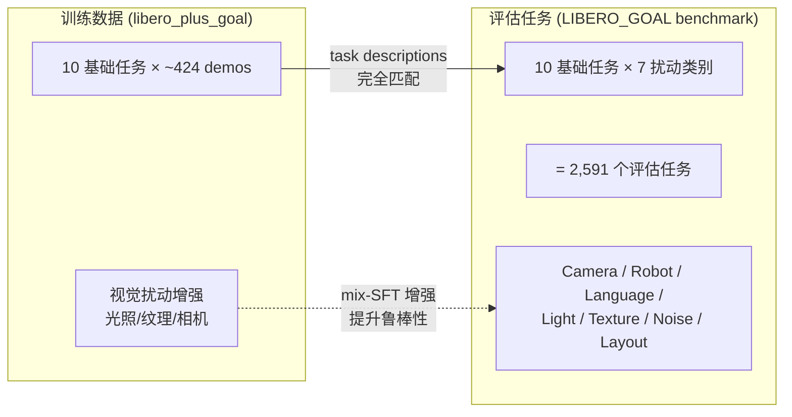
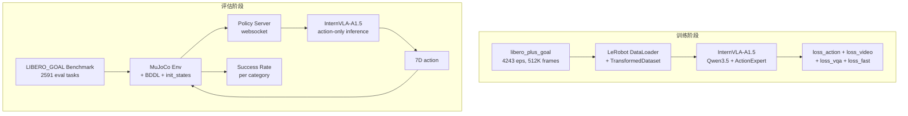

# LIBERO-Plus-Goal 训练数据集深入分析

> **分析对象**: `/B/Dta/LIBERO/libero_plus_goal/`
> **数据格式**: LeRobot v2.1
> **来源**: [HuggingFace Sylvest/libero_plus_data_4suite](https://huggingface.co/datasets/Sylvest/libero_plus_data_4suite/tree/main)
> **关联代码库**: `/B/SRC/LIBERO-plus/`（[LIBERO-Plus 论文](https://arxiv.org/abs/2510.13626)官方实现）

---

## 1. 数据集概览

### 1.1 核心指标

| 指标 | 值 |
|------|-----|
| 总 episode 数 | 4,243 |
| 总帧数 | 512,604 |
| 总时长 | 25,630 秒 ≈ 427 分钟 ≈ 7.1 小时 |
| 任务数 | 10 |
| 采样频率 | 20 Hz |
| 磁盘占用 | ~3.4 GB |
| 格式版本 | LeRobot v2.1 (`codebase_version: v2.1`) |
| 机器人类型 | `panda`（Franka Emika Panda） |
| 数据分割 | `train: 0:4243`（仅训练集） |

### 1.2 与原始 LIBERO 的对比

| 属性 | 原始 LIBERO `libero_goal` | LIBERO-Plus-Goal |
|------|---------------------------|------------------|
| 数据格式 | RLDS TFRecord | LeRobot v2.1 |
| Episode 数 | 428 | 4,243 |
| **扩增倍率** | — | **9.9×** |
| 每任务 demos | ~42-43 | 320-500 |
| 扰动增强 | 无（基线条件） | 有（光照、纹理、相机等） |
| 视频编码 | JPEG 帧序列 | AV1 (MP4) |
| 用途 | 基线训练/评估 | 抗扰动 mix-SFT 训练 |

> **关键洞察**: 该数据集是 LIBERO-Plus 论文为 "mix-SFT"（混合监督微调）提供的训练数据。9.9× 的扩增并非简单的数据复制，而是在**多种扰动条件**下重新采集的机器人演示——同一个基础任务在不同光照、背景纹理、相机视角等条件下由 scripted policy 执行并记录。这使模型在训练时就见过多样化的视觉条件，从而在 LIBERO-Plus 的 2,591 个扰动评估任务上表现更好。论文中 OpenVLA-OFT+ 通过 mix-SFT 将总成功率从 69.6% 提升到 79.6%（+10%），证实了该训练策略的有效性。

---

## 2. 数据结构

### 2.1 目录结构

```
/B/Dta/LIBERO/libero_plus_goal/
├── meta/
│   ├── info.json               # 数据集元数据（features, splits, paths）
│   ├── episodes.jsonl          # 4,243 行，每行一个 episode 的 task + length
│   ├── episodes_stats.jsonl    # 4,243 行，每行一个 episode 的 per-feature 统计
│   └── tasks.jsonl             # 10 行，task_index → task_description 映射
├── data/
│   ├── chunk-000/              # episode_000000 ~ episode_000999 (1,000 parquets)
│   ├── chunk-001/              # episode_001000 ~ episode_001999 (1,000 parquets)
│   ├── chunk-002/              # episode_002000 ~ episode_002999 (1,000 parquets)
│   ├── chunk-003/              # episode_003000 ~ episode_003999 (1,000 parquets)
│   └── chunk-004/              # episode_004000 ~ episode_004242 (243 parquets)
├── videos/
│   ├── chunk-000/
│   │   ├── observation.images.front/   # agentview 相机 MP4 (1,000 files)
│   │   └── observation.images.wrist/   # 腕部相机 MP4 (1,000 files)
│   ├── chunk-001/ ~ chunk-004/         # 同上
└── images/
    ├── observation.images.front/       # 空目录
    └── observation.images.wrist/       # 空目录
```

**磁盘分布**:

| 目录 | 大小 | 占比 |
|------|------|------|
| `videos/` | ~3.3 GB | 97.1% |
| `data/` (parquets) | ~60 MB | 1.8% |
| `meta/` | ~11 MB | 0.3% |
| `images/` | ~12 KB | ≈ 0% |
| **总计** | **~3.4 GB** | |

### 2.2 Chunk 分布

| Chunk | Episode 范围 | Parquet 数 | 前视视频数 | 腕部视频数 |
|-------|-------------|-----------|-----------|-----------|
| chunk-000 | [000000, 000999] | 1,000 | 1,000 | 1,000 |
| chunk-001 | [001000, 001999] | 1,000 | 1,000 | 1,000 |
| chunk-002 | [002000, 002999] | 1,000 | 1,000 | 1,000 |
| chunk-003 | [003000, 003999] | 1,000 | 1,000 | 1,000 |
| chunk-004 | [004000, 004242] | 243 | 243 | 243 |
| **总计** | | **4,243** | **4,243** | **4,243** |

> Parquet、前视视频、腕部视频三者 1:1:1 严格对齐，`chunks_size = 1000`。

---

## 3. Feature 定义

### 3.1 Parquet Schema

每个 episode 的 parquet 文件包含以下列：

| 列名 | dtype | shape | 语义 |
|------|-------|-------|------|
| `observation.state` | float32 | [8] | EEF 状态：位置(3) + 轴角(3) + 手指(2) |
| `action` | float32 | [7] | Delta EEF 动作：位置(3) + 轴角(3) + 夹爪(1) |
| `timestamp` | float32 | [1] | 帧时间戳（秒），`t = frame_index / fps` |
| `frame_index` | int64 | [1] | 当前 episode 内的帧索引 |
| `episode_index` | int64 | [1] | 全局 episode 索引 |
| `index` | int64 | [1] | 全局帧索引（跨所有 episode 的累计计数） |
| `task_index` | int64 | [1] | 任务索引（0-9，对应 `tasks.jsonl`） |

> **注意**: Parquet 中**不包含图像数据**。图像以 AV1 编码的 MP4 视频存储在 `videos/` 目录下，通过 `episode_index` 和 `frame_index` 与 parquet 对齐。这是 LeRobot v2.1 的标准做法——将高体积的视频数据与低体积的状态/动作数据分离存储。

### 3.2 视频特征

| 特征 | 值 |
|------|-----|
| 前视相机键名 | `observation.images.front` |
| 腕部相机键名 | `observation.images.wrist` |
| 分辨率 | 256 × 256 |
| 编码 | AV1 (`av1`) |
| 像素格式 | `yuv420p` |
| 帧率 | 20 fps |
| 通道数 | 3 (RGB) |
| 音频 | 无 |

> **视频文件大小差异显著**：同一个 chunk 内，前视视频大小从 ~90 KB 到 ~1.5 MB 不等，反映了不同扰动条件下的场景复杂度差异（如光照条件简单时压缩率高，背景纹理丰富时压缩率低）。

---

## 4. `observation.state` 语义解析

```
observation.state[8D] = [eef_pos_x, eef_pos_y, eef_pos_z,
                          axis_angle_x, axis_angle_y, axis_angle_z,
                          finger_left, finger_right]
```

### 4.1 各维度统计

| 维度 | 语义 | 全局最小值 | 全局最大值 | 均值 | 标准差 | 单位 |
|------|------|-----------|-----------|------|--------|------|
| 0 | EEF x 位置 | -0.456 | 0.136 | -0.097 | 0.121 | 米 |
| 1 | EEF y 位置 | -0.301 | 0.337 | 0.026 | 0.112 | 米 |
| 2 | EEF z 位置 | 0.909 | 1.366 | 1.062 | 0.105 | 米 |
| 3 | 轴角 x | 1.085 | 3.401 | 2.904 | 0.481 | 弧度 |
| 4 | 轴角 y | -1.481 | 2.521 | 0.205 | 0.640 | 弧度 |
| 5 | 轴角 z | -1.280 | 0.721 | -0.250 | 0.343 | 弧度 |
| 6 | 左手指开合 | -0.001 | 0.042 | 0.028 | 0.015 | 米 |
| 7 | 右手指开合 | -0.042 | 0.001 | -0.027 | 0.015 | 米 |

**轴角表示** ($\vec{a} = \theta \cdot \hat{n}$):
- 维度 3-5 构成一个轴角向量，其模长 $\|\vec{a}\| = \theta$ 是旋转角度（弧度），方向 $\hat{n}$ 是旋转轴
- 全局模长范围 [2.03, 3.45] 弧度，均值 ~3.00 弧度（接近 $\pi$），说明末端执行器大部分时间接近倒置姿态（tool-down），这与 Panda 机器人在桌面操作场景中的典型构型一致

**手指状态**:
- dim 6（左手指）和 dim 7（右手指）近似相反数：$|d_6 + d_7| \approx 0.001$
- 范围 ~[0, 0.04] 米，对应 Panda gripper 的物理行程
- 全开时 dim6 ≈ 0.04, dim7 ≈ -0.04；全闭时两者趋近 0

### 4.2 各任务的 EEF 工作空间

| 任务 | x 范围 | y 范围 | z 范围 |
|------|--------|--------|--------|
| open the middle drawer of the cabinet | [-0.21, 0.10] | [-0.15, 0.12] | [0.99, 1.19] |
| open the top drawer and put the bowl inside | [-0.22, 0.10] | [-0.11, 0.14] | [0.91, 1.33] |
| push the plate to the front of the stove | [-0.21, 0.11] | [-0.03, 0.34] | [0.91, 1.18] |
| put the bowl on the plate | [-0.22, 0.09] | [-0.01, 0.07] | [0.91, 1.18] |
| put the bowl on the stove | [-0.28, 0.00] | [-0.01, 0.28] | [0.91, 1.19] |
| put the bowl on top of the cabinet | [-0.21, 0.04] | [-0.24, 0.08] | [0.91, 1.28] |
| put the cream cheese in the bowl | [-0.22, 0.03] | [-0.04, 0.17] | [0.91, 1.18] |
| put the wine bottle on the rack | [-0.24, -0.09] | [-0.30, 0.07] | [0.95, 1.30] |
| put the wine bottle on top of the cabinet | [-0.24, 0.01] | [-0.24, 0.01] | [0.99, 1.37] |
| turn on the stove | [-0.46, -0.20] | [-0.02, 0.24] | [0.92, 1.19] |

> `turn on the stove` 的 x 范围明显偏负（[-0.46, -0.20]），因为炉灶旋钮位于工作台的左侧深处。`put the wine bottle on the rack` 的 y 范围最广（[-0.30, 0.07]），因为酒架的横向跨度较大。

---

## 5. Action 语义解析

```
action[7D] = [delta_pos_x, delta_pos_y, delta_pos_z,
              delta_axisangle_x, delta_axisangle_y, delta_axisangle_z,
              gripper_cmd]
```

### 5.1 各维度统计

| 维度 | 语义 | 最小值 | 最大值 | 均值 | 标准差 |
|------|------|--------|--------|------|--------|
| 0 | $\Delta$ EEF x | -0.9375 | 0.9375 | 0.044 | 0.408 |
| 1 | $\Delta$ EEF y | -0.9375 | 0.9375 | 0.041 | 0.354 |
| 2 | $\Delta$ EEF z | -0.9375 | 0.9375 | -0.157 | 0.494 |
| 3 | $\Delta$ 轴角 x | -0.237 | 0.340 | -0.003 | 0.048 |
| 4 | $\Delta$ 轴角 y | -0.273 | 0.375 | 0.024 | 0.078 |
| 5 | $\Delta$ 轴角 z | -0.227 | 0.375 | 0.024 | 0.096 |
| 6 | 夹爪指令 | -1.0 | 1.0 | -0.260 | 0.966 |

### 5.2 动作特征分析

**位移动作 (dims 0-2)**:
- 被 clip 到 $[-0.9375, 0.9375]$，其中 $0.9375 = \frac{15}{16}$
- 存在约 701 个离散值，暗示 LIBERO 的 scripted policy 在量化后输出
- 位移幅度（L2 范数）：均值 0.654，最大 1.341

**旋转动作 (dims 3-5)**:
- 范围远小于位移：最大约 $\pm 0.375$ 弧度（$\approx 21.5°$）
- 均值近零，说明大部分时间不做大幅旋转调整

**夹爪指令 (dim 6)**:
- 严格二值：$\{-1.0, +1.0\}$，无中间状态
- $-1.0$（张开）占 63.0%，$+1.0$（闭合）占 37.0%
- 对应 `action_mask_spec: [6, -1]`——前 6 维是 delta，最后 1 维是绝对值

---

## 6. 任务分布

### 6.1 每任务 Episode/帧分布

| 任务 | Episodes | 帧数 | 帧占比 | 平均长度 |
|------|----------|------|--------|----------|
| turn on the stove | 500 | 44,540 | 8.7% | 89.1 |
| put the bowl on the plate | 490 | 45,630 | 8.9% | 93.1 |
| put the bowl on the stove | 480 | 48,540 | 9.5% | 101.1 |
| put the wine bottle on top of the cabinet | 470 | 50,270 | 9.8% | 107.0 |
| put the bowl on top of the cabinet | 470 | 47,160 | 9.2% | 100.3 |
| open the middle drawer of the cabinet | 430 | 59,490 | 11.6% | 138.3 |
| put the cream cheese in the bowl | 400 | 42,030 | 8.2% | 105.1 |
| put the wine bottle on the rack | 360 | 61,640 | 12.0% | 171.2 |
| push the plate to the front of the stove | 323 | 48,014 | 9.4% | 148.7 |
| open the top drawer and put the bowl inside | 320 | 65,290 | 12.7% | 204.0 |

**观察**:
1. **Episode 数分布不均**: 最多 500（turn on the stove），最少 320（open top drawer），约 1.56× 差距
2. **帧数分布更不均**: 因 episode 长度差异（简单任务短、复杂任务长），最多 65,290 帧（open top drawer），最少 42,030 帧（put cream cheese），1.55× 差距
3. **任务复杂度与 episode 长度正相关**:
   - 简单的单步任务（turn on the stove, put bowl on plate）平均 ~90 帧
   - 多步骤任务（open top drawer and put bowl inside, put wine bottle on rack）平均 ~170-204 帧

### 6.2 Episode 长度分布

| 长度区间 | Episode 数 | 占比 |
|----------|-----------|------|
| [75, 80) | 90 | 2.1% |
| [80, 100) | 1,560 | 36.8% |
| [100, 120) | 1,016 | 23.9% |
| [120, 150) | 729 | 17.2% |
| [150, 200) | 680 | 16.0% |
| [200, 300) | 168 | 4.0% |

- 最短: 75 帧 (3.75s)，最长: 299 帧 (14.95s)
- 中位数: 105 帧 (5.25s)，均值: 120.8 帧 (6.04s)
- 标准差: 37.5 帧

> 约 60% 的 episode 在 80-120 帧之间，反映了大多数任务（pick-and-place、按钮操作）可在 4-6 秒内完成。尾部的 200-300 帧 episode 来自复杂的多步骤任务。

---

## 7. 扰动增强证据

该数据集虽然每个 episode 的文本指令只使用 10 个基础任务描述（无扰动后缀），但通过分析 `episodes_stats.jsonl` 中的图像统计量，可以确认数据是在**不同的视觉条件**下采集的。

### 7.1 图像亮度方差分析

对每个 episode 的 `observation.images.front` 计算 RGB 均值亮度（三通道平均），按任务分组：

| 任务 | 亮度均值 | 亮度标准差 | 亮度范围 |
|------|---------|-----------|---------|
| open the middle drawer of the cabinet | 0.403 | 0.087 | [0.161, 0.530] |
| open the top drawer and put the bowl inside | 0.408 | 0.081 | [0.163, 0.544] |
| push the plate to the front of the stove | 0.407 | 0.092 | [0.147, 0.565] |
| put the bowl on the plate | 0.410 | 0.079 | [0.151, 0.547] |
| put the bowl on the stove | 0.402 | 0.088 | [0.169, 0.524] |
| put the bowl on top of the cabinet | 0.403 | 0.090 | [0.145, 0.520] |
| put the cream cheese in the bowl | 0.395 | 0.094 | [0.165, 0.567] |
| put the wine bottle on the rack | 0.409 | 0.082 | [0.150, 0.541] |
| put the wine bottle on top of the cabinet | 0.407 | 0.081 | [0.143, 0.522] |
| turn on the stove | 0.394 | 0.090 | [0.160, 0.558] |

**平均亮度标准差 = 0.086**——在同一任务内，不同 episode 的亮度从 ~0.14 到 ~0.57 变化（4× 范围），远超原始 LIBERO 中仅有固定光照条件下的微小变化。这表明数据采集时变换了**光照条件 (Light Conditions)** 和/或 **背景纹理 (Background Textures)**。

### 7.2 初始 EEF 位置方差分析

| 任务 | 初始位置 std(x) | std(y) | std(z) |
|------|----------------|--------|--------|
| open the middle drawer | 0.0090 | 0.0070 | 0.0049 |
| open the top drawer | 0.0081 | 0.0069 | 0.0053 |
| push the plate | 0.0061 | 0.0073 | 0.0055 |
| put bowl on plate | 0.0063 | 0.0053 | 0.0078 |
| put bowl on stove | 0.0046 | 0.0057 | 0.0065 |
| put bowl on top cabinet | 0.0068 | 0.0066 | 0.0067 |
| put cream cheese in bowl | 0.0061 | 0.0074 | 0.0062 |
| put wine bottle on rack | 0.0088 | 0.0079 | 0.0062 |
| put wine bottle on top | 0.0064 | 0.0054 | 0.0059 |
| turn on the stove | 0.0052 | 0.0071 | 0.0064 |

**初始位置 std ≈ 0.005-0.009 米**——变化量约为 5-9 毫米。这个量级对应的是 LIBERO 中不同 demo 之间的自然初始化变化（scripted policy 的 homing 位置微小抖动），而非 LIBERO-Plus 评估时使用的 "Robot Initial States" 扰动（后者的位移在厘米量级，且由专门的 `.pruned_init` 文件控制）。

> **结论**: 训练数据中的扰动增强**主要体现在视觉维度**（光照、纹理、可能的相机视角），而**非机器人动力学维度**（初始姿态）。这与 mix-SFT 策略的设计意图一致——通过在多样化的视觉条件下采集 demo，提升模型对视觉扰动的鲁棒性。

---

## 8. 与 InternVLA 训练管线的兼容性

### 8.1 图像键名不匹配（关键问题）

| 项目 | 该数据集 | InternVLA `libero.yaml` 期望 |
|------|---------|---------------------------|
| 前视相机 | `observation.images.front` | `observation.images.image` |
| 腕部相机 | `observation.images.wrist` | `observation.images.image2` |

InternVLA 的 `libero.yaml`（位于 `src/lerobot/dataset_schemas/configs/libero.yaml`）定义了 `image_mapping`:

```yaml
image_mapping:
    observation.images.image: observation.images.image0
    observation.images.image2: observation.images.image1
```

该映射假设源数据集使用 `observation.images.image0` / `observation.images.image1` 作为视频键名。而 LIBERO-Plus-Goal 数据集使用 `observation.images.front` / `observation.images.wrist`。

**解决方案**（按推荐度排列）:

1. **新增 `dataset_schemas` 配置项**（推荐）: 在 `libero.yaml` 中添加一个 `robot_type: libero_plus_goal` 条目，映射 `observation.images.image: observation.images.front`，`observation.images.image2: observation.images.wrist`
2. **重命名视频目录**: 将 `videos/*/observation.images.front/` → `observation.images.image/`，`observation.images.wrist/` → `observation.images.image2/`，并修改 `info.json` 中对应的 feature 名
3. **符号链接**: `ln -s observation.images.front observation.images.image`

### 8.2 其他兼容性检查

| 检查项 | 状态 | 说明 |
|--------|------|------|
| `observation.state` shape | ✅ 兼容 | [8] = EEF pos(3) + axisangle(3) + gripper(2)，与 InternVLA 期望一致 |
| `action` shape | ✅ 兼容 | [7] = delta_pos(3) + delta_rot(3) + gripper(1) |
| `action_mask_spec` | ✅ 兼容 | [6, -1]（前 6 维 delta，末位绝对值） |
| FPS | ⚠️ 需确认 | 数据集 20Hz，InternVLA 训练可能使用 10Hz（decimation=2） |
| 分辨率 | ✅ 兼容 | 256×256，InternVLA 会 resize 到 224×224 |
| LeRobot 版本 | ⚠️ 需确认 | 数据集 v2.1，InternVLA 代码库的 LeRobot 版本需检查兼容性 |
| NaN 检查 | ✅ 无 NaN | 采样检查无任何 NaN 值 |

---

## 9. 与 LIBERO-Plus 评估任务的关系

### 9.1 训练 vs 评估的任务对应



训练数据的 10 个基础任务与评估 benchmark 的 10 个基础任务**完全相同**（集合交集 = 10/10）：

| task_index | 训练数据任务描述 | 评估 benchmark 基础任务 |
|------------|-----------------|----------------------|
| 0 | put the cream cheese in the bowl | ✅ 匹配 |
| 1 | put the wine bottle on top of the cabinet | ✅ 匹配 |
| 2 | open the middle drawer of the cabinet | ✅ 匹配 |
| 3 | put the bowl on the plate | ✅ 匹配 |
| 4 | put the wine bottle on the rack | ✅ 匹配 |
| 5 | put the bowl on top of the cabinet | ✅ 匹配 |
| 6 | open the top drawer and put the bowl inside | ✅ 匹配 |
| 7 | put the bowl on the stove | ✅ 匹配 |
| 8 | turn on the stove | ✅ 匹配 |
| 9 | push the plate to the front of the stove | ✅ 匹配 |

### 9.2 训练-评估数据流



---

## 10. 数据质量总结

| 检查项 | 结果 |
|--------|------|
| Parquet-视频对齐 | ✅ 4,243 parquets = 4,243 front videos = 4,243 wrist videos |
| Chunk 连续性 | ✅ episode 索引在 chunk 间连续无间隙 |
| NaN 值 | ✅ 采样中未发现任何 NaN |
| State 值域 | ✅ 所有维度在物理合理范围内 |
| Action 值域 | ✅ 位移 clip 到 $\pm 0.9375$，旋转 $< \pm 0.375$，夹爪严格二值 |
| 任务覆盖 | ✅ 10/10 任务完整匹配评估 benchmark |
| 数据一致性 | ✅ `total_frames` (info.json) = Σ episode lengths (episodes.jsonl) = 512,604 |
| 视觉多样性 | ✅ 图像亮度 std ~0.086 表明视觉扰动增强有效 |

---

## 11. `keypoint_history_max_len` 选择分析

### 11.1 参数含义与训练管线

设：

- \(H\) = `keypoint_history_max_len`，历史关键点帧数；
- \(C\) = `chunk_size`，未来动作/关键点 chunk 长度；
- \(t\) = 当前 episode 内的帧索引；
- \(f\) = 数据采样频率。

对当前 InternVLA-A1.5 GeoPredict 管线，关键点查询窗口大致为：

$$
[-H,\ldots,-1,0,1,\ldots,C]
$$

因此总查询帧数为：

$$
N_{\text{query}} = H + 1 + C
$$

其中：

- `his_kpts` 使用当前帧之前的 \(H\) 帧；
- `kpt_t` 使用当前帧；
- `kpt_future` 使用当前帧之后的 \(C\) 帧；
- episode 边界之外的索引会被 clamp，并由 `*_is_pad` 标记；
- `Extract3DKeypointTransformFn` 会把有效历史帧放在 `his_kpts` 前部，把无效部分补零，并通过 `his_len` 告诉 `TrackEncoder` 有多少帧有效。

相关实现：

- `/B/SRC/itvlaGpLibPlus/src/lerobot/policies/internvla_a1_5/configuration_internvla_a1_5.py`
  - `chunk_size` 默认值为 50；
  - `keypoint_history_max_len` 是 TrackEncoder 的历史容量；
- `/B/SRC/itvlaGpLibPlus/src/lerobot/policies/internvla_a1_5/transform_internvla_a1_5.py`
  - `Extract3DKeypointTransformFn` 负责窗口拆分、边界 mask 和 `his_len`；
- `/B/SRC/itvlaGpLibPlus/src/lerobot/policies/internvla_a1_5/keypoints.py`
  - `PointPatchEmbedding` 使用 `patch_size=4` 对历史时间维做 patchify。

### 11.2 该数据集的时间尺度

对 `/B/Dta/LIBERO/libero_plus_goal/` 的 `episodes.jsonl` 和全部 parquet 进行统计，得到：

| 指标 | 结果 |
|------|------|
| Episodes | 4,243 |
| 总帧数 | 512,604 |
| FPS | 20 Hz |
| 最短 episode | 75 帧 = 3.75 秒 |
| P10 | 88 帧 = 4.40 秒 |
| 中位数 | 105 帧 = 5.25 秒 |
| P75 | 139 帧 = 6.95 秒 |
| P90 | 181 帧 = 9.05 秒 |
| 最长 episode | 299 帧 = 14.95 秒 |
| 平均 episode | 120.81 帧 = 6.04 秒 |

任务之间存在明显的时间尺度差异：

- 简单操作，例如 `turn on the stove`、`put the bowl on the plate`，大多约 4–6 秒；
- `open the middle drawer of the cabinet`、`push the plate to the front of the stove`，通常约 6–9 秒；
- `open the top drawer and put the bowl inside`、`put the wine bottle on the rack` 是明显的多阶段长任务，平均约 8.5–10.2 秒，最长接近 15 秒。

因此，不能简单把最长 episode 的长度 299 帧作为历史窗口。历史关键点的职责是描述**近期运动轨迹和运动阶段**，而不是替代语言指令、当前图像和整个 episode 的任务记忆。

### 11.3 运动相关性对历史长度的约束

当前数据没有 `observation.keypoint_3d` 列，只有 EEF 位置、轴角和夹爪状态。因此，在关键点生成之前，使用 `observation.state` 的 EEF 位置/姿态变化作为关键点时间尺度的代理。

20 Hz 数据上的实测结果：

- EEF 位置速度方向相关性：
  - 0.5 秒滞后时约为 0.50；
  - 1.0 秒滞后时已经接近 0；
  - 更长滞后不再呈现稳定的局部运动方向信息。
- EEF 位置的跨帧位移：
  - 2.5 秒时中位位移约 0.193 m；
  - 5.0 秒时中位位移约 0.249 m；
  - 7.5 秒时中位位移下降到约 0.206 m，继续增加窗口并没有带来持续增加的局部运动信息。

这说明历史窗口至少应覆盖数秒的接近、抓取和放置过程，但超过 6–8 秒后，新增帧更多是较早的旧轨迹，边际信息明显下降。

### 11.4 候选值比较

以下计算固定 \(C=50\)，即未来窗口为 2.5 秒。

| H | 历史时长 | 查询窗口 | 查询窗口覆盖的 episode 比例* | 平均有效历史 | 时间 patch 数 |
|---:|---:|---:|---:|---:|---:|
| 90 | 4.5 秒 | 7.05 秒 | 76.2% | 56.1 帧 | 23 |
| 100 | 5.0 秒 | 7.55 秒 | 80.7% | 58.4 帧 | 25 |
| 112 | 5.6 秒 | 8.15 秒 | 85.1% | 60.5 帧 | 28 |
| 120 | 6.0 秒 | 8.55 秒 | 87.4% | 61.6 帧 | 30 |
| **128** | **6.4 秒** | **8.95 秒** | **89.96%** | **62.5 帧** | **32** |
| 144 | 7.2 秒 | 9.75 秒 | 94.4% | 63.8 帧 | 36 |
| 150 | 7.5 秒 | 10.05 秒 | 96.3% | 64.1 帧 | 38 |
| 200 | 10.0 秒 | 12.55 秒 | 99.3% | 65.5 帧 | 50 |

\* “查询窗口覆盖”是一个 episode 级粗指标，表示 episode 长度不超过 \(H+1+C\)。它不表示每个样本都拥有 \(H\) 帧有效历史；episode 开头的历史必然逐步增长，episode 末尾的未来窗口可能发生 clamp。

关键观察：

1. 从 \(H=128\) 增大到 \(H=200\)，平均有效历史只增加约 3 帧；
2. `TrackEncoder` 的 temporal patch 数从 32 增加到 50，增加约 56.25%；
3. \(H=128\) 已经使约 90% 的 episode 的“历史 + 当前 + 未来 chunk”落入一个窗口；
4. \(H=150\) 虽然覆盖率更高，但相对于 \(H=128\) 只多约 1.6 个平均有效历史帧，却增加约 18.75% 的 patch 数；
5. \(H=90\) 或 \(H=100\) 计算便宜，但对多阶段抽屉、酒架任务的历史覆盖偏短。

### 11.5 推荐值

综合 episode 时间尺度、EEF 运动相关性、episode 边界利用率和 TrackEncoder 计算成本，推荐：

```text
keypoint_history_max_len = 128
```

理由：

1. **时间上合理**：20 Hz 下为 6.4 秒，覆盖大多数局部接近/抓取/放置运动；
2. **与未来 chunk 匹配**：\(H=128\) 与 \(C=50\) 形成约 8.95 秒的总查询范围，接近 P90 episode 时间尺度；
3. **结构上友好**：128 是 `patch_size=4` 的整数倍，不需要额外的时间 patch 补齐；
4. **计算上适中**：32 个 temporal patches，明显低于默认 200 对应的 50 个；
5. **对长任务有余量**：比 90/100 帧多出 1.4–1.9 秒历史，可覆盖一部分多阶段任务上下文；
6. **不会把完整任务记忆错误地塞进 keypoint history**：任务身份仍由语言和图像承担。

训练和推理必须使用相同值：

```bash
--policy.keypoint_history_max_len=128 \
--dataset.keypoint_history_max_len=128
```

同时必须保持 `his_kpts` 的语义为“严格早于当前帧的历史”，不能把当前帧重复放入历史。

### 11.6 什么时候选择其他值

#### 选择 100

适合显存或吞吐优先的实验。它在普通 4–6 秒任务上基本够用，但应重点验证：

- `open the top drawer and put the bowl inside`；
- `put the wine bottle on the rack`；
- 多阶段任务的 `loss_kpt_future` 和成功率。

#### 选择 150

适合长任务成功率明显受历史长度影响的情况。它可以作为 `H=128` 的第二个 A/B 值，但不建议作为首个默认值，因为新增的有效历史很少，计算成本却更高。

#### 选择 200

只有在验证表明长任务确实依赖超过 7 秒的 keypoint history 时才使用。它不是该数据集的默认最优值：大多数 episode 没有这么长的有效历史，平均有效历史只比 128 多约 3 帧。

### 11.7 验收与 A/B 方案

首次训练建议固定其他配置，仅比较：

```text
H ∈ {100, 128, 150, 200}
```

每个值至少记录：

1. `loss_kpt_current`；
2. `loss_kpt_future`；
3. `loss_action`；
4. 每个任务的离线 open-loop 指标；
5. 显存峰值和 samples/sec；
6. `open the top drawer and put the bowl inside`、`put the wine bottle on the rack` 两个长任务的独立成功率；
7. LIBERO-Plus 各扰动类别的成功率，尤其是 Robot Initial States、Camera Viewpoints 和 Objects Layout。

推荐的接受规则：

- 若 `H=128` 与 `H=150` 成功率差异小于实验噪声，则选择 `H=128`；
- 若 `H=150` 在长任务上稳定提高成功率，且吞吐下降可接受，则选择 `H=150`；
- 若 `H=200` 没有带来统计显著的成功率提升，则不采用；
- 训练和评估配置中的 H 不一致时，直接判定为不合格，不比较成功率。

### 11.8 当前数据的前置限制

该数据集当前 parquet 只有 `observation.state` 和 `action`，没有 `observation.keypoint_3d`。因此，使用 GeoPredict/InternVLA keypoint 分支前还必须完成：

1. 从 LIBERO/Panda 的 simulator state 或关节状态生成关键点；
2. 固化关键点坐标系、关键点数量、位置归一化和四元数约定；
3. 把 `observation.keypoint_3d` 写回每个 episode parquet；
4. 生成并校验 `keypoints_meta.json`；
5. 确认训练与评估端使用同一套 FK、URDF/MJCF 坐标系和 H=128。

在关键点注入完成前，`keypoint_history_max_len` 只能完成配置层面的选择，不能据此宣称 keypoint 分支已经被实测验证。

---

## 参考来源

| 来源 | 说明 |
|------|------|
| `/B/Dta/LIBERO/libero_plus_goal/meta/info.json` | 数据集元数据、feature schema |
| `/B/Dta/LIBERO/libero_plus_goal/meta/episodes.jsonl` | 每 episode 的任务和长度 |
| `/B/Dta/LIBERO/libero_plus_goal/meta/episodes_stats.jsonl` | 每 episode 的 per-feature 统计 |
| `/B/Dta/LIBERO/libero_plus_goal/meta/tasks.jsonl` | 任务索引与描述的映射 |
| `/B/SRC/itvlaGpLibPlus/src/lerobot/dataset_schemas/configs/libero.yaml` | InternVLA 的 LIBERO 数据集 schema 配置 |
| `/B/SRC/LIBERO-plus/libero/libero/benchmark/__init__.py` | LIBERO-Plus benchmark 注册与任务构建 |
| `/B/SRC/LIBERO-plus/libero/libero/benchmark/task_classification.json` | 评估任务的扰动类别与难度 |
| [LIBERO-Plus 论文 (arXiv:2510.13626)](https://arxiv.org/abs/2510.13626) | Benchmark 设计、mix-SFT 策略、OpenVLA-OFT+ 实验结果 |
| [HuggingFace Sylvest/libero_plus_data_4suite](https://huggingface.co/datasets/Sylvest/libero_plus_data_4suite) | 数据集发布页，4 个子套件的训练数据 |
