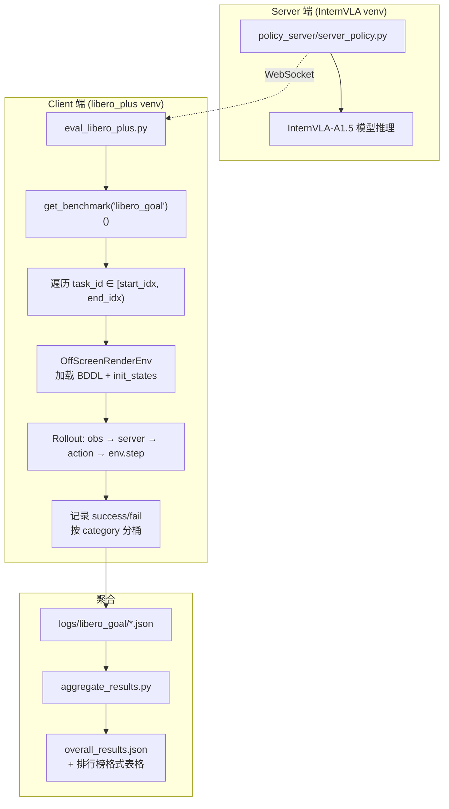
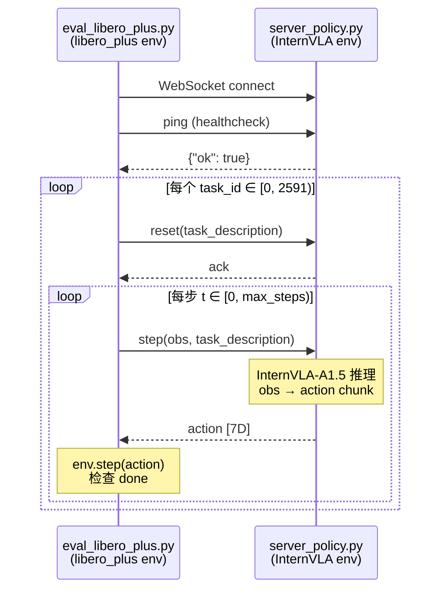

# LIBERO-Plus Goal 子套件单独评估方案

> **目标**: 仅对 LIBERO-Plus 的 `libero_goal` 子套件（2,591 个扰动任务）进行 VLA 模型评估，跳过其余 3 个子套件（libero_spatial / libero_object / libero_10），并生成与全套件评估格式兼容的聚合结果。

---

## 1. 可行性分析

### 1.1 现有架构是否支持单套件评估？

**结论：完全支持，无需修改任何源码。**

现有评估流程的架构天然支持只评估单个子套件，关键证据如下：

| 层级 | 机制 | 代码位置 | 说明 |
|------|------|----------|------|
| Benchmark 注册 | `@register_benchmark` 装饰器 | `LIBERO-plus/libero/libero/benchmark/__init__.py:16-18` | `LIBERO_GOAL` 是独立注册的类，可单独实例化 |
| 评估脚本 CLI | `--task_suite_name` 参数 | `evaluation/LIBERO-plus/eval_libero_plus.py:198-201` | 直接接受 `libero_goal` 作为值 |
| 启动脚本 | `TASK_SUITES` 数组 | `evaluation/LIBERO-plus/run_eval_libero_plus.sh:58` | 可修改为只含 `libero_goal` |
| 单 GPU 脚本 | `TASK_SUITE` 环境变量 | `evaluation/LIBERO-plus/run_eval_libero_plus_single.sh:37` | 默认值就是 `libero_goal` |
| 聚合脚本 | 按目录扫描 | `evaluation/LIBERO-plus/aggregate_results.py:38-44` | 只有 `logs/libero_goal/` 下有 JSON 时只聚合该套件 |

### 1.2 评估流程总览



### 1.3 `libero_goal` 子套件数据概况

| 属性 | 值 |
|------|-----|
| 子套件名 | `libero_goal` |
| Benchmark 类 | `LIBERO_GOAL` |
| 总任务数 | 2,591 |
| 基础任务数 | 10 |
| 最大仿真步数 | 300 |
| `num_trials_per_task` | 1（LIBERO-Plus 规范） |

**基础任务列表**（来源：`bddl_files/libero_goal/tasks_info.txt`）:

| # | 任务描述 |
|---|----------|
| 1 | open the middle drawer of the cabinet |
| 2 | open the top drawer and put the bowl inside |
| 3 | push the plate to the front of the stove |
| 4 | put the bowl on the plate |
| 5 | put the bowl on the stove |
| 6 | put the bowl on top of the cabinet |
| 7 | put the cream cheese in the bowl |
| 8 | put the wine bottle on the rack |
| 9 | put the wine bottle on top of the cabinet |
| 10 | turn on the stove |

**按扰动类别分布**（来源：`task_classification.json`）:

| 扰动类别 | 任务数 |
|----------|--------|
| Objects Layout | 425 |
| Language Instructions | 410 |
| Robot Initial States | 409 |
| Camera Viewpoints | 408 |
| Sensor Noise | 379 |
| Background Textures | 281 |
| Light Conditions | 279 |

---

## 2. 评估方案

提供 3 种方案，按从简单到复杂排列，适用于不同场景。

### 方案 A：使用现有 `run_eval_libero_plus_single.sh`（单 GPU，最简单）

**适用场景**: 快速验证、小规模测试、单 GPU 机器。

**原理**: `run_eval_libero_plus_single.sh` 的 `TASK_SUITE` 环境变量默认值就是 `libero_goal`，并且支持通过 `START_IDX` / `END_IDX` 控制评估范围。要评估完整的 `libero_goal` 套件，只需设置 `END_IDX=-1`（或 2591）。

**命令**:

```bash
# 必需的环境变量
export CKPT_PATH="<InternVLA-A1.5 checkpoint 路径>"
export LIBERO_HOME="/B/SRC/LIBERO-plus"
export VLM_MODEL_PATH="<Qwen3.5 VLM 权重路径>"

# 可选调整
export GPU_ID=0
export TASK_SUITE=libero_goal
export START_IDX=0
export END_IDX=-1                      # -1 = 评估全部 2591 个任务
export NUM_TRIALS_PER_TASK=1           # LIBERO-Plus 标准
export EVAL_LOG_DIR="outputs/sim_eval/libero_plus_goal_only/$(date +%Y%m%d_%H%M%S)"

# 如果 checkpoint 是 action-only（跳过 WAN），不需设 WAN 路径
export ACTION_LOSS_ONLY_FLAG="--action_loss_only"

# 启动
bash evaluation/LIBERO-plus/run_eval_libero_plus_single.sh
```

**预估耗时**: 单 GPU 约 2,591 × (300步 × ~0.05s/步 + 环境初始化) ≈ **12-15 小时**。

**输出结构**:

```
outputs/sim_eval/libero_plus_goal_only/<timestamp>/
├── logs/libero_goal/0_to_2591.json     # 每个 category 的 success_count / total_count
├── videos/libero_goal/                  # rollout 录像（若开启）
├── overall_results.json                 # 聚合结果（只含 Goal 一个套件）
├── libero_config/config.yaml            # 自动生成的 LIBERO 路径配置
├── server.log
├── client_libero_goal_0_2591.log
└── healthcheck.log
```

### 方案 B：修改 `TASK_SUITES` 使用 `run_eval_libero_plus.sh`（多 GPU，推荐）

**适用场景**: 多 GPU 机器，需要并行加速。

**原理**: `run_eval_libero_plus.sh` 的 `TASK_SUITES` 数组控制要评估的套件列表。只需将其改为只含 `libero_goal`。脚本会自动将 2,591 个任务分成 `SHARDS_PER_SUITE` 个分片，分配到各 GPU。

**方法 1 — 环境变量覆盖（不修改源码）**:

由于 `TASK_SUITES` 是 Bash 数组，不能通过环境变量直接覆盖。创建一个薄包装脚本：

```bash
#!/usr/bin/env bash
# File: evaluation/LIBERO-plus/run_eval_libero_plus_goal.sh
# 只评估 libero_goal 的多 GPU 包装脚本

set -euo pipefail

SCRIPT_DIR="$(cd "$(dirname "${BASH_SOURCE[0]}")" && pwd)"

# 复用原始脚本的全部逻辑，但覆盖 TASK_SUITES
# 利用 sed 将原脚本中的 TASK_SUITES 行替换后 source
TEMP_SCRIPT=$(mktemp)
sed 's/^TASK_SUITES=.*/TASK_SUITES=(libero_goal)/' \
    "${SCRIPT_DIR}/run_eval_libero_plus.sh" > "${TEMP_SCRIPT}"
chmod +x "${TEMP_SCRIPT}"
bash "${TEMP_SCRIPT}" "$@"
rm -f "${TEMP_SCRIPT}"
```

**方法 2 — 直接调用（更清晰）**:

由于 `run_eval_libero_plus.sh` 第 58 行是：
```bash
TASK_SUITES=(libero_spatial libero_object libero_goal libero_10)
```

可以复制为 `run_eval_libero_plus_goal.sh`，将该行改为：
```bash
TASK_SUITES=(libero_goal)
```

其他部分完全不变。

**命令**:

```bash
export CKPT_PATH="<checkpoint>"
export LIBERO_HOME="/B/SRC/LIBERO-plus"
export VLM_MODEL_PATH="<VLM 权重路径>"
export SHARDS_PER_SUITE=4        # 4个分片 → 用4个GPU并行
export GPU_IDS="0,1,2,3"         # 或不设，自动检测空闲GPU
export ACTION_LOSS_ONLY_FLAG="--action_loss_only"
export EVAL_LOG_DIR="outputs/sim_eval/libero_plus_goal_only/$(date +%Y%m%d_%H%M%S)"

bash evaluation/LIBERO-plus/run_eval_libero_plus_goal.sh
```

**分片示意**（`SHARDS_PER_SUITE=4`，总 2,591 任务）:

| 分片 | GPU | task_id 范围 | 任务数 |
|------|-----|-------------|--------|
| 0 | GPU 0 | [0, 648) | 648 |
| 1 | GPU 1 | [648, 1296) | 648 |
| 2 | GPU 2 | [1296, 1944) | 648 |
| 3 | GPU 3 | [1944, 2591) | 647 |

**预估耗时**: 4 GPU 约 **3-4 小时**。

### 方案 C：直接调用 Python 评估入口（最灵活）

**适用场景**: 需要精细控制（特定扰动类别、特定难度级别、特定 task_id 范围）、集成到自定义评估管线、调试。

**前提**: 需要先手动启动 policy server。

**Step 1 — 启动 Policy Server**:

```bash
conda activate lerobot_lab  # 或 InternVLA 的 venv
cd /B/SRC/itvlaGpLibPlus

CUDA_VISIBLE_DEVICES=0 python evaluation/LIBERO/policy_server/server_policy.py \
    --ckpt_path "<checkpoint>" \
    --host 0.0.0.0 \
    --port 5784 \
    --device cuda \
    --resize_size 224 \
    --stats_key libero_goal \
    --robot_type libero_goal \
    --vlm_model_path "<VLM 路径>" \
    --action_loss_only \
    --inference_backend standard \
    --idle_timeout -1
```

**Step 2 — 启动 Client 评估**:

```bash
conda activate libero_plus
cd /B/SRC/itvlaGpLibPlus

# 设置 LIBERO-plus 的路径配置
export LIBERO_CONFIG_PATH="/tmp/libero_plus_config"
mkdir -p "${LIBERO_CONFIG_PATH}"
cat > "${LIBERO_CONFIG_PATH}/config.yaml" <<EOF
benchmark_root: /B/SRC/LIBERO-plus/libero/libero
bddl_files: /B/SRC/LIBERO-plus/libero/libero/bddl_files
init_states: /B/SRC/LIBERO-plus/libero/libero/init_files
datasets: /B/SRC/LIBERO-plus/libero/datasets
assets: /B/SRC/LIBERO-plus/libero/libero/assets
EOF

MUJOCO_GL=egl PYTHONPATH="/B/SRC/LIBERO-plus:/B/SRC/itvlaGpLibPlus:${PYTHONPATH:-}" \
python evaluation/LIBERO-plus/eval_libero_plus.py \
    --host 127.0.0.1 \
    --port 5784 \
    --task_suite_name libero_goal \
    --num_trials_per_task 1 \
    --num_steps_wait 10 \
    --seed 7 \
    --replan_steps 8 \
    --start_idx 0 \
    --end_idx -1 \
    --task_classification_path /B/SRC/LIBERO-plus/libero/libero/benchmark/task_classification.json \
    --eval_log_dir outputs/sim_eval/libero_plus_goal_only
```

**Step 3 — 聚合结果**:

```bash
python evaluation/LIBERO-plus/aggregate_results.py \
    --root outputs/sim_eval/libero_plus_goal_only
```

---

## 3. 关键代码路径分析

### 3.1 评估入口：`eval_libero_plus.py` 的 `evaluate_policy()` 函数

```
eval_libero_plus.py:116  evaluate_policy(args, client)
  ├─ :119  benchmark.get_benchmark_dict()  → 获取全部注册的 Benchmark 类
  ├─ :124  benchmark_dict["libero_goal"]()  → 实例化 LIBERO_GOAL
  │   └─ __init__.py:268  LIBERO_GOAL.__init__()
  │       ├─ self.name = "libero_goal"
  │       └─ self._make_benchmark()
  │           └─ :121  tasks = task_maps["libero_goal"].values()  → 2591 个 Task
  ├─ :128-130  start_idx / end_idx 裁剪（分片支持）
  ├─ :136  _load_id2category()  → 从 task_classification.json 读取 id→(category, name) 映射
  └─ :155  for task_id in range(start_idx, end_idx):
      ├─ :157  task = task_suite.get_task(task_id)  → Task NamedTuple
      ├─ :158  initial_states = task_suite.get_task_init_states(task_id)
      │   └─ __init__.py:189-245  根据后缀解析 init_states 文件路径
      │       ├─ _language_ → 去后缀取 base
      │       ├─ _view_ → 去后缀取 base
      │       ├─ _table_/_tb_ → regex 去后缀
      │       ├─ _light_ → 去后缀取 base
      │       └─ _add_/_level → 从 libero_newobj/ 子目录取，reshape (1,-1)
      └─ :159  evaluate_task(task, initial_states, ...)
          ├─ :67  _get_libero_env(task, ...)  → 构建 MuJoCo 仿真环境
          │   └─ OffScreenRenderEnv(bddl_file_name=..., camera_heights=256, camera_widths=256)
          ├─ :72  client.reset(task_description)  → 通知 server 当前任务指令
          ├─ :73  env.reset() + env.set_init_state(initial_states[0])
          └─ :78-88  Rollout 循环（最多 300 + 10 步）:
              ├─ 前 10 步: dummy action (num_steps_wait)
              └─ 之后: action = client.step(obs, task_description)
```

### 3.2 Server-Client 通信



### 3.3 聚合逻辑

`aggregate_results.py` 扫描 `logs/` 目录下的子目录，每个子目录对应一个套件。如果只跑了 `libero_goal`，那么只会有 `logs/libero_goal/` 目录，聚合输出的 `per_suite` 只含 `libero_goal`，`leaderboard_summary_percent` 也只反映 Goal 套件的数据。

输出的 `overall_results.json` 格式：

```json
{
  "overall": {
    "total_count": 2591,
    "success_count": "...",
    "success_rate": "...",
    "per_category": {
      "Camera Viewpoints": {"total_count": 408, "success_count": "...", "success_rate": "..."},
      "Robot Initial States": {"total_count": 409, ...},
      "Language Instructions": {"total_count": 410, ...},
      "Light Conditions": {"total_count": 279, ...},
      "Background Textures": {"total_count": 281, ...},
      "Sensor Noise": {"total_count": 379, ...},
      "Objects Layout": {"total_count": 425, ...}
    }
  },
  "per_suite": {
    "libero_goal": { "per_category": {...}, "total": {...} }
  },
  "leaderboard_summary_percent": {
    "Camera Viewpoints": "...",
    "Robot Initial States": "...",
    "...": "...",
    "Total": "..."
  }
}
```

> **注意**: 只跑 Goal 套件时，排行榜的 "Total" 不能与全套件论文结果直接对比——论文的 "Total" 是 4 个套件 10,030 个任务的加权平均。单套件 "Total" 只是 Goal 的 2,591 个任务的成功率。

---

## 4. 进阶：按扰动类别或难度级别筛选

虽然不是题目要求，但既然 `task_classification.json` 提供了每个任务的 `category` 和 `difficulty_level`，可以在不修改源码的前提下，利用 `--start_idx` / `--end_idx` 配合外部脚本实现更精细的筛选。

### 4.1 只评估特定扰动类别（如仅 Camera Viewpoints）

`task_classification.json` 中任务按 id 排列（id = task_order_index + 1）。可以提取特定类别的 task_id，然后分批调用 `eval_libero_plus.py`。由于 `eval_libero_plus.py` 的 `--start_idx` / `--end_idx` 只支持连续范围，对于不连续的 task_id 需要多次调用，或修改 `eval_libero_plus.py` 增加 `--task_ids_file` 参数。

```python
# 提取 libero_goal 中 Camera Viewpoints 类别的 task_id 列表
import json
with open("libero/libero/benchmark/task_classification.json") as f:
    m = json.load(f)
cam_ids = [t["id"] - 1 for t in m["libero_goal"] if t["category"] == "Camera Viewpoints"]
# cam_ids 有 408 个，但不一定连续
```

### 4.2 只评估特定难度级别

```python
level5_ids = [t["id"] - 1 for t in m["libero_goal"] if t["difficulty_level"] == 5]
# 578 个 Level 5 任务
```

这些进阶场景需要对 `eval_libero_plus.py` 做小改动（增加 task_id 列表文件输入），或写一个外部循环脚本逐个调用。但对于 "只跑 Goal 套件" 这个需求，**不需要任何代码修改**。

---

## 5. 环境前置条件清单

| # | 前置条件 | 检查方法 |
|---|----------|----------|
| 1 | InternVLA-A1.5 checkpoint 可用 | `ls $CKPT_PATH` |
| 2 | VLM 基座模型权重可用 | `ls $VLM_MODEL_PATH` |
| 3 | `lerobot_lab` conda 环境（Server 端） | `conda activate lerobot_lab && python -c "import lerobot"` |
| 4 | `libero_plus` conda 环境（Client 端） | `conda activate libero_plus && python -c "from libero.libero import benchmark"` |
| 5 | LIBERO-plus 资产已下载解压 | `ls /B/SRC/LIBERO-plus/libero/libero/assets/textures/` |
| 6 | BDDL 文件完整 | `ls /B/SRC/LIBERO-plus/libero/libero/bddl_files/libero_goal/ \| wc -l` → 应 ≥ 2030 |
| 7 | Init states 完整 | `ls /B/SRC/LIBERO-plus/libero/libero/init_files/libero_goal/ \| wc -l` → 应 > 0 |
| 8 | EGL 渲染可用 | `MUJOCO_GL=egl python -c "import mujoco; print('OK')"` |
| 9 | GPU 可用且显存充足 | `nvidia-smi` → 至少 30GB 空闲 |

---

## 6. 推荐方案与命令速查

**推荐**: 多 GPU 场景用 **方案 B**，单 GPU 场景用 **方案 A**。

### 方案 A 速查（单 GPU）

```bash
CKPT_PATH=<ckpt> \
LIBERO_HOME=/B/SRC/LIBERO-plus \
VLM_MODEL_PATH=<vlm> \
GPU_ID=0 \
TASK_SUITE=libero_goal \
START_IDX=0 END_IDX=-1 \
NUM_TRIALS_PER_TASK=1 \
ACTION_LOSS_ONLY_FLAG="--action_loss_only" \
EVAL_LOG_DIR="outputs/sim_eval/goal_only_$(date +%Y%m%d_%H%M%S)" \
bash evaluation/LIBERO-plus/run_eval_libero_plus_single.sh
```

### 方案 B 速查（多 GPU）

```bash
# 1. 创建 Goal-only 启动脚本（一次性）
sed 's/^TASK_SUITES=.*/TASK_SUITES=(libero_goal)/' \
    evaluation/LIBERO-plus/run_eval_libero_plus.sh \
    > evaluation/LIBERO-plus/run_eval_libero_plus_goal.sh
chmod +x evaluation/LIBERO-plus/run_eval_libero_plus_goal.sh

# 2. 启动
CKPT_PATH=<ckpt> \
LIBERO_HOME=/B/SRC/LIBERO-plus \
VLM_MODEL_PATH=<vlm> \
SHARDS_PER_SUITE=4 \
GPU_IDS=0,1,2,3 \
ACTION_LOSS_ONLY_FLAG="--action_loss_only" \
EVAL_LOG_DIR="outputs/sim_eval/goal_only_$(date +%Y%m%d_%H%M%S)" \
bash evaluation/LIBERO-plus/run_eval_libero_plus_goal.sh
```

---

## 7. 参考来源

| 来源 | 说明 |
|------|------|
| `LIBERO-plus/libero/libero/benchmark/__init__.py` | Benchmark 注册机制、`LIBERO_GOAL` 类定义、`get_task_init_states()` 后缀解析 |
| `LIBERO-plus/libero/libero/benchmark/task_classification.json` | 10,030 个任务的扰动类别与难度级别映射 |
| `LIBERO-plus/libero/libero/benchmark/libero_suite_task_map.py` | 各套件的完整任务名列表（`libero_goal` 在 L4926-7518，2,591 条） |
| `itvlaGpLibPlus/evaluation/LIBERO-plus/eval_libero_plus.py` | 评估 Python 入口，`--task_suite_name` 和分片参数 |
| `itvlaGpLibPlus/evaluation/LIBERO-plus/run_eval_libero_plus.sh` | 多 GPU 启动脚本，`TASK_SUITES` 数组 |
| `itvlaGpLibPlus/evaluation/LIBERO-plus/run_eval_libero_plus_single.sh` | 单 GPU 启动脚本，`TASK_SUITE` 默认 `libero_goal` |
| `itvlaGpLibPlus/evaluation/LIBERO-plus/aggregate_results.py` | 结果聚合逻辑，按目录自适应 |
| [LIBERO-Plus 论文](https://arxiv.org/abs/2510.13626) | Benchmark 设计、扰动维度、评估协议 |
| [LIBERO-Plus README](https://github.com/sylvestf/LIBERO-plus) | 安装、资产下载、`num_trials_per_task=1` 设定 |
