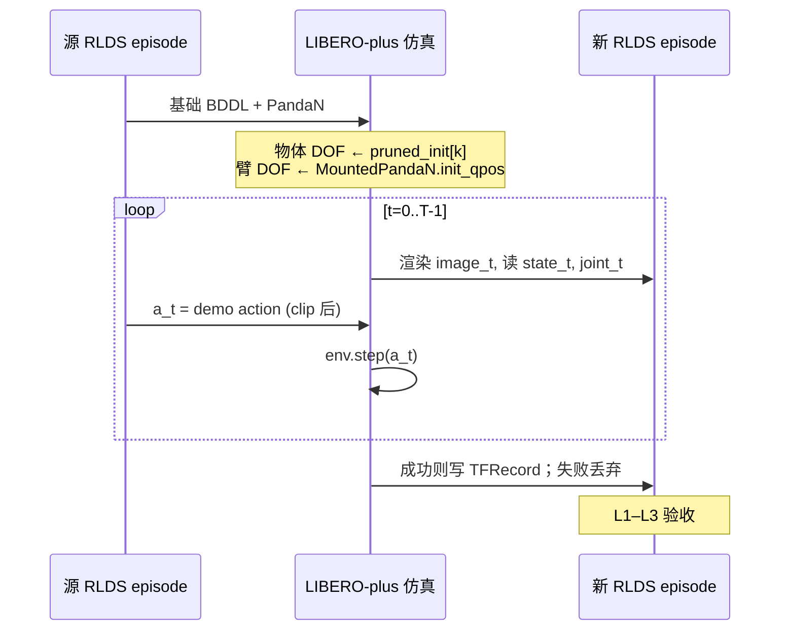
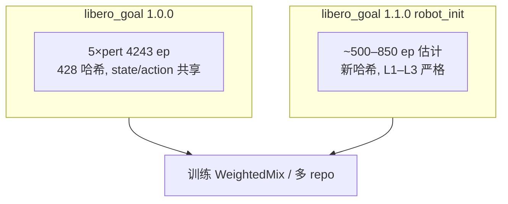

# 为 `/B/Dta/LIBERO/rlds/libero_goal/` 增加 Robot Initial States 扰动 — 实施方案（改良版 v2）

> **目标数据**: `/B/Dta/LIBERO/rlds/libero_goal/1.0.0/`（4,243 episode / 428 条本体轨迹，见 [`dsanalyz1.markdown`](dsanalyz1.markdown)）  
> **关联代码库**: `/B/SRC/LIBERO-plus/`  
> **论文**: [LIBERO-Plus (arXiv:2510.13626)](https://arxiv.org/html/2510.13626v1) — Appendix **A.5**（评估）、**D.3**（回放采集）  
> **文档性质**: **仅方案**，不改代码。  
> **v2 相对 v1 的重心**: 明确「state / action 正确性与有效性」的定义；修正 **物体初态加载与 `MountedPandaN` 的冲突**；给出 **可验收的三一致采集协议**，避免复制视觉 perturb 的「字节复用」陷阱。

---

## 0. 核心矛盾与方案立场

### 0.1 现有五类 perturb 的做法

对 `language / env / light / camera_view / noise`，Goal RLDS 在 **428 个** \((\mathbf{q}_{1:T},\mathbf{a}_{1:T})\) 哈希上 **逐字节复用** `joint_state` 与 `action`，只改图像（及腕部相机随场景渲染变化）。这在 **严格物理** 意义下，当 `camera_view` 改变 agentview 构图时，可能出现「图像中的臂姿与 `state` 不完全一致」的松弛；但 **训练管线** 把它当作「**同一套示教指令 + 同一套 proprio 轨迹 + 不同 pixels**」的 mix-SFT 策略（论文 Appendix D + 本地 [`dsanalyz1.markdown`](dsanalyz1.markdown) §9）。

### 0.2 Robot Initial States 不能沿用同一套路

改 **机器人初始关节** 后，若仍 **复制** 源 `joint_state` / `state`，则：

- 与 **新初态下的仿真** 及 **新图像** 必然矛盾 → **state 无效**；
- 若 **图像** 仍按旧轨迹渲染 → **视觉无效**。

因此：**Robot Initial States 增广不能** 在保持扰动效果的同时，保留与源 episode 相同的 `state`/`joint_state` 字节。

### 0.3 「不影响 state 和 action 正确性与有效性」在本方案中的精确定义

| 层级 | 名称 | 含义 | Robot Init 增广是否必须满足 |
|------|------|------|-----------------------------|
| **L1** | **指令一致** | 存入 RLDS 的 `action[t]` 等于 **实际传入** `env.step(...)` 的 7 维向量（含与 OpenVLA 相同的 clip，如 \(\pm 15/16\)） | **必须** |
| **L2** | **转移一致** | 在 LIBERO-plus 仿真内，用记录的 \((s_t,a_t)\) 逐步回放，\(s_{t+1}\) 与记录一致（容差见 §8） | **必须**（对写入 TFRecord 的 episode 做抽检） |
| **L3** | **感知一致** | `image` / `wrist_image` 由 **当前** MuJoCo 状态渲染，与 **同一步** 的 `state` / `joint_state` 同步采样 | **必须** |
| **L4** | **示教字节一致** | `action`/`joint_state` 与 **源 428 轨迹 MD5 相同** | **不要求**（与 Robot Init **互斥**） |
| **L5** | **任务成功** | 回放末态满足 BDDL 目标（与 Appendix D.3「只保留成功轨迹」一致） | **必须**（写入数据的门槛） |

**结论（给实施者）**: 目标是 **L1–L3 + L5**，而不是 **L4**。  
**action 的「有效性」** = 真实下发、可被控制器执行的 OSC 指令，**优先与源示教同序列** \(a_t^{\mathrm{demo}}\)（开环 BC 标签）；**state 的「有效性」** = 在该 \(N\) 初态与物体布局下 **仿真真值**，**禁止** 从源 RLDS 复制。

---

## 1. 背景（简述）

- 评估侧：`task_classification.json` 中 Goal **409** 条 **Robot Initial States**；Appendix **A.5**：\(\mathbf{q}_{\mathrm{init}}\) 在默认 \(\mathbf{q}_0\) 上沿随机方向扰动，**\(\epsilon \in [0.1,0.5]\)** rad。
- 代码：`MountedPanda1…500` 的 `init_qpos`（`new_init.py` 生成，`mounted_panda.py` 注册）；BDDL 文件名 `_initstate_N` → `ControlEnv` 设 `robots=["PandaN"]`（`env_wrapper.py`）。
- 训练侧：官方 mix-SFT **未纳入** pose 变体（Appendix **D.1**）；当前 `libero_goal` RLDS **无** `robot_init` 目录。

---

## 2. 关键代码事实（影响采集协议）

### 2.1 评估时的初态文件解析

`Benchmark.get_task_init_states()` 对文件名含 `_view_` 的任务，会 **截断到基础任务** 的 `<base>.pruned_init`（`libero/libero/benchmark/__init__.py`），**不会** 因 `_initstate_N` 换文件。  
即：**物体布局** 来自 **基础任务** 的 pruned 初态；**机械臂构型** 在评估语义上依赖 **`PandaN` + 仿真状态写入顺序**。

### 2.2 `set_init_state` 会覆盖整机 MuJoCo 状态

`OffScreenRenderEnv.set_init_state` → `sim.set_state_from_flattened(mujoco_state)`（`env_wrapper.py`）。  
若直接 `torch.load(<base>.pruned_init)[k]` 并 **整向量写入**，则 **演示中记录的 arm qpos** 会 **覆盖** `MountedPandaN.init_qpos` 在 `reset()` 时设定的初值。

**v1 方案疏漏**: 「`reset` → `set_init_state(pruned_init)` → 期望 joint 等于 `MountedPandaN`」在 **整向量加载** 下 **一般不成立**。

### 2.3 动作语义（与现有 RLDS 对齐）

- 7 维 **OSC_POSE** 增量 + 夹爪；RLDS 中常见 clip 界 **±0.9375**（[`dsanalyz1.markdown`](dsanalyz1.markdown) §3）。
- OpenVLA 管线：**20 Hz**、256×256 JPEG、`agentview` + `robot0_eye_in_hand`（与 `ControlEnv` 默认相机名一致）。
- **No-op 过滤**: \(\|a_{0:6}\|\le 10^{-4}\) 且夹爪不变则删帧（见 `itvlaGpLibPlus` 侧 [`libero_raw_analyz4.md`](../../../../itvlaGpLibPlus/b/d/libplus/ds/libero_raw_analyz4.md)）；须在 **录制完成后** 对 **新轨迹** 做，**不能** 假设与源 \(T\) 相同。

### 2.4 `observation.state`（8 维）与仿真 obs 的对应

LIBERO 域内机器人向量来自 gripper + EEF pos/quat（`bddl_base_domain.get_robot_state_vector`）；RLDS 的 8 维为 **EEF 位姿 + 两指** 的紧凑表示（与 [`dsanalyz1.markdown`](dsanalyz1.markdown) §3 一致）。  
采集时必须使用 **与 OpenVLA→RLDS 转换相同** 的拼接顺序与 **轴角** 约定，否则 **L2/L3** 在训练侧失效。

---

## 3. 改良采集协议（推荐：M1「分离式初态 + 开环示教指令」）

### 3.1 总览



### 3.2 源 episode 去重与索引

- 从 `1.0.0` 建立 **428 个唯一** 源轨迹（MD5(\(\mathbf{q},\mathbf{a}\))），每条保留：`task_name`、`language`、`actions[T,7]`、**pruned 行号** `k`（若可从元数据或顺序推断；否则按 task 内顺序与 HDF5 对齐）。
- **不要** 对 4,243 条重复渲染副本各做一遍 Robot Init（浪费算力）；新数据 **每条源轨迹 × 少量 \(N\)** 即可。

### 3.3 环境构造（单扰动维度）

- **BDDL**: `<base_task>_view_0_0_100_0_0_initstate_N.bddl`（若仓库中无此文件，则 **等价** 于 `<base>.bddl` + `robots=["PandaN"]`，与 `ControlEnv` 解析一致）。
- **相机 / 光照 / 纹理**: **固定基线**（等同现有 `language` 行），**不** 与 `env/light/camera/noise` 叠加，避免组合爆炸与 L3 混淆。
- **\(N\) 采样**: 训练用 **\(N \in [1,100]\)**（\(\epsilon=0.1\) 档）为主；与评估 **0.1–0.5** 全档 **错开**（Appendix D 精神）。

### 3.4 初态写入（v2 核心修正）——「物体 / 机器人分离」

目标：物体布局与 **源示教第 k 条** 一致，机械臂关节为 **`MountedPandaN.init_qpos`**。

**推荐步骤**（实现时用配置开关 `init_mode: split`）：

1. 创建 `OffScreenRenderEnv(..., robots=["PandaN"])`，`reset()`。  
2. 读取 `flat_ref = pruned_init[k]`（与源 demo 对应行）。  
3. **分解** `flat_ref` 为 MuJoCo `qpos` / `qvel`（或 flattened 布局中与 **arm 7 维 + gripper** 对应的 slice；slice 索引需在实现阶段对 Panda + Goal 场景 **标定一次**，写入配置 `mujoco_slice.yaml`）。  
4. 构造 `flat_new`：  
   - **物体与关节物体、fixture、门抽屉等 DOF** ← 与 `flat_ref` 相同；  
   - **手臂 7 关节** ← `MountedPandaN.init_qpos`；  
   - **夹爪** ← 与源 demo 首帧一致（通常张开，与现有 RLDS 首步 `state[6:8]` 一致）。  
5. `set_init_state(flat_new)` → `sim.forward()` → 读首帧 obs。  
6. **验收**: \(\|\mathbf{q}_{\mathrm{arm},0} - \mathrm{init\_qpos}_N\|_\infty < 10^{-3}\,\mathrm{rad}\)；物体关键 pose 与 `flat_ref` 一致（容差见 §8）。

**禁止**:

- **整包** `set_init_state(flat_ref)` 后直接声称 Robot Init（会被 **L3** 否决）。  
- **P2** 只改 \(t=0\) joint、后续 **复制** 源 `state`/`joint`（**L2** 失败）。

**备选（若 slice 标定成本高）**: 物理步进 **短 settle**（如 5 步零动作）仅用于稳定接触，仍记录 **L1** 的 demo action 序列；需在文档中标注 **settle 步不算入 RLDS** 或单独标记。

### 3.5 开环回放与标签（L1 / L2）

对每个时间步 \(t\)：

1. **记录**（step 前或 step 后，须与 OpenVLA RLDS **同一约定** 固定一种；推荐 **post-step**：`step` 后记录 obs 作为 \(s_t\)，与现有 LeRobot 20Hz 习惯一致——实现前用 **\(N=0\)** 与源 RLDS 对齐验证）。  
2. \(a_t \leftarrow \mathrm{clip}(a_t^{\mathrm{demo}})\)（与 OpenVLA 相同规则）。  
3. `env.step(a_t)`。  
4. 末步或全程检查 `check_success()`。

**action 字段**: 存 **\(a_t\)**（实际下发值），**不是** 「期望但未 clip 的向量」。  
**state / joint_state**: 存 **仿真读数**，**禁止** 复制源 TFRecord。

若开环导致 **中途失败**：**整段丢弃**（Appendix D.3）；**不要** 截断后仍用源轨迹后缀。

### 3.6 成功后处理

- **No-op 过滤** 在 **新序列** 上执行；\(T'\) 可能 **短于** 源 \(T\)。  
- `action`、`state`、`joint`、`image` **同索引同步删帧**。  
- `reward`: 末步 1、其余 0；`is_terminal` / `is_last` 与 OpenVLA RLDS 一致。

### 3.7 输出布局

- HDF5 中间: `.../pro_data/robot_init/libero_goal/{task}_demo.hdf5`（与现有 `pro_data` 命名平行）。  
- RLDS: **新版本** `/B/Dta/LIBERO/rlds/libero_goal/1.1.0/` 或独立根 `libero_goal_robot_init/` — **不覆盖** `1.0.0`。  
- `episode_metadata/file_path` 含 `robot_init`；建议扩展（builder 允许时）: `robot_init_index`, `source_trajectory_hash`, `pruned_init_row`.

---

## 4. 备选路线（仅在 M1 成功率过低时）

| 编号 | 做法 | 对 L4 | 对 L1–L3 | 建议 |
|------|------|-------|----------|------|
| **M1** | §3 分离初态 + 开环 demo action | 否 | **是** | **默认** |
| **M2** | 在 M1 基础上 **仅减小** \(\epsilon\)（自定义 \(N\) 或新子集 `MountedPanda` 微调表） | 否 | 是 | 成功率低时用 |
| **M3** | **OSC 跟踪源 EE 轨迹** 重算 \(a_t\)（闭环） | 否 | 是，但 **action ≠ demo** | **不推荐** 若要求「示教指令不变」 |
| **M4** | 像 `light` 一样 **只改图**、state 复制 | 是 | **否** | **禁止** |

**说明**: 用户若强调「action 与源示教一致」，应选 **M1/M2**，而非 M3。

---

## 5. 与现有 `1.0.0` 的共存与训练混合



- **不要** 把 robot_init episode **append** 进 `1.0.0` 分片而不改版本号（破坏可复现与 hash 统计）。  
- 混合训练时单独配置 **采样权重**；robot_init 条数少时 **适当上调权重** 或 **过采样**，避免被 4243 淹没。  
- **InternVLA / OpenVLA**: `features.json` 不变即可读；**语义** 上需在实验记录中注明含 **robot_init** 子集。

---

## 6. 方案对比（保留并收紧）

| 路径 | 结论 |
|------|------|
| 视觉 perturb 式复制 `state`/`action` | **禁止**（Robot Init 无效） |
| 整包 `pruned_init` + `PandaN` 不分离 | **禁止**（初态扰动被覆盖，见 §2.2） |
| M1 分离初态 + 开环 demo action | **推荐** |
| 评估全集 \(N\in1..500\) 全进训练 | **不推荐**（分布过难 + leakage） |
| 人工重采 | 质量最高，超出本方案范围 |

---

## 7. 测试与验收（加强版）

### 7.1 回归：\(N=0\) 与源 RLDS 对齐

在 **split 初态 + 基线视觉** 下，\(N=0\)（默认 `MountedPanda`）回放应满足：

- 与对应源 episode 的 \(\mathbf{q}_{1:T}\)、\(\mathbf{a}_{1:T}\) 在 **max abs error** 阈值内（建议 \(\mathrm{rad}\)/action 维分别设阈，由 Phase 0 标定）；  
- 若不能对齐 → **转换/state 8 维约定/slice** 错误，**禁止** 批量生产。

### 7.2 单 episode 门槛（L1–L3）

| ID | 检查 | 通过条件 |
|----|------|----------|
| T1 | 初态 arm | \(\mathbf{q}_{\mathrm{arm},0}\) ≈ `MountedPandaN.init_qpos` |
| T2 | 初态物体 | 与 `pruned_init[k]` 物体 DOF 一致（抽检 pose） |
| T3 | L1 | 存盘 `action[t]` == `step` 输入（含 clip） |
| T4 | L2 抽检 | 重放 10% episode：逐步 `step(a_t)` 复现 `state[t+1]` |
| T5 | L3 | 同一步 `image` 与 `state` 中 EE 投影一致（人工或 SSIM 辅） |
| T6 | 限位 | 全程 joint 在 Panda 限位内 |
| T7 | L5 | `check_success()` |

### 7.3 数据集级

| ID | 检查 | 通过条件 |
|----|------|----------|
| V1 | 与源 428 哈希 | 新 episode **不得** 与源 **完全相同** MD5(\(\mathbf{q},\mathbf{a}\)) |
| V2 | \(N\) 分离 | 不同 \(N\) 首帧 arm 差 \(\gg 0.05\,\mathrm{rad}\)（相对 5-pert 的 ~0.02 档） |
| V3 | 规模 | 记录成功率；难任务（如 push plate）失败率可高于均值（类比 `noise` 少 37 条） |
| V4 | 元数据 | `file_path`、可选 `robot_init_index` 可解析 |
| V5 | 分片 | `shardLengths` 与实际 record 数一致 |

### 7.4 与评估基准

- 训练 \(N \in [1,100]\) 时，held-out **\(N > 100\)** 用于 offline eval。  
- 训练锚定 **10 个基础 Goal 任务** + 采样 \(N\)，**不要** 把 409 条评估 BDDL 任务全集当作训练清单。

---

## 8. 规模与资源（更新）

- 源 **428** × 每源 **K=2** 个 \(N\) × 成功率 \(p_{\mathrm{succ}}\)（M1 分离初态后预期 **高于** 整包 `pruned_init` 乱序，但仍 **低于** 纯视觉 perturb；Phase 0 实测）。  
- \(N_{\mathrm{ep,new}} \approx 428 \times K \times p_{\mathrm{succ}}\)。  
- 磁盘：与单 perturb 同量级（JPEG 256²）；算力：**EGL 多进程**，20 Hz × 平均 ~120 step。

---

## 9. 配置要点（增补 `init_mode`）

```yaml
# robot_init_goal_rlds.yaml — 示意
source_rlds: /B/Dta/LIBERO/rlds/libero_goal/1.0.0
source_dedupe: by_trajectory_hash   # 428 唯一源
output_rlds: /B/Dta/LIBERO/rlds/libero_goal/1.1.0

robot_init:
  index_pool: [1, 100]
  samples_per_source: 2
  init_mode: split                  # 必: object from pruned_init, arm from PandaN
  mujoco_slice_config: mujoco_slice_goal.yaml  # arm/gripper/object DOF 索引

recording:
  obs_timing: post_step             # 须与 N=0 回归验证一致
  action_source: demo_open_loop
  clip: openvla                     # ±15/16 等

filter:
  require_success: true
  drop_noops: openvla
  sync_drop: [action, state, joint_state, images]

validation:
  n0_regression: true
  l2_replay_sample_rate: 0.1
```

---

## 10. 风险与缓解（更新）

| 风险 | 缓解 |
|------|------|
| 整包 `pruned_init` 覆盖 arm | **强制 split 初态**（§3.4） |
| action 与 dynamics 脱节 | L2 抽检；失败 episode 丢弃 |
| \(T\) 与源不一致仍复制标签 | **同步删帧**，禁止后缀复制 |
| 与 4243 混合比例失调 | WeightedMix 权重 |
| 评估仍掉点 | 预期内；robot 维需专门增广 |

---

## 11. 实施阶段

| 阶段 | 内容 |
|------|------|
| **Phase 0** | 标定 `mujoco_slice`；\(N=0\) 回归；10 任务 × 3 个 \(N\) 成功率 |
| **Phase 1** | 428 源 × M1 × K=2 → `1.1.0` |
| **Phase 2** | 可选 M2 更小 \(\epsilon\)；**不做** robot×light 默认组合 |
| **Phase 3** | LeRobot 同步；更新 [`dsanalyz1.markdown`](dsanalyz1.markdown) 姊妹说明 |

---

## 12. 参考文献

| 内容 | 出处 |
|------|------|
| Robot Init 定义 | 论文 Appendix **A.5** |
| 回放采集 / 排除 pose | Appendix **D.1**, **D.3** |
| `MountedPandaN` / `_initstate_N` | `new_init.py`, `mounted_panda.py`, `env_wrapper.py` |
| `get_task_init_states` 截断 | `benchmark/__init__.py` |
| 现有 RLDS 五 pert | [`dsanalyz1.markdown`](dsanalyz1.markdown) |
| No-op / OpenVLA 约定 | [`libero_raw_analyz4.md`](../../../../itvlaGpLibPlus/b/d/libplus/ds/libero_raw_analyz4.md) |

---

## 13. 小结

对 `libero_goal` 增加 **Robot Initial States** 时，**不能** 复制现有五类 perturb 的 **state/action 字节**；**可以且应当** 在 **L1–L3** 意义下保证：

1. **action** = 源示教 **开环指令**（clip 后 **实际 step** 的值）；  
2. **state / joint_state / image** = **同一仿真、同一 \(N\)、同一物体行 k** 下 **逐步录制** 的真值；  
3. **初态** = **`pruned_init[k]` 的物体部分 + `MountedPandaN.init_qpos` 的 arm 部分**（**分离写入**，避免 §2.2 覆盖问题）；  
4. **只保留成功 episode**，并在 **新轨迹** 上做 no-op 过滤。

按 **M1 + §7 验收** 落地，可在 **不伪造 L4 字节一致** 的前提下，得到 **对 VLA 训练有效** 的 Robot Initial States 增广；与 `1.0.0` **版本并存**，通过混合训练接入。
