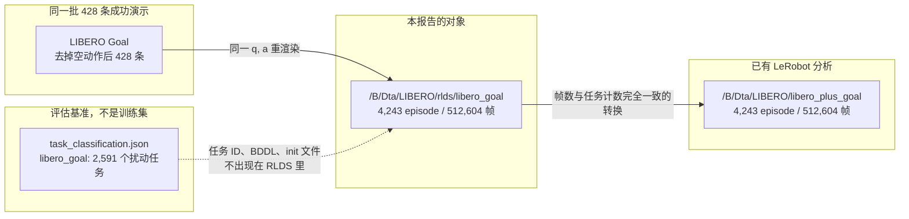
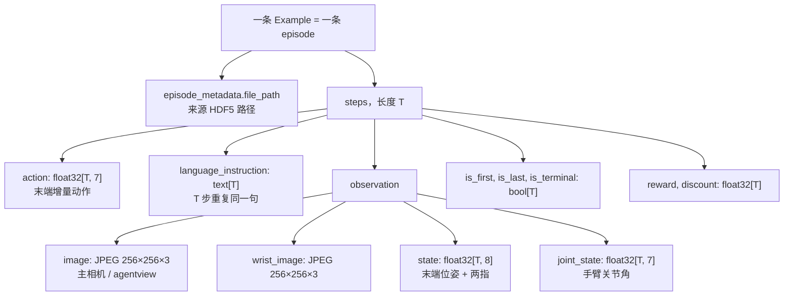

# LIBERO-Plus-Goal 原始 RLDS 训练数据深入分析

> **分析对象**: `/B/Dta/LIBERO/rlds/libero_goal/`（版本目录 `1.0.0`）
> **数据格式**: RLDS / TFRecord（TFDS `FeaturesDict`，模块名 `LIBERO_Goal.LIBERO_Goal_dataset_builder`）
> **关联代码库**: `/B/SRC/LIBERO-plus/`
> **关联论文**: [LIBERO-Plus: In-depth Robustness Analysis of Vision-Language-Action Models](https://arxiv.org/abs/2510.13626)（Fei et al., 2025），HTML 版 [arXiv:2510.13626](https://arxiv.org/html/2510.13626v1)
> **对照副本**: 同一批轨迹的 LeRobot v2.1 转换位于 `/B/Dta/LIBERO/libero_plus_goal/`，已在 [`../dsanalyz1.markdown`](../dsanalyz1.markdown) 中分析

本文回答一个具体问题：这份 Goal 子集的原始训练数据里，到底有没有 LIBERO-Plus 评估基准所声称的 7 类扰动样本。结论来自对全部 256 个分片、4,243 条 episode 的解析，而不是目录名推断。

---

## 1. 结论

这份目录是 LIBERO-Plus 作者为 mix-SFT 生成的 **Goal 套件重渲染训练集**，不是原始 LIBERO 的 `libero_goal_no_noops`，也不是 2,591 条评估任务本身。

它包含 **428 条互不相同的** \((\mathbf{q}, \mathbf{a})\) 轨迹。这 428 条与 OpenVLA 发布的、去掉空动作之后的 LIBERO Goal 演示规模一致（见第 4 节）。五个来源目录把这同一批轨迹各渲染了一遍；其中四类把每条轨迹存了两份。

对照论文评估用的 7 类扰动（README 与 `task_classification.json`），这份 Goal RLDS 的覆盖情况如下。

| # | 评估扰动（论文 / 代码中的类别名） | 本目录中的样本 | 判定 |
|---|-----------------------------------|----------------|------|
| 1 | Camera Viewpoints | `camera_view`，856 条 | **有。** 主相机取景明显改变，腕部相机基本保持原样 |
| 2 | Light Conditions | `light`，856 条 | **有。** 同一布局下亮度分布被拉开 |
| 3 | Background Textures | `env`，856 条 | **有，但文件夹名字是 `env`。** 地面、墙面、灶台外观被替换，物体集合与摆放保持原任务 |
| 4 | Sensor Noise | `noise`，819 条 | **有。** 只破坏主相机，腕部相机保持清晰；与 `env_wrapper.py` 只改 `agentview_image` 的实现一致 |
| 5 | Language Instructions | 路径在 `language/` 下，856 条 | **文件夹在，语言扰动不在。** 全部 episode 的 `language_instruction` 仍是 10 句原始 LIBERO 指令，没有任何 LLM 改写 |
| 6 | Objects Layout | 无独立来源目录 | **没有。** 抽查的 `env` 帧只换纹理，不增加干扰物，也不挪动目标 |
| 7 | Robot Initial States | 无独立来源目录 | **没有。** 五个文件夹的关节角与动作逐条相同，初始关节只在默认复位姿态附近抖动 |

论文附录 D 自己也把训练集说成 **6 类变体**，并写明姿态变化因为自动轨迹不可靠而没有加入。本目录比附录 D 的清单还少一类：附录 D 同时列出了 “objects spanning” 和 “background environment sampling”，Goal 这份 RLDS 里只能看到背景纹理（`env`），看不到独立的物体布局变体；附录 D 列出的 LLM 改写也没有写进 `language_instruction`。

因此：**不能把这份数据当成 “7 类扰动都训练过” 的 Goal 训练集。** 模型从中能看到的新因素是主相机视角、光照、背景纹理和主相机退化。语言句子、物体布局、机器人初始关节都与那 428 条原始成功演示相同。

---

## 2. 数据是什么

### 2.1 磁盘布局

```
/B/Dta/LIBERO/rlds/libero_goal/
└── 1.0.0/
    ├── dataset_info.json          # 4,282 B，TFDS 模板，citation / description 仍是 TODO
    ├── features.json              # 9,195 B，完整 FeaturesDict
    └── libero_goal-train.tfrecord-00000-of-00256
        … 共 256 个分片，合计 18,314,493,440 字节（约 17.1 GiB）
```

`dataset_info.json` 只声明一个 split：`train`。没有 validation / test。分片长度在 16 与 17 之间，声明的 episode 总数为 4,243。逐分片读出的记录数也是 4,243，与声明一致。

`features.json` 的 `moduleName` 对应字段在 `dataset_info.json` 里写作：

- `name`: `libero_goal`
- `moduleName`: `LIBERO_Goal.LIBERO_Goal_dataset_builder`
- `version`: `1.0.0`
- `fileFormat`: `tfrecord`

元数据 JSON 没有写扰动类型、采集脚本或论文引用。扰动身份只能从每条 episode 的 `episode_metadata/file_path` 还原。全部 4,243 条路径都形如：

```
/inspire/hdd/project/embodied-multimodality/public/syfei/WorldVLA/pro_data/{pert}/libero_goal/{task}_demo.hdf5
```

`syfei` 是论文作者侧的集群路径。`{pert}` 只有五个取值：`language`、`env`、`light`、`camera_view`、`noise`。每个取值下面都是 10 个 HDF5 文件名，对应 LIBERO Goal 的 10 个基础任务。HDF5 本体不在本机，RLDS 里只保留了这条来源字符串。

### 2.2 与三份容易混淆的数据的关系



| 对象 | 规模 | 角色 |
|------|------|------|
| 本 RLDS | 4,243 episode，512,604 步 | Goal 套件的扰动重渲染训练数据 |
| LeRobot `libero_plus_goal` | 4,243 episode，512,604 帧 | 上述 RLDS 的逐帧转换。任务计数一一相同，见第 8 节 |
| 评估套件 `libero_goal` | 2,591 个任务，每任务 1 次试验 | 测试分布。类别计数见第 6 节 |
| 论文附录 D 的全套训练集 | 过滤前 22,400 条，过滤后超过 20,000 条 | 四个套件合计。本目录只是其中的 Goal 切片 |

LeRobot 副本的 `info.json` 把采样率标成 20 Hz。RLDS schema 里没有时间戳，也没有 `fps` 字段。下文在把步数换算成秒时，沿用这个成对副本的 20 Hz：75 步 = 3.75 s，299 步 = 14.95 s。

### 2.3 规模

| 指标 | 值 |
|------|-----|
| 分片 | 256 |
| episode | 4,243 |
| 步 / 帧 | 512,604 |
| 每条 episode 的步数 | 最小 75，中位数 105，均值 120.81，最大 299 |
| 基础任务 | 10 |
| 来源 HDF5 路径 | 50（5 个扰动目录 × 10 个任务） |
| 互不相同的 \((\mathbf{q}_{1:T}, \mathbf{a}_{1:T})\) | **428** |
| 成功标记 | 4,243 / 4,243 的末步 `reward = 1` |
| 步内指令变化 | 0 条 episode 的指令在 \(T\) 步之间发生过变化 |

末步奖励恒为 1、其余步为 0，符合 “只保留成功演示” 的过滤。这与附录 D.3 的采集规则一致：用原始 \((\mathrm{state}, \mathrm{action})\) 在新环境里回放，只留下成功轨迹，并去掉空动作。

---

## 3. 一条 episode 里有什么

RLDS 把一整条轨迹打成一个 `tf.train.Example`。`steps/...` 下的每个键沿时间拉长：图像和字符串是长度为 \(T\) 的 `BytesList`，浮点张量是一段长度为 \(T \times d\) 的 `FloatList`。



字段定义来自 `features.json`。各符号的含义：

| 符号 | 形状 | 含义 |
|------|------|------|
| \(T\) | 标量 | 该 episode 的步数。图像张数、指令条数、奖励长度必须相同 |
| \(\mathbf{a}_t \in \mathbb{R}^{7}\) | `[T, 7]` | 末端执行器动作。`features.json` 的描述是 “Robot EEF action.” |
| \(\mathbf{s}_t \in \mathbb{R}^{8}\) | `[T, 8]` | 末端状态。描述是 “Robot EEF state (6D pose, 2D gripper).” |
| \(\mathbf{q}_t \in \mathbb{R}^{7}\) | `[T, 7]` | 七个手臂关节角，不含两个手指 |
| \(r_t\) | `[T]` | 演示奖励。实测除最后一步外为 0，最后一步为 1 |
| \(\gamma_t\) | `[T]` | 折扣，schema 默认 1 |

实测首步状态的均值是

\[
\bar{\mathbf{s}}_0 = [-0.204,\ 0.001,\ 1.173,\ 3.140,\ 0.001,\ -0.092,\ 0.0388,\ -0.0388].
\]

前三维是末端位置（米），量级与 LIBERO 桌面操作的复位高度一致：\(z \approx 1.17\,\mathrm{m}\)。中间三维接近 \((\pi, 0, 0)\)，对应夹爪朝下的轴角。最后两维是左右指开合，首步几乎恒为 \(+0.0388\) 与 \(-0.0388\)，也就是张开。

首步关节均值

\[
\bar{\mathbf{q}}_0 = [0.0007,\ -0.146,\ 0.0017,\ -2.428,\ 0.0004,\ 2.223,\ 0.788]
\]

与代码里默认 Panda 复位角同一位置。`MountedPanda.init_qpos` 返回

```35:38:libero/libero/envs/robots/mounted_panda.py
    def init_qpos(self):
        return np.array(
            [0, -1.61037389e-01, 0.00, -2.44459747e00, 0.00, 2.22675220e00, np.pi / 4]
        )
```

\(\pi/4 \approx 0.785\)。数据均值与这个默认向量的偏差在 \(0.02\,\mathrm{rad}\) 量级，属于演示采集时的复位噪声。评估用的 `MountedPanda1`、`MountedPanda2` 等子类把 `init_qpos` 改成另一组常数；那些常数没有作为单独的轨迹族出现在本目录里（第 5.7 节）。

动作的实测范围：

| 维度 | 含义（LIBERO 的 7 维末端动作约定） | 最小值 | 最大值 | 全体步的均值绝对值 |
|------|--------------------------------------|--------|--------|-------------------|
| \(a_0, a_1, a_2\) | 末端位置增量 | \(-0.9375\) | \(+0.9375\) | 0.295, 0.222, 0.423 |
| \(a_3, a_4, a_5\) | 末端姿态增量 | 约 \(-0.38\) | 约 \(+0.38\) | 0.029, 0.052, 0.052 |
| \(a_6\) | 夹爪 | \(-1\) | \(+1\) | **恰好为 1** |

\(a_6\) 的绝对值均值等于 1，且上下界就是 \(\pm 1\)，所以每一步的夹爪指令都是二值开合，没有中间量。位置三维被夹在 \(\pm 0.9375 = \pm 15/16\)，这是 OpenVLA 系 RLDS 里常见的动作裁剪界，不是物理米制的裸增量。

主相机首帧 JPEG 平均约 18.0 KB。全数据首帧亮度（RGB 均值，像素值除以 255）为 \(0.406 \pm 0.089\)，范围 \([0.120,\ 0.575]\)。这个总方差主要来自 `env` 和 `light`，不是来自 `language`（第 5 节）。

解析没有使用 TensorFlow。记录格式是 TFRecord 长度头加 `tf.train.Example`，解码器与 [`rlds_reader.py`](/B/SRC/itvlaGpLibPlus/b/d/libplus/ds/asset/rlds_reader.py) 相同。

---

## 4. 本体轨迹只有 428 条，并且被复制了一遍

对每条 episode 取 \(\mathbf{q}_{1:T}\) 与 \(\mathbf{a}_{1:T}\) 的字节做 MD5。五个扰动目录的结果：

| 来源目录 | episode 数 | 不同哈希数 | 与 `language` 哈希的交集 | 只在该目录出现的哈希 |
|----------|------------|------------|--------------------------|----------------------|
| `language` | 856 | 428 | 428 | 0 |
| `env` | 856 | 428 | 428 | 0 |
| `light` | 856 | 428 | 428 | 0 |
| `camera_view` | 856 | 428 | 428 | 0 |
| `noise` | 819 | 427 | 427 | 0 |

四个完整目录的哈希集合彼此相同。`noise` 的 427 个哈希是这 428 个的子集，没有新轨迹。

在 `language` 内部按任务再数一遍，每条任务的 episode 数都恰好是不同哈希数的 2 倍：

| 任务（文件名，下划线即原始指令） | episode | 不同 \((\mathbf{q},\mathbf{a})\) |
|----------------------------------|---------|----------------------------------|
| `open_the_middle_drawer_of_the_cabinet` | 86 | 43 |
| `open_the_top_drawer_and_put_the_bowl_inside` | 64 | 32 |
| `push_the_plate_to_the_front_of_the_stove` | 72 | 36 |
| `put_the_bowl_on_the_plate` | 98 | 49 |
| `put_the_bowl_on_the_stove` | 96 | 48 |
| `put_the_bowl_on_top_of_the_cabinet` | 94 | 47 |
| `put_the_cream_cheese_in_the_bowl` | 80 | 40 |
| `put_the_wine_bottle_on_the_rack` | 72 | 36 |
| `put_the_wine_bottle_on_top_of_the_cabinet` | 94 | 47 |
| `turn_on_the_stove` | 100 | 50 |
| **合计** | **856** | **428** |

428 这个数就是既有分析里原始 LIBERO Goal、去掉空动作之后的演示条数（[`../dsanalyz1.markdown`](../dsanalyz1.markdown) 第 1.2 节）。每个任务的不同轨迹数也都是偶数 episode 数的一半，所以这不是 “大约两倍”，而是 **每条原始轨迹被原样写入了两次**。

`env`、`light`、`camera_view` 的逐任务计数与上表完全相同，因此它们也是这 428 条的两次写入，只是像素不同。五个目录的首步关节标准差打印到 \(10^{-8}\) 量级仍然一致，是同一结论的另一个侧面。

`noise` 少了 37 条，而且这 37 条全部来自 `push_the_plate_to_the_front_of_the_stove`（72 → 35）。按哈希拆开：该任务 36 条原始轨迹里，1 条两次渲染都没留下，其余 35 条只留下一次。其他九个任务在 `noise` 里仍然是满的两次写入。附录 D 说只保留成功回放；推盘子这条在传感器退化下失败得最多，与 “模糊主相机之后脚本策略更容易失败” 相符。

论文附录 D.3 的原话是：用原始 LIBERO 的 \((\mathrm{state}, \mathrm{action})\) 在新环境中执行，只保留成功轨迹（[arXiv HTML, Appendix D](https://arxiv.org/html/2510.13626v1)）。本目录把这句话落实到了字节级：动作和关节角没有重新采样。

由此得到一个直接推论。下面任何 “扰动” 如果声称改变了机器人的初始关节或动作分布，都必须先推翻这张哈希表。五个目录推翻不了。

---

## 5. 七类扰动分别是否存在

评估类别的名字以仓库 README 的 “7 Perturbation Dimensions” 和 `libero/libero/benchmark/task_classification.json` 为准。训练侧的名字以 `file_path` 中 `pro_data/` 的下一级目录为准。两者不是同一套字符串。

### 5.1 总表：每个目录的视觉统计

统计量都取每条 episode 的主相机 **第 0 帧**。亮度是 RGB 均值。拉普拉斯方差用灰度图的五点离散拉普拉斯，数值越小，画面越糊。

| 目录 | 条数 | 首帧亮度均值 | 亮度标准差 | 亮度范围 | 拉普拉斯方差均值 | 拉普拉斯中位数 |
|------|------|--------------|------------|----------|------------------|----------------|
| `language` | 856 | 0.461 | **0.00023** | [0.460, 0.461] | 0.0118 | 0.0117 |
| `camera_view` | 856 | 0.468 | 0.026 | [0.405, 0.575] | 0.0125 | 0.0124 |
| `light` | 856 | 0.321 | 0.057 | [0.286, 0.525] | 0.0068 | 0.0056 |
| `env` | 856 | 0.314 | **0.094** | [0.120, 0.566] | 0.0111 | 0.0102 |
| `noise` | 819 | 0.468 | 0.028 | [0.386, 0.539] | **0.0022** | **0.00068** |

`language` 的 856 张首帧亮度几乎是常数。它是干净的原始厨房画面，不是一类视觉扰动。`noise` 的拉普拉斯中位数约为 `language` 的 \(1/17\)，高频结构被抹掉。`env` 的亮度跨度最大，对应纹理替换而不是统一调光。`light` 的亮度标准差介于两者之间，拉普拉斯也下降，因为变暗之后边缘对比变弱。

同一任务 `put_the_bowl_on_the_plate` 的五类首帧（左主相机，右腕部）见 [`asset/pert_contact_bowl_on_plate.jpg`](asset/pert_contact_bowl_on_plate.jpg)。十个任务的 `language` / `env` / `light` 首帧见 [`asset/pert_grid_lang_env_light.jpg`](asset/pert_grid_lang_env_light.jpg)。同一任务各 8 条的 `language` / `env` / `camera_view` 见 [`asset/same_task_eight.jpg`](asset/same_task_eight.jpg)。

### 5.2 Camera Viewpoints：有

`camera_view` 的主相机里，机械臂进入画面，机位从斜上方桌面变成更侧面的机位；腕部相机仍对着灶台和碗，构图与 `language` 的腕部几乎一样。

这和代码里的分工一致：视角扰动改的是场景中的 agentview 相机，腕部相机装在夹爪上，随机器人运动，不随 “相机视角” 这一评估维度重设。论文附录 D.2 写的训练侧相机偏移是相对测试集球面坐标差 \(5^\circ\)。本数据的主相机变化从画面上看大于 “微微偏 5 度”：手臂是否入画、桌面占比都变了。训练分布与评估分布因此不是同一个相机参数集合。附录 D 也明确说训练参数要避开测试参数。

关节与动作哈希和 `language` 全等，所以相机变化没有伴随新的本体轨迹。

### 5.3 Light Conditions：有

`light` 行与 `language` 行的物体和木地板相同，但整帧变暗，部分 episode 亮部被压掉。亮度标准差 0.057，范围约 0.29 到 0.53，而 `language` 的标准差是 0.00023。光照是一个真实存在的渲染因素。

它没有变成另一套动作。哈希集合与 `language` 相同。

### 5.4 Background Textures：有，目录名是 `env`

十个任务的 `env` 首帧把木地板换成了纯蓝、鹅卵石、绿色、全黑、带白条的深色、木纹、砖纹等表面，灶台和墙的材质也跟着变。同一任务的 8 条 `env` 之间，纹理各不相同，碗、盘子、酒瓶、柜子的集合和大致位置仍与 `language` 那一行相同。

所以 `env` 对应的是论文附录 D.2 的 “Background Environment Sampling”（桌面、墙、地面的额外纹理），也就是评估类别里的 **Background Textures**。它不对应 Objects Layout。文件夹名叫 `env`，阅读 `file_path` 时不能把它理解成 “环境 = 七类扰动的总称”，也不能理解成 “加了干扰物体”。

`env` 的亮度标准差 0.094 是五类里最大的，全数据亮度下界 0.120 也落在这一类。此前在 LeRobot 副本上看到的 “同一任务亮度从 0.14 到 0.57” （[`../dsanalyz1.markdown`](../dsanalyz1.markdown) 第 7.1 节）主要就是 `env` 与 `light` 叠在一起的结果。那份分析当时无法拆开目录，把亮度方差同时归于光照和纹理。RLDS 的路径把二者分开了：纹理的亮度跨度比光照更大。

### 5.5 Sensor Noise：有，而且只作用在主相机

`noise` 的主相机首帧是大尺度模糊和暗斑，腕部相机仍然能看清灶台旋钮和碗。拉普拉斯方差下降一个数量级。

代码里的传感器噪声就是这样实现的。`OffScreenRenderEnv` 在 `step` 时若 `self.noise != 0`，只替换 `agentview_image`：

```288:308:libero/libero/envs/env_wrapper.py
        if self.noise != 0:
            img_array = obs[0]["agentview_image"]
            ...
            if self.noise <= 10:
                blurred_array = motion_blur(pil_image, severity=self.noise)
            elif self.noise <= 20:
                blurred_array = gaussian_blur(pil_image, severity=self.noise-10)
            elif self.noise <= 30:
                blurred_array = zoom_blur(pil_image, severity=self.noise-20)
            elif self.noise <= 40:
                blurred_array = fog(pil_image, severity=self.noise-30)
            elif self.noise <= 50:
                blurred_array = glass_blur(pil_image, severity=self.noise-40)
            obs[0]["agentview_image"] = blurred_array
```

severity 分成五段，依次是运动模糊、高斯模糊、缩放模糊、雾、玻璃模糊。RLDS 里没有保存 `noise` 的整数档位，因此不能把 819 条再分成这五档。能确定的是：退化发生在主相机图像上，腕部图像和 \((\mathbf{q}, \mathbf{a})\) 没有被改写。

这一类比其他四类少 37 条，原因已在第 4 节说明。

### 5.6 Language Instructions：目录在，句子没有被改写

评估侧的语言扰动是 LLM 重写指令，写进 BDDL 的 `:language`，任务名带 `_language_` 后缀（仓库 `CLAUDE.md` 与附录 D.2）。训练侧如果做了同样的事，`steps/language_instruction` 里应该出现多句不同的英文。

实测：

- 4,243 条 episode 各自的 \(T\) 步指令完全相同（`lang_changed_within = 0`）。
- 按任务聚合后，每个任务只剩 **1** 句指令。
- 这 10 句就是文件名把下划线换成空格：

| 文件名任务 | 存进去的指令 |
|------------|--------------|
| `put_the_cream_cheese_in_the_bowl` | put the cream cheese in the bowl |
| `put_the_wine_bottle_on_top_of_the_cabinet` | put the wine bottle on top of the cabinet |
| `open_the_middle_drawer_of_the_cabinet` | open the middle drawer of the cabinet |
| `put_the_bowl_on_the_plate` | put the bowl on the plate |
| `put_the_wine_bottle_on_the_rack` | put the wine bottle on the rack |
| `put_the_bowl_on_top_of_the_cabinet` | put the bowl on top of the cabinet |
| `open_the_top_drawer_and_put_the_bowl_inside` | open the top drawer and put the bowl inside |
| `put_the_bowl_on_the_stove` | put the bowl on the stove |
| `turn_on_the_stove` | turn on the stove |
| `push_the_plate_to_the_front_of_the_stove` | push the plate to the front of the stove |

`language/` 目录下的 856 条也是这 10 句，没有第 11 句。该目录的首帧亮度标准差是 0.00023，画面就是原始场景。schema 里也没有第二个文本字段可以藏改写句。

附录 D.2 写了 “LLM-based Language Rewrites: New language instructions were generated”。这句话 **没有反映在这份 Goal RLDS 的可读字段里**。可能改写发生在上游 HDF5 但建库时被原始任务句覆盖，也可能 Goal 这一切片从未写入改写句。无论哪一种，用这份数据做 SFT 的模型读到的语言标签就是原始 10 句。它解释不了评估集上 410 条语言改写任务的训练覆盖。

`language/` 在这份数据里的实际角色是 **未扰动外观的对照渲染**，而且每条轨迹写了两遍。训练时若按 episode 均匀抽样，这 856 条会让原始画面的权重等于 `env`、`light` 或 `camera_view` 的权重。

### 5.7 Objects Layout：没有

评估类别 Objects Layout 做两件事：加入干扰物体，以及挪动目标物体的位置（README 第 1 条；`task_classification.json` 里 Goal 有 425 条）。附录 D 把对应的训练变体称为 objects spanning / compounding objects，并单列了 2,400 条（四个套件合计），且声明与测试集不重叠。

本目录没有 `layout`、`object`、`add` 之类的来源目录。唯一可能被误认成布局扰动的是 `env`。第 5.4 节的十任务网格和同一任务的 8 条抽样里，`env` 换的是表面纹理，物体清单和相对位置保持在原始任务的样子。

因此这份 Goal RLDS **不包含** Objects Layout 的训练样本。全库 22,400 条里的 2,400 条 compounding-object 轨迹如果存在，也不在 `libero_goal` 这个版本目录中。

### 5.8 Robot Initial States：没有

评估侧为这个类别注册了数百个 `MountedPandaK`，每个类覆盖 `init_qpos`（`mounted_panda.py`）。Goal 评估集里这一类有 409 个任务。

附录 D.1 写明：涉及姿态变化的变体没有加入训练集，因为自动生成的轨迹不够可靠。数据与这句话一致。

- 五个目录的 \((\mathbf{q}, \mathbf{a})\) 哈希集合相同（`noise` 是子集）。
- 全体首步位置标准差约为 \(7\,\mathrm{mm}\)：\(\mathrm{std}(s_0^{x,y,z}) = (0.0074,\ 0.0071,\ 0.0065)\,\mathrm{m}\)。
- 全体首步关节标准差最大的一维是第 4 关节 \(0.029\,\mathrm{rad}\)（约 \(1.7^\circ\)）。七维的全距是 \(0.052\) 到 \(0.208\,\mathrm{rad}\)。
- 首步两指开合的标准差约为 \(10^{-6}\)，等于张开且不变。

\(7\,\mathrm{mm}\) 和大约 \(2^\circ\) 是脚本策略复位时的重复误差，与 LeRobot 副本上测到的 \(5\)–\(9\,\mathrm{mm}\) 是同一事实（[`../dsanalyz1.markdown`](../dsanalyz1.markdown) 第 7.2 节）。评估用的独立初始姿态族不会让五个渲染目录的关节字节完全重合。

---

## 6. 和 Goal 评估集并排放

`task_classification.json` 里 `libero_goal` 有 2,591 条，类别计数是：

| 评估类别 | 任务数 | 本 RLDS 是否提供同类训练样本 |
|----------|--------|------------------------------|
| Objects Layout | 425 | 否 |
| Language Instructions | 410 | 否（只有原始 10 句） |
| Robot Initial States | 409 | 否 |
| Camera Viewpoints | 408 | 是，`camera_view`，但是同一 428 条动作的重渲染 |
| Sensor Noise | 379 | 是，`noise`，主相机退化；该任务族少了 37 条回放 |
| Background Textures | 281 | 是，目录名 `env` |
| Light Conditions | 279 | 是，`light` |

评估任务通过 BDDL 后缀（`_view_`、`_language_`、`_table_` / `_tb_`、`_light_`、`_add_`、`_level`）和 `Benchmark.get_task_init_states()` 选择初始状态。这些任务名、难度等级和 `.pruned_init` **都不是 RLDS 的字段**。训练样本无法按评估 task id 对齐。

论文附录 D 还强调训练参数与测试参数错开：相机差 \(5^\circ\)，纹理和噪声参数避开测试表，语言是另一批改写。即便某一类 “有训练样本”，也是邻近分布上的重渲染，不是评估任务的泄露副本。

---

## 7. 附录 D 的六类变体，落到 Goal 目录后剩四类有效扰动

附录 D.1 列出的训练集变体是六类，不是评估用的七类：

1. objects spanning（复合干扰物），过滤前 2,400 条；
2. environment sampling（背景纹理），4,000 条；
3. light variations，4,000 条；
4. camera-view shifts，4,000 条；
5. LLM language rewrites，4,000 条；
6. sensor noise，4,000 条。

合计 22,400，再滤掉失败和空动作，保留超过 20,000 条。姿态变化被明确排除。这六类是 **四个套件合计**，不是 Goal 单独的配额。

Goal 这份 RLDS 与该清单的对应：

| 附录 D 变体 | Goal RLDS | 有效训练信号 |
|-------------|-----------|----------------|
| camera-view shifts | `camera_view` 856 | 有，主相机 |
| light variations | `light` 856 | 有 |
| environment sampling | `env` 856 | 有，即背景纹理 |
| image noise | `noise` 819 | 有，主相机 |
| LLM language rewrites | `language` 856 | **无。** 句子和画面都是原始任务 |
| objects spanning | 不在本目录 | **无** |
| （附录未列入）robot pose | 不在本目录 | **无** |

856 相对 “每套件大约 1,000” 是合理的量级：\(4{,}000 / 4 = 1{,}000\)，再经过成功过滤会少于 1,000。本目录没有把四个套件混在一起，不能用 4,243 去除 20,000 去反推其他套件的条数。

`language` 的两次重复还有一个训练上的后果。按 episode 均匀抽样时，原始画面出现的次数等于任一真实扰动类。若转换到 LeRobot 时保留了这 4,243 条而没有按哈希去重，批次里大约 \(856/4243 \approx 20\%\) 的样本是重复的原始外观，另外约 \(20\% \times 4\) 才是四类视觉扰动。`noise` 略少。

---

## 8. 与 LeRobot 副本的一一对应

[`../dsanalyz1.markdown`](../dsanalyz1.markdown) 记录的 LeRobot 数据集 `/B/Dta/LIBERO/libero_plus_goal/` 有 4,243 条 episode、512,604 帧、10 个任务、20 Hz。本 RLDS 的 episode 数、总步数、10 句指令、以及下表的逐任务条数与之一致。

| 指令 | RLDS episode |
|------|--------------|
| open the middle drawer of the cabinet | 430 |
| open the top drawer and put the bowl inside | 320 |
| push the plate to the front of the stove | 323 |
| put the bowl on the plate | 490 |
| put the bowl on the stove | 480 |
| put the bowl on top of the cabinet | 470 |
| put the cream cheese in the bowl | 400 |
| put the wine bottle on the rack | 360 |
| put the wine bottle on top of the cabinet | 470 |
| turn on the stove | 500 |
| **合计** | **4,243** |

上表等于第 4 节每个任务的 5 倍再减去推盘子在 `noise` 中少掉的 37：例如 middle drawer 为 \(86 \times 5 = 430\)，push the plate 为 \(72 \times 4 + 35 = 323\)。LeRobot 的 `tasks.jsonl` 只有这 10 句，因为 RLDS 里本来就没有第 11 句。

两份数据的差别在表示，不在轨迹集合：

| | RLDS | LeRobot v2.1 |
|--|------|----------------|
| 图像 | 每步 JPEG \(256\times256\) | AV1 视频 |
| 关节角 \(\mathbf{q}_t\) | 有，`joint_state` 7 维 | 该副本的对外 schema 以 8 维末端状态为主 |
| 扰动标签 | `file_path` 的目录名 | 转换后若丢掉 `file_path`，就只剩图像统计能间接看出扰动 |
| 时间 | 无 | `fps = 20` |

LeRobot 分析里 “扩增约 9.9 倍”（4,243 / 428）这个倍数现在可以拆开：\(428 \times 2 \times 5 - 37 = 4{,}243\)。倍数来自 **5 种渲染 × 每条写 2 次**，再减去噪声回放失败，不是 4,243 条新的人类演示。

---

## 9. 训练时这些样本实际教给模型什么

把一条样本写成条件分布里的一次观测：

\[
(\mathbf{o}^{\mathrm{agent}}_t,\ \mathbf{o}^{\mathrm{wrist}}_t,\ \mathbf{s}_t,\ \mathbf{q}_t,\ \ell,\ \mathbf{a}_t).
\]

其中 \(\ell\) 是那 10 句之一。五个目录对各项的改变是：

| 目录 | \(\mathbf{o}^{\mathrm{agent}}\) | \(\mathbf{o}^{\mathrm{wrist}}\) | \(\mathbf{s}, \mathbf{q}, \mathbf{a}\) | \(\ell\) |
|------|--------------------------------|--------------------------------|----------------------------------------|---------|
| `language` | 原始场景 | 原始 | 原始 428 条，每条两次 | 原始句 |
| `env` | 背景纹理 | 随纹理改变 | 与上同一批 | 原始句 |
| `light` | 光照 | 随光照改变 | 与上同一批 | 原始句 |
| `camera_view` | 机位改变 | 基本不变 | 与上同一批 | 原始句 |
| `noise` | 模糊 / 退化 | 基本不变 | 同一批的子集 | 原始句 |

模型可以学会：在纹理、光照、主相机机位和主相机模糊变化时，仍输出那 428 条演示里的动作。模型 **没有** 从这份数据里见过：

- 另一句描述同一目标的指令；
- 桌上多出来的干扰物或被挪走的目标；
- 一组远离默认 `init_qpos` 的起始关节。

这三块恰恰是论文 Table 1 里 VLA 掉点严重或被单独拿出来讨论的维度（相机与初始姿态最脆，语言经常被忽略）。其中相机在训练侧是有样本的；初始姿态和语言改写在这份 Goal RLDS 里没有样本。把 mix-SFT 的整体提升理解成 “七个维度都做了数据增强” 与本目录不符。

另一个后果是动作多样性没有增加。7 维动作的直方图如果画出来，画的仍是那 428 条演示（外加一份完全重复，以及噪声目录里少掉的 37 条）。附录 D 的 Figure 9 把 7 维动作分布当作 “generalized dataset” 的覆盖展示；对 Goal 这一切片，该分布就是原始 Goal 演示的分布。

---

## 10. 证据等级与出处

| 陈述 | 证据 | 等级 |
|------|------|------|
| 4,243 条、512,604 步、256 分片 | `dataset_info.json` 的 `shardLengths` 求和，并逐条读出 | 直接测量 |
| 五个目录名及每目录条数 | 全部 `file_path` | 直接测量 |
| 只有 428 条不同的关节与动作，且四类目录哈希相同 | 全部 episode 的 MD5 | 直接测量 |
| 每条原始轨迹写了两次 | 分任务的 episode 数 = 2 × 哈希数 | 直接测量 |
| `noise` 少的 37 条都在推盘子 | 分任务计数 72 → 35 | 直接测量 |
| 语言字段只有原始 10 句 | 全部 `language_instruction` 的集合 | 直接测量 |
| `env` 是背景纹理而不是物体布局 | 10 任务网格 + 同任务 8 条抽样的画面 | 抽样观察。未逐帧分割物体，不能排除极少数未抽到的帧里出现小干扰物；路径空间里没有第二套布局目录 |
| 噪声只在主相机 | 接触图的腕部仍清晰；代码只改 `agentview_image` | 画面 + 代码 |
| 没有机器人初始姿态扰动 | 哈希全等 + 首步标准差 + 附录 D.1 的排除声明 | 直接测量 + 论文 |
| 20 Hz | RLDS 无此字段；成对 LeRobot `info.json` 为 20 | 对应关系，不是 RLDS 自带 |
| 428 等于原始 no-noop Goal 规模 | 既有分析 [`../dsanalyz1.markdown`](../dsanalyz1.markdown)；本机未再次打开那份 OpenVLA TFRecord | 与既有测量一致。本报告独立证明的是 “428 个不同哈希”，不是重新打开了原始包 |

论文出处：

- 七类评估扰动：仓库 [README](https://github.com/sylvestf/LIBERO-plus) “7 Perturbation Dimensions”；本地 `README.md` 同节。
- 训练集六类变体、排除姿态变化、用原始状态动作回放、过滤前 22,400 条：论文附录 D，[arXiv:2510.13626 HTML](https://arxiv.org/html/2510.13626v1)。
- 评估任务到类别的映射：本地 `libero/libero/benchmark/task_classification.json` 的 `libero_goal` 键，共 2,591 条。
- 噪声作用在主相机：本地 `libero/libero/envs/env_wrapper.py`。
- 默认复位关节：本地 `libero/libero/envs/robots/mounted_panda.py` 的 `MountedPanda.init_qpos`。

样例图：

- [`asset/pert_contact_bowl_on_plate.jpg`](asset/pert_contact_bowl_on_plate.jpg)
- [`asset/pert_grid_lang_env_light.jpg`](asset/pert_grid_lang_env_light.jpg)
- [`asset/same_task_eight.jpg`](asset/same_task_eight.jpg)
