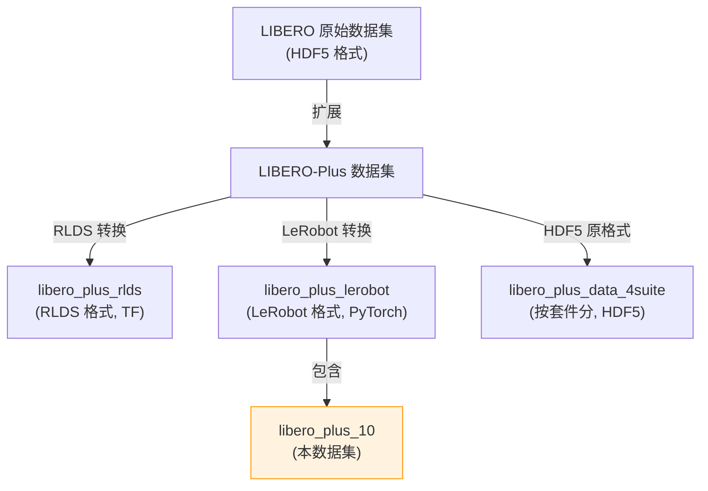
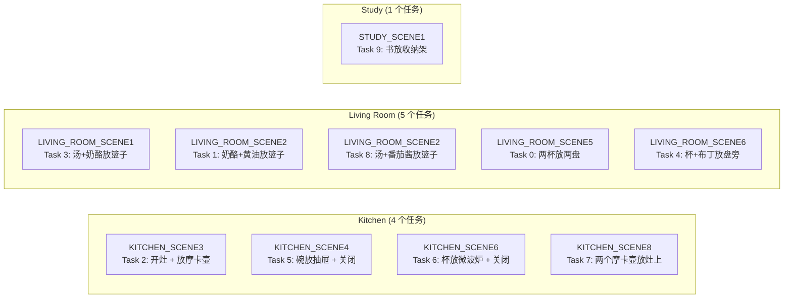
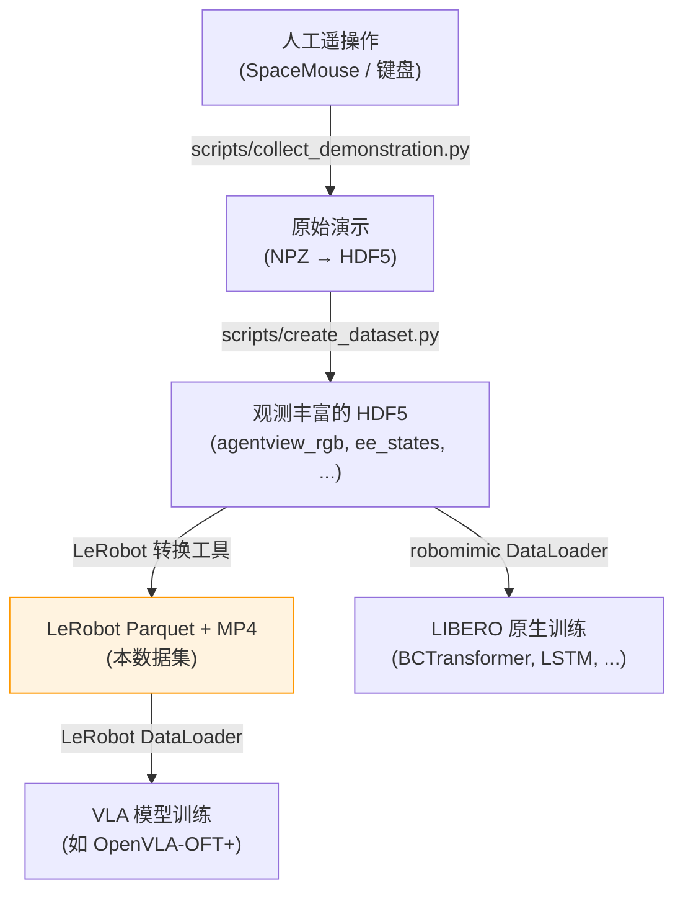

# LIBERO-Plus 10 数据集深度分析

> **数据集路径**: `/B/Dta/LIBERO/libero_plus_10/`
> **格式**: [LeRobot](https://huggingface.co/docs/lerobot) v2.1
> **来源**: [Hugging Face - Sylvest/libero_plus_lerobot](https://huggingface.co/datasets/Sylvest/libero_plus_lerobot)
> **对应代码库**: `/B/SRC/LIBERO-plus/` (LIBERO-Plus 基准框架)
> **对应论文**: [LIBERO-Plus: In-depth Robustness Analysis of Vision-Language-Action Models](https://arxiv.org/abs/2510.13626)

---

## 目录

1. [数据集概览](#1-数据集概览)
2. [数据格式与存储结构](#2-数据格式与存储结构)
3. [任务定义与场景映射](#3-任务定义与场景映射)
4. [Episode 统计分析](#4-episode-统计分析)
5. [观测空间分析](#5-观测空间分析)
6. [动作空间分析](#6-动作空间分析)
7. [夹爪行为与任务结构分析](#7-夹爪行为与任务结构分析)
8. [视频数据分析](#8-视频数据分析)
9. [与代码库的对应关系](#9-与代码库的对应关系)
10. [基准任务分类与难度分布](#10-基准任务分类与难度分布)
11. [数据质量评估](#11-数据质量评估)
12. [使用建议](#12-使用建议)

---

## 1. 数据集概览

### 1.1 基本信息

| 属性 | 值 |
|------|-----|
| 总 Episode 数 | 2,791 |
| 总帧数 | 738,120 |
| 任务数 | 10 |
| 机器人 | Franka Panda (7-DoF) |
| 控制频率 | 20 Hz (0.05s/步) |
| 数据总大小 | 4.56 GB |
| 代码库版本 | LeRobot v2.1 |
| 数据分割 | train: 0:2791 (全部为训练集) |

### 1.2 数据集定位

LIBERO-Plus 10 是 LIBERO-Plus 基准中 **LIBERO-10** 套件的训练演示数据集。LIBERO-10 对应原始 LIBERO 基准中的 **Long Horizon** (长时域) 套件, 包含 10 个多步操作任务, 每个任务需要执行 2-3 个子目标。这些是 LIBERO 基准中**最复杂**的任务, 涉及跨场景 (Kitchen, Living Room, Study) 的多步操作序列。

该数据集以 LeRobot 格式存储 (区别于代码库中原生使用的 HDF5 格式), 主要服务于以下模型的训练:
- **LeRobot 生态** (如 ACT, Diffusion Policy 等基于 LeRobot 框架的策略)
- **OpenVLA-OFT+ (Mix-SFT)** — 论文中提出的数据增强微调方法

### 1.3 与其他数据集的关系



---

## 2. 数据格式与存储结构

### 2.1 目录结构

```
libero_plus_10/
├── meta/                                    # 元数据 (6.9 MB)
│   ├── info.json                            # 数据集全局配置
│   ├── tasks.jsonl                           # 10 个任务描述
│   ├── episodes.jsonl                        # 2,791 个 episode 元数据
│   └── episodes_stats.jsonl                  # 逐 episode 统计信息
├── data/                                     # Parquet 数据 (63.1 MB)
│   ├── chunk-000/                            # episode 0-999
│   │   ├── episode_000000.parquet
│   │   ├── ...
│   │   └── episode_000999.parquet
│   ├── chunk-001/                            # episode 1000-1999
│   └── chunk-002/                            # episode 2000-2790
├── videos/                                   # 视频数据 (4.50 GB, 占 98.7%)
│   ├── chunk-000/
│   │   ├── observation.images.front/         # 第三人称相机
│   │   │   ├── episode_000000.mp4
│   │   │   └── ...
│   │   └── observation.images.wrist/         # 腕部相机
│   │       ├── episode_000000.mp4
│   │       └── ...
│   ├── chunk-001/
│   └── chunk-002/
└── images/                                   # 空目录 (视频存储模式)
    ├── observation.images.front/
    └── observation.images.wrist/
```

**存储大小分布**:

| 组件 | 大小 | 占比 |
|------|------|------|
| 视频 (videos/) | 4,595.3 MB | 98.7% |
| 数据 (data/) | 63.1 MB | 1.4% |
| 元数据 (meta/) | 6.9 MB | 0.1% |
| **总计** | **4,565.3 MB (4.56 GB)** | **100%** |

### 2.2 Parquet 文件格式

每个 episode 对应一个 Parquet 文件, 列结构如下:

| 列名 | 数据类型 | 形状 | 说明 |
|------|----------|------|------|
| `observation.state` | float32 (object) | (8,) | 机器人本体感觉状态 |
| `action` | float32 (object) | (7,) | 动作指令 |
| `timestamp` | float32 | scalar | 时间戳 (秒) |
| `frame_index` | int64 | scalar | 帧内索引 (0-based) |
| `episode_index` | int64 | scalar | 全局 episode 索引 |
| `index` | int64 | scalar | 全局帧索引 |
| `task_index` | int64 | scalar | 任务索引 (0-9) |

注意: 图像观测 (`observation.images.front` 和 `observation.images.wrist`) 不存储在 Parquet 中, 而是以 MP4 视频文件的形式独立存储, 通过 `episode_index` 和 `frame_index` 关联。这是 LeRobot v2.1 的标准视频存储模式 (出处: [LeRobot 文档](https://huggingface.co/docs/lerobot)), 相比逐帧存储图像, 视频编码可减少约 10-50 倍的存储空间。

### 2.3 视频格式

| 属性 | 值 |
|------|-----|
| 编码格式 | AV1 |
| 分辨率 | 256 × 256 |
| 像素格式 | yuv420p |
| 帧率 | 20 FPS |
| 通道数 | 3 (RGB) |
| 是否为深度图 | 否 |
| 音频 | 无 |

**文件大小统计** (采样 150 个视频):

| 相机 | 最小 | 最大 | 平均 |
|------|------|------|------|
| Front (第三人称) | 119.8 KB | 2,794.0 KB | 962.2 KB |
| Wrist (腕部) | 242.5 KB | 1,492.0 KB | 725.5 KB |

Front 相机视频大小方差更大, 这反映了不同场景 (Kitchen 暗色调 vs Living Room 明色调) 的压缩率差异。

### 2.4 与代码库 HDF5 格式的对比

代码库 (`libero/lifelong/datasets.py`) 原生使用 robomimic 的 HDF5 格式:

| 属性 | LeRobot (本数据集) | HDF5 (代码库原生) |
|------|---------------------|-------------------|
| 图像存储 | MP4 视频 (AV1) | HDF5 内嵌数组 |
| 图像分辨率 | 256×256 | 128×128 (代码库默认) |
| 状态表示 | 8-dim (紧凑) | 分离: joint_states(7) + gripper_states(2) + ee_states(6) |
| 动作维度 | 7 (6 DoF + gripper) | 7 (相同) |
| 帧率 | 20 Hz | 20 Hz |
| 任务描述 | `tasks.jsonl` | HDF5 `problem_info` 属性 |
| 训练框架 | LeRobot (PyTorch) | robomimic (PyTorch) |

---

## 3. 任务定义与场景映射

### 3.1 10 个任务列表

| task_index | 场景 | 任务描述 (自然语言指令) | 子目标数 |
|:---:|------|------------------------|:---:|
| 0 | LIVING_ROOM_SCENE5 | put the white mug on the left plate and put the yellow and white mug on the right plate | 2 |
| 1 | LIVING_ROOM_SCENE2 | put both the cream cheese box and the butter in the basket | 2 |
| 2 | KITCHEN_SCENE3 | turn on the stove and put the moka pot on it | 2 |
| 3 | LIVING_ROOM_SCENE1 | put both the alphabet soup and the cream cheese box in the basket | 2 |
| 4 | LIVING_ROOM_SCENE6 | put the white mug on the plate and put the chocolate pudding to the right of the plate | 2 |
| 5 | KITCHEN_SCENE4 | put the black bowl in the bottom drawer of the cabinet and close it | 2 |
| 6 | KITCHEN_SCENE6 | put the yellow and white mug in the microwave and close it | 2 |
| 7 | KITCHEN_SCENE8 | put both moka pots on the stove | 2 |
| 8 | LIVING_ROOM_SCENE2 | put both the alphabet soup and the tomato sauce in the basket | 2 |
| 9 | STUDY_SCENE1 | pick up the book and place it in the back compartment of the caddy | 1 |

### 3.2 场景与任务的对应关系



注意: **LIVING_ROOM_SCENE2** 被两个不同任务 (Task 1 和 Task 8) 共用, 它们使用相同的物理场景但操作不同的物体。

### 3.3 任务类型分析

从任务描述和数据分析可以归纳出三种操作模式:

| 模式 | 任务 | 特点 | 夹爪转换次数 |
|------|------|------|:---:|
| **Pick-and-Place × 2** | 0, 1, 3, 4, 7, 8 | 抓取两个物体分别放置 | ~4 次 |
| **Pick-Place + Close** | 5, 6 | 放入容器 (抽屉/微波炉) 后关闭 | ~2 次 |
| **Pick-and-Place × 1** | 9 | 单次抓取放置 | ~1 次 |
| **Turn-on + Pick-Place** | 2 | 开启灶台 + 放置摩卡壶 | ~5 次 |

---

## 4. Episode 统计分析

### 4.1 各任务 Episode 数量与长度

| task_index | Episode 数 | 占比 | 最短 | 最长 | 平均帧数 | 平均时长 | 总帧数 |
|:---:|---:|---:|---:|---:|---:|---:|---:|
| 0 | 275 | 9.9% | 214 | 330 | 260.4 | 13.0s | 71,600 |
| 1 | 480 | 17.2% | 234 | 322 | 259.4 | 13.0s | 124,535 |
| 2 | 390 | 14.0% | 218 | 323 | 265.0 | 13.2s | 103,350 |
| 3 | 370 | 13.3% | 219 | 323 | 267.6 | 13.4s | 98,995 |
| 4 | 230 | 8.2% | 203 | 301 | 246.8 | 12.3s | 56,775 |
| 5 | 245 | 8.8% | 217 | 287 | 241.6 | 12.1s | 59,180 |
| 6 | 160 | 5.7% | 224 | 449 | 291.3 | 14.6s | 46,615 |
| 7 | 146 | 5.2% | 341 | 505 | 406.3 | 20.3s | 59,325 |
| 8 | 240 | 8.6% | 245 | 367 | 291.0 | 14.6s | 69,850 |
| 9 | 255 | 9.1% | 162 | 259 | 187.8 | 9.4s | 47,895 |
| **合计** | **2,791** | **100%** | **162** | **505** | **264.5** | **13.2s** | **738,120** |

### 4.2 Episode 长度分布

| 长度范围 (帧) | 时长范围 | Episode 数 | 占比 |
|:---:|:---:|---:|---:|
| [100, 200) | 5-10s | 200 | 7.2% |
| [200, 300) | 10-15s | 2,170 | 77.7% |
| [300, 400) | 15-20s | 350 | 12.5% |
| [400, 500) | 20-25s | 66 | 2.4% |
| [500, 600) | 25-30s | 5 | 0.2% |

**关键观察**:
- 绝大多数 episode (77.7%) 集中在 200-300 帧 (10-15 秒), 这是双目标 pick-and-place 任务的典型时长
- **Task 7** (put both moka pots on the stove) 是异常值 — 平均 406 帧 (20.3 秒), 最长达 505 帧, 这是因为需要依次抓取两个摩卡壶并精确放在灶台上, 灶台放置区域较小
- **Task 9** (pick up the book) 最短, 仅 188 帧 (9.4 秒), 因为只需一次抓取放置

### 4.3 数据不平衡性

Episode 数量在任务间存在显著不平衡:
- 最多: Task 1 (480 episodes, 17.2%)
- 最少: Task 7 (146 episodes, 5.2%)
- 比值: 3.29:1

这种不平衡可能影响多任务训练时的任务间公平性。代码库中的 `GroupedTaskDataset` 通过交错索引 (round-robin) 来部分缓解此问题。

---

## 5. 观测空间分析

### 5.1 状态向量 (`observation.state`, 8 维)

基于对多个 episode 的数值分析, 8 维状态向量的语义如下:

| 维度 | 含义 | 最小值 | 最大值 | 均值 | 标准差 | 单位 |
|:---:|------|---:|---:|---:|---:|------|
| 0 | 末端执行器 X 坐标 (前后) | -0.367 | 0.158 | -0.032 | 0.093 | m |
| 1 | 末端执行器 Y 坐标 (左右) | -0.312 | 0.370 | 0.034 | 0.156 | m |
| 2 | 末端执行器 Z 坐标 (上下) | 0.446 | 1.212 | 0.830 | 0.257 | m |
| 3 | 末端执行器姿态参数 1 | 2.122 | 3.395 | 2.890 | 0.324 | rad |
| 4 | 末端执行器姿态参数 2 | -3.245 | 2.346 | -0.745 | 1.333 | rad |
| 5 | 末端执行器姿态参数 3 | -1.261 | 1.030 | -0.214 | 0.395 | rad |
| 6 | 右指宽度 | 0.000 | 0.042 | 0.027 | 0.015 | m |
| 7 | 左指宽度 | -0.040 | -0.001 | -0.028 | 0.014 | m |

**状态向量语义推断** (出处: 代码库 `scripts/create_dataset.py` 中的 `ee_states` 和 `gripper_states`):

- **维度 0-2**: 末端执行器 (End-Effector, EE) 的笛卡尔坐标。Z 轴范围 [0.45, 1.21] 对应从桌面高度到举起高度, 符合 Panda 机器人在 robosuite 中的工作空间
- **维度 3-5**: 末端执行器的姿态参数 (axis-angle 表示的 3 个分量)。维度 3 的范围集中在 [2.1, 3.4], 维度 4 范围较大 [-3.2, 2.3], 说明不同任务需要截然不同的抓取姿态
- **维度 6-7**: 夹爪两指的宽度。维度 6 为正 (右指), 维度 7 为负 (左指, 对称设计)。$|\text{dim}_6| + |\text{dim}_7| \approx 0.055$ m 为最大张开宽度

### 5.2 视觉观测

两个相机视角:

| 相机 | 视角 | 分辨率 | 作用 |
|------|------|--------|------|
| `observation.images.front` | 第三人称 (agentview) | 256×256 | 全局场景理解, 物体定位 |
| `observation.images.wrist` | 腕部 (eye-in-hand) | 256×256 | 近距离操作引导, 精确抓取 |

论文指出 (出处: [论文 Section 3.3](https://arxiv.org/html/2510.13626v3)): 腕部相机提供的**近距离几何和接触线索**对鲁棒性至关重要。去除腕部相机后, 模型在相机视角扰动下的性能从 59.7% 骤降至 16.8%。

---

## 6. 动作空间分析

### 6.1 动作向量 (`action`, 7 维)

| 维度 | 含义 | 最小值 | 最大值 | 均值 | 标准差 | P5 | P95 |
|:---:|------|---:|---:|---:|---:|---:|---:|
| 0 | $\Delta x$ (前后位移) | -0.938 | 0.938 | 0.029 | 0.316 | -0.474 | 0.600 |
| 1 | $\Delta y$ (左右位移) | -0.828 | 0.863 | 0.069 | 0.362 | -0.608 | 0.750 |
| 2 | $\Delta z$ (上下位移) | -0.938 | 0.938 | -0.061 | 0.347 | -0.552 | 0.597 |
| 3 | $\Delta \psi$ (偏航角) | -0.162 | 0.189 | 0.008 | 0.040 | -0.047 | 0.087 |
| 4 | $\Delta \theta$ (俯仰角) | -0.209 | 0.216 | 0.002 | 0.051 | -0.080 | 0.092 |
| 5 | $\Delta \phi$ (翻滚角) | -0.348 | 0.375 | -0.007 | 0.090 | -0.192 | 0.124 |
| 6 | 夹爪指令 | -1.000 | 1.000 | -0.145 | 0.989 | -1.000 | 1.000 |

**动作空间特性**:

1. **位移动作 (维度 0-2)**: 采用 OSC (Operational Space Control) 控制模式, 值域约 $[-0.94, 0.94]$, 表示末端执行器在各轴上的位移增量。均值接近 0 说明动作分布大致对称

2. **旋转动作 (维度 3-5)**: 量级远小于位移 (约 $\frac{1}{5}$), 说明大多数操作不需要大幅旋转末端执行器。维度 5 (翻滚) 的范围稍大, 可能用于调整抓取角度

3. **夹爪指令 (维度 6)**: **严格二值** — 只有 -1.0 (关闭) 和 1.0 (打开), 无中间值。整体分布偏向关闭 (-1.0 占 57.3%), 因为抓取和搬运占据了大部分执行时间

### 6.2 动作范围的物理意义

动作值域 $[-0.94, 0.94]$ 对应代码库中 robosuite 的 OSC_POSE 控制器的归一化输出。实际位移量取决于控制器的增益参数:

$$\Delta p_{\text{actual}} = k_p \cdot a_{\text{normalized}} \cdot \Delta t$$

其中 $k_p$ 是控制器增益, $a_{\text{normalized}} \in [-1, 1]$, $\Delta t = 0.05$ s (20 Hz)。

### 6.3 动作平滑度分析

通过计算动作序列的 lag-1 自相关系数, 可以评估演示轨迹的平滑程度:

| 任务 | 自相关系数 | 平均帧间变化量 | 解读 |
|------|:---:|:---:|------|
| Task 7 (两摩卡壶) | 0.992 | 最小 | 最平滑 — 缓慢精确的灶台放置 |
| Task 5 (碗放抽屉) | 0.991 | 小 | 单次操作, 动作连贯 |
| Task 9 (书放收纳架) | 0.987 | 中 | 简单任务, 动作直接 |
| Task 1 (奶酪放篮子) | 0.979 | 最大 | 相对最"急促" — 两次快速抓放 |

所有任务的自相关系数均 > 0.97, 说明演示数据来自**平滑、连贯**的人工遥操作, 而非噪声或不稳定的控制。

### 6.4 状态-动作互相关

状态和动作维度之间的显著相关性:

| 状态维度 | 动作维度 | 相关系数 $r$ | 解读 |
|----------|----------|:---:|------|
| state[6] (右指宽度) | action[6] (夹爪指令) | **-0.797** | 指宽 → 趋向合拢指令 |
| state[7] (左指宽度) | action[6] (夹爪指令) | **+0.770** | 对称的镜像关系 |
| 其他所有对 | — | $|r| < 0.26$ | 位移/旋转动作与关节状态弱相关 |

这说明夹爪状态与夹爪指令之间存在强反馈关系 (张开时倾向发出关闭指令, 反之亦然), 而位移/旋转动作基本不依赖当前关节构型, 而是由视觉输入驱动。

### 6.5 任务工作空间聚类

通过分析各任务的状态中心点 (state[2] 维度, 对应 Z 轴高度), 可以发现两个明显的工作空间聚类:

| 聚类 | 任务 | state[2] 均值 | 场景类型 |
|------|------|:---:|----------|
| 低位工作空间 | 0, 1, 3, 4, 8 | 0.55 - 0.62 | Living Room (桌面操作) |
| 高位工作空间 | 2, 5, 6, 7, 9 | 1.00 - 1.17 | Kitchen/Study (灶台/柜子/收纳架操作) |

最相似任务对: **Task 3 与 Task 8** (距离 = 0.044) — 两者都是 "把物品放入篮子" 任务, 在几乎相同的 Living Room 工作空间中操作。

最不相似任务对: **Task 2 与 Task 7** (距离 = 3.61) — state[4] (关节角度) 差异达 ~3.5 弧度, 反映了开灶 vs 放摩卡壶需要截然不同的手臂构型。

---

## 7. 夹爪行为与任务结构分析

### 7.1 夹爪转换次数

夹爪状态转换 (open↔close) 的次数直接反映了任务的**操作步骤数**:

| task_index | 任务简述 | 平均夹爪转换 | 操作模式 |
|:---:|---------|:---:|---------|
| 9 | 书放收纳架 | 1.0 | 单次 pick-place |
| 5 | 碗放抽屉+关闭 | 2.0 | pick-place + close |
| 6 | 杯放微波炉+关闭 | 2.3 | pick-place + close |
| 0 | 两杯放两盘 | 4.1 | pick-place × 2 |
| 1 | 奶酪+黄油放篮子 | 4.1 | pick-place × 2 |
| 3 | 汤+奶酪放篮子 | 4.0 | pick-place × 2 |
| 4 | 杯+布丁放盘旁 | 4.1 | pick-place × 2 |
| 7 | 两摩卡壶放灶上 | 4.1 | pick-place × 2 |
| 8 | 汤+番茄酱放篮子 | 4.3 | pick-place × 2 |
| 2 | 开灶+放摩卡壶 | 4.7 | turn-on + pick-place |

**规律**: 每次 pick-place 需要 2 次夹爪转换 (open→close 抓取, close→open 释放), 因此:
- 单次 pick-place: ~1-2 次转换
- 双次 pick-place: ~4 次转换
- Turn-on 操作额外增加转换

### 7.2 任务执行的时间结构

```mermaid
gantt
    title 典型双目标 Pick-and-Place 任务时间线 (Task 1, ~13s)
    dateFormat X
    axisFormat %s

    section 第一次抓取
    接近目标物体 1      : 0, 3
    抓取 (gripper close): 3, 4
    搬运到目标位置       : 4, 6
    释放 (gripper open) : 6, 7

    section 第二次抓取
    接近目标物体 2      : 7, 10
    抓取 (gripper close): 10, 11
    搬运到目标位置       : 11, 12
    释放 (gripper open) : 12, 13
```



从数据的时序分析 (将每个 episode 分为 4 个四分位, 对比 Q1 前 25% 与 Q4 后 25% 的动作特征) 可观察到两种不同的时序模式:

**模式 A — 先大后小 (常规 Pick-and-Place)**:
- Task 1, 3 (篮子放置): Q2 动作幅度最大 (0.65-0.81), 对应第一次抓取的接近阶段; 之后逐渐减小
- 解读: 到达阶段需要大幅移动, 精确放置阶段动作变小

**模式 B — 先小后大 (容器关闭)**:
- Task 5, 6 (抽屉/微波炉关闭): Q1 动作幅度较小 (0.37-0.42), Q4 反而最大 (0.64-0.72)
- 解读: 先精确放入物体, 最后执行大幅度的关闭门/抽屉动作

**夹爪时序特征**:
- 双物体任务 (T0,1,3,4,7,8): 夹爪从 Q1 关闭 (抓第一个物体) → Q4 打开 (释放第二个物体)
- 容器任务 (T5,6): 夹爪在整个 episode 中保持关闭 (抓取物体后推/关容器)

### 7.3 任务复杂度与 Episode 长度的关系

按平均 Episode 长度排序的任务复杂度图谱:

```
Task 9 (书放收纳架):     ████████████████████ 188 帧 (9.4s)  ← 最简单, 单次抓放
Task 5 (碗放抽屉):       ████████████████████████ 242 帧 (12.1s)
Task 4 (杯+布丁):        █████████████████████████ 247 帧 (12.3s)
Task 1 (奶酪+黄油):      ██████████████████████████ 259 帧 (13.0s)
Task 0 (两杯两盘):       ██████████████████████████ 260 帧 (13.0s)
Task 2 (开灶+摩卡壶):    ███████████████████████████ 265 帧 (13.2s)
Task 3 (汤+奶酪):        ███████████████████████████ 268 帧 (13.4s)
Task 8 (汤+番茄酱):      █████████████████████████████ 291 帧 (14.6s)
Task 6 (杯放微波炉):     █████████████████████████████ 291 帧 (14.6s)
Task 7 (两摩卡壶):       █████████████████████████████████████████ 406 帧 (20.3s) ← 最难
```

**Task 7 为何最长**: "put both moka pots on the stove" 需要将两个形状相似的摩卡壶分别放在灶台上的特定位置。灶台的放置区域较小且位置较高, 需要更精确的末端执行器控制, 因此每次放置耗时更长。

---

## 8. 视频数据分析

### 8.1 视频文件统计

| 指标 | 值 |
|------|-----|
| Front 相机视频数 | 2,791 |
| Wrist 相机视频数 | 2,791 |
| 总视频文件数 | 5,582 |
| 视频编码 | AV1 (高效编码, 比 H.264 节省 ~30%) |
| 总视频大小 | 4.50 GB |
| 每 episode 平均视频大小 | ~1.69 MB (front + wrist) |

### 8.2 AV1 编码选择的意义

LeRobot v2.1 选择 AV1 而非 H.264/H.265 编码, 原因包括:
- **更高压缩率**: 在同等画质下, AV1 比 H.264 节省约 30-50% 空间
- **开源无专利**: 避免 H.265 的专利授权问题
- **训练时的按需解码**: LeRobot 的 DataLoader 在训练时逐帧解码, AV1 的解码性能在现代硬件上已足够

### 8.3 图像存储模式

`images/` 目录下的 `observation.images.front/` 和 `observation.images.wrist/` 为空目录, 这是因为数据集使用**视频存储模式** (`dtype: "video"` in `info.json`) 而非帧图像存储模式。LeRobot 在训练时通过视频解码器按需提取帧:

```python
# LeRobot 内部加载逻辑 (伪代码)
video_path = f"videos/chunk-{chunk}/observation.images.front/episode_{ep_idx}.mp4"
frame = decode_video_frame(video_path, frame_index)  # 按需解码
```

---

## 9. 与代码库的对应关系

### 9.1 任务映射

数据集中的 10 个任务与代码库 BDDL 文件的映射关系:

| task_index | 数据集任务描述 | 代码库 BDDL 基础文件 |
|:---:|-------------|-------------------|
| 0 | put the white mug on the left plate... | `LIVING_ROOM_SCENE5_put_the_white_mug_on_the_left_plate_...bddl` |
| 1 | put both the cream cheese box... | `LIVING_ROOM_SCENE2_put_both_the_cream_cheese_box_...bddl` |
| 2 | turn on the stove... | `KITCHEN_SCENE3_turn_on_the_stove_...bddl` |
| 3 | put both the alphabet soup and the cream cheese... | `LIVING_ROOM_SCENE1_put_both_the_alphabet_soup_...bddl` |
| 4 | put the white mug on the plate... | `LIVING_ROOM_SCENE6_put_the_white_mug_on_the_plate_...bddl` |
| 5 | put the black bowl... | `KITCHEN_SCENE4_put_the_black_bowl_...bddl` |
| 6 | put the yellow and white mug... | `KITCHEN_SCENE6_put_the_yellow_and_white_mug_...bddl` |
| 7 | put both moka pots... | `KITCHEN_SCENE8_put_both_moka_pots_...bddl` |
| 8 | put both the alphabet soup and the tomato sauce... | `LIVING_ROOM_SCENE2_put_both_the_alphabet_soup_...bddl` |
| 9 | pick up the book... | `STUDY_SCENE1_pick_up_the_book_...bddl` |

### 9.2 BDDL 文件中的扰动变体

代码库的 `libero_10/` 目录包含 **2,031** 个 BDDL 文件 (含 10 个基础任务 + 2,000 个扰动变体 + 20 个副本文件):

| 扰动类型 | 后缀 | 文件数 | 说明 |
|----------|------|-----:|------|
| 语言重写 | `_language_N` | 500 | LLM 重写指令 (3 种风格 × ~17 个任务变体) |
| 光照条件 | `_light_N` | 500 | 漫反射/方向/高光/阴影变化 |
| 物体布局 | `_add_N` | 300 | 添加干扰物体 |
| 桌面纹理 | `_table_N` | 280 | 桌面/地板纹理替换 |
| 桌面纹理 (缩写) | `_tb_N` | 220 | 另一种纹理变体编码 |
| 难度等级 | `_levelN_sampleM` | 200 | 分级添加干扰物 |
| 基础任务 | (无后缀) | 10 | 原始未扰动任务 |
| 副本文件 | copy/copy 2 | 20 | 备份 (可能是开发遗留) |

注意: **相机视角扰动** (`_view_`) 在 BDDL 层面无对应文件, 因为视角变化通过运行时参数在 `ControlEnv` 中实现 (编码在文件名中: `_view_H_V_S_R_RV_initstate_N`)。

### 9.3 数据流: 从演示采集到训练



---

## 10. 基准任务分类与难度分布

### 10.1 LIBERO-10 基准评估任务分布

代码库中的 `task_classification.json` 将 LIBERO-10 的 **2,519** 个评估任务按扰动类型和难度分类 (出处: `libero/libero/benchmark/task_classification.json`):

**按扰动类型**:

| 扰动类型 | 任务数 | 占比 |
|----------|-----:|-----:|
| Sensor Noise | 449 | 17.8% |
| Camera Viewpoints | 419 | 16.6% |
| Robot Initial States | 393 | 15.6% |
| Language Instructions | 383 | 15.2% |
| Objects Layout | 312 | 12.4% |
| Background Textures | 289 | 11.5% |
| Light Conditions | 274 | 10.9% |
| **合计** | **2,519** | **100%** |

**按难度等级**:

| 等级 | 含义 | 任务数 | 占比 |
|:---:|------|-----:|-----:|
| L1 | 被 4/4 模型通过 | 357 | 14.2% |
| L2 | 被 3/4 模型通过 | 450 | 17.9% |
| L3 | 被 2/4 模型通过 | 484 | 19.2% |
| L4 | 被 1/4 模型通过 | 523 | 20.8% |
| L5 | 无模型通过 | 705 | 28.0% |

难度分布呈**金字塔形** — L5 (最难) 占比最高 (28.0%), 说明 LIBERO-10 的长时域任务在扰动下极具挑战性。

### 10.2 扰动类型 × 难度交叉分析

| 扰动类型 | L1 | L2 | L3 | L4 | L5 |
|----------|---:|---:|---:|---:|---:|
| Background Textures | 24 | 56 | 53 | 61 | 95 |
| Camera Viewpoints | 16 | 47 | 55 | 58 | **243** |
| Language Instructions | 65 | 64 | 77 | 104 | 73 |
| Light Conditions | 11 | 35 | 53 | 73 | 102 |
| Objects Layout | **150** | 74 | 65 | 20 | 3 |
| Robot Initial States | 64 | 77 | 100 | 83 | 69 |
| Sensor Noise | 27 | 97 | 81 | 124 | 120 |

**关键观察**:

1. **Camera Viewpoints 难度极高**: L5 级别有 243 个任务 (占 Camera 扰动的 58%), 远超其他维度。这与论文发现一致 — 相机视角是最具破坏性的扰动

2. **Objects Layout 难度极低**: L1 级别有 150 个任务 (占 Layout 扰动的 48%), L5 仅 3 个。添加干扰物体对大多数模型影响不大

3. **Language Instructions 难度均匀分布**: 各等级分布相对均匀, 这与论文的"语言忽略"发现一致 — 由于模型基本不使用语言, 语言扰动的影响是随机的

---

## 11. 数据质量评估

### 11.1 数据完整性

| 检查项 | 结果 |
|--------|------|
| NaN 值 (状态) | 无 |
| NaN 值 (动作) | 无 |
| Inf 值 (状态) | 无 |
| Inf 值 (动作) | 无 |
| 帧索引连续性 | 每个 episode 内帧索引连续, 无间断 |
| 时间戳步长 | 标称 0.05s (20Hz), 存在微小浮点偏差 |
| 所有 10 个任务均有数据 | 是 |
| 视频文件完整 | 2,791 × 2 = 5,582 个 MP4 文件齐全 |

### 11.2 潜在问题

1. **数据不平衡**: Task 1 (480 eps) 是 Task 7 (146 eps) 的 3.3 倍。多任务训练时建议使用加权采样或 `GroupedTaskDataset` 的交错策略

2. **图像分辨率差异**: 本数据集使用 256×256 分辨率, 但代码库训练配置默认使用 128×128 (`configs/data/default.yaml:img_h=128, img_w=128`)。使用 HDF5 格式训练时需注意分辨率匹配

3. **状态表示差异**: LeRobot 格式的 8 维紧凑状态与代码库 HDF5 格式的分离表示 (joint_states + gripper_states + ee_states) 不直接对应。转换时需要参考 `scripts/create_dataset.py` 中的映射逻辑

4. **无验证/测试集划分**: `info.json` 中只有 `train: "0:2791"`, 无 val/test 分割。评估需使用 LIBERO-Plus 基准的 2,519 个评估任务 (通过仿真环境执行)

5. **505 帧截断**: Task 7 有 5 个 episode 长度恰好为 505 帧, 这可能是仿真环境的超时截断 (代码库默认 `max_steps=600`, 但数据采集可能使用了不同阈值)。这些 episode 可能代表**边界成功或失败**的演示

6. **动作零值比例**: 旋转动作 (维度 3-5) 的零值比例较高 (29%-45%), 说明大量帧中不需要旋转调整, 模型训练时可能需要注意这种稀疏性

---

## 12. 使用建议

### 12.1 直接使用 LeRobot 加载

```python
from lerobot.common.datasets.lerobot_dataset import LeRobotDataset

dataset = LeRobotDataset(
    repo_id="Sylvest/libero_plus_lerobot",
    root="/B/Dta/LIBERO/libero_plus_10/",
    episodes=None,  # 加载全部
)
# dataset[i] 返回包含 observation.state, action,
# observation.images.front, observation.images.wrist 的字典
```

### 12.2 转换为代码库原生格式

如需使用代码库的训练管道 (`lifelong/main.py`), 需将数据转换为 robomimic HDF5 格式:
- 将 8 维状态拆分为 `joint_states(7)` + `gripper_states(2)` + `ee_states(6)`
- 将 256×256 图像下采样至 128×128
- 构建 `demo_N` 层级的 HDF5 结构

### 12.3 评估建议

训练完成后, 评估应在 LIBERO-Plus 的仿真环境中进行 (而非在本数据集上计算离线指标):
- 使用 `libero/lifelong/evaluate.py` 或等效的 VLA 评估脚本
- 设置 `num_trials_per_task = 1` (LIBERO-Plus 评估协议)
- 评估 2,519 个 LIBERO-10 扰动任务, 按 7 个维度和 5 个难度等级分析结果

### 12.4 参考资料

- [LIBERO-Plus 论文](https://arxiv.org/abs/2510.13626)
- [LeRobot 文档](https://huggingface.co/docs/lerobot)
- [LIBERO-Plus 数据集 (HuggingFace)](https://huggingface.co/datasets/Sylvest/libero_plus_lerobot)
- [LIBERO-Plus GitHub](https://github.com/sylvestf/LIBERO-plus)
- 代码库分析: [cd_analyz.md](../cd_analyz.md)
